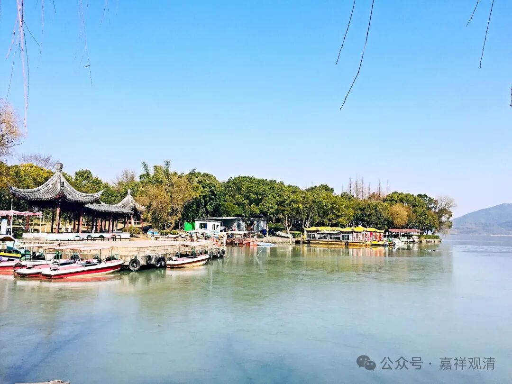

**《宗义略讲》004·004**

那么有部为什么这么强调，三世实有呢，他有他历史的一个原因……因为在第三次结集的时候，就是目犍连子帝须在阿育王时代那次结集的时候，这次结集的时候，目犍连子帝须有一个专门观点，“过未无而现在有”——这是很早的一次佛教分化、部派的产生。那么今天南传佛教的观点就跟这个（目犍连子帝须的）观点比较接近，也是认为“过未无而现在实有”的。

那么，持说一切有部类似观点的人就要很明确的和他们（目犍连子帝须代表的上座部）分开，他说，“你这个目犍连子帝须，你们这一系上座部，说过去未来无，这个观点我不接受，不同意”，就说他们（目犍连子帝须）是“分别说部”，为什么说他们是“分别说部”呢，因为他们（目犍连子帝须）对“三世法的有无”是分别说的，过去、现在、未来的法，有些（现在法）有，有些（过去未来法）没有，同样蕴、界、处，也是有些“实有”，有些“非实有”……说一切有部师就说，“你们是属于‘分别说’的，而我们是说一切有，我们不是一路人了，我们分河饮水（分派）了”。

（可以理解，说一切有部的思路是：“真理是普遍的，不能是特殊的”；真实的存在，不应该“只”是偶然的、暂时的“现在”！真实的存在是普遍于三世的。）

这里，什么是“说一切有”，就是“过去、现在、未来”、“蕴、界、处”都实有，所以叫“说一切有”。

但是三世法，在其表现上，仍有三世的不同——现在的法它是有表现、呈现的，它的作用是现在的呈现，三世的差别是位置的不同，过去、现在位置不同，现在他有一个特征，就是它能够表现、呈现出它的作用……

那么还有一个原因也助成了有部要说三世实有，昨天讲的，比如佛见过去，佛见未来……佛既然回忆了过去、预言了未来，那么，过去未来在佛面前就是实际呈现的，就应该有——这也是说一切有部的一个思路。

