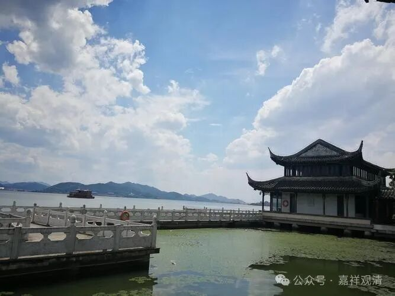

**《宗义略讲》004·009**

** 三世假实**

过去

现在

未来

有部

实有

实有

实有

《俱舍论》

假有

实有

假有

经部

假有

实有（有为）

假有

大众部

假有

实有（无为）

假有

化地部

一分实有（异熟因未熟）

实有

假有

分别说部

一分实有（未与果）

实有

假有

南传上座部

假有

实有

假有

饮光部

一分实有

实有

一分实有

这里面又要提到“分别说部”这个系统了。你看啊，南传上座部是一种分别说的，他自称是最原始的“上座部”，也把它当做分别说系统的赤衣部的（有说就是法藏部，我们汉传的律部就是法藏部。考虑到汉传的戒律是从斯里兰卡传来，这种南传上座部就是法藏部的“传说”也就颇有几分可信），而化地部和饮光部，也算它是分别说系统的。

化地部说现在是实有，这个不用说了，所有人都认为现在是实有，但是化地部还有说过去的一份是实有，也有几分道理啊……看到到没有，“异熟因未熟”，它们说，过去的业，在他还没有产生（感）果以前，它还是有；过去的业，如果产生果了以后，就没有了。也就是说，他认为，业灭了以后，不是全无，也不是都有——这确实有点“分别说”的意思吧。

那么经部呢，实际上他把过去、未来法放在“种子说”里面谈，经部就把类似这个异熟因这些，未遇果这些都放在种子里面。

化地部的意思是“分别说”，就是一个果，一个因，它在还没有产生果以前，它即使是过去，它还永远在那里，哪一天它感了果以后，他就没了，生果的功能就再也没有了，有道理啊，很有道理……

我们现在到底是哪一派呢？我们看那个派都对，哈哈，都有点道理。

再说饮光部。饮光部认为过去一分是实有，这个跟化地不一样，是“分别说”的，还没产生果的时候是有，未来一分是实有的……这些是南传的《论事》那里面摘录过来的。它是说未来的能够生的那个法，是有，未来不能生的那个法，是没有。（那么未来如果不能生的那个法，那么它本来就没有啊，所以这个我没看懂，我要找机会问一下南传的法师。）

