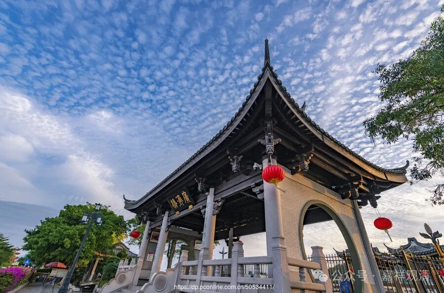

**《宗义建立》004·012**

那么这个里面就谈到，“蕴界处”的这个当中，对“处”，一般没有什么多讨论的，因为“处”呢，大家多半接受处是实有，主要的原因又是经典里面，佛自己讲的，《阿含经》里面自己讲的，“十二处”，眼、耳、鼻、舌、身、意，色、声、香、味、触、法，就是一切处，“有”，所以基本上大家呢不再讨论了。

这个“一切处有”，除了个别的宗派还要继续推究，比如中观宗。中观宗这个时候马上把类似《大空经》《小空经》……（加上大乘的《般若经》、《华严经》……）啊，拿出来说，“你看，色、声、香、味、触、法都是空，十二处都是空，都是空，你这可以搬出有，我可以搬出空来……”，所以，也有个别（再比如说假部）谈“处非实有”的，一般会认为处是实有的，因为还是前面讲的，有佛经里面直接写出来，这个直接写出来的，大家就比较容易接受了。

那么“蕴”这个实有，基本上其他的部派不接受，因为“蕴”本身是聚合的意思，所以你很难说服别人说“聚集”是实有的。所以其他部派，一般认为“蕴”不是实有的。不过呢，也可以安排道理——“蕴”固然是聚合，但我讲的“蕴实有”不是大的概念，我是指蕴里面的，色，极微啊，或者是心啊，刹那的那个心啊，是蕴里面一个个个体，一个个实有法，他们是实有，我不是指的是那个整合的那个聚。即使我们要说这个“聚”，有部后面还有一句话等着你，“假必依实”，就是你所有这个假的背后，一定要有一个真的东西存在，比如说瓶、衣等，它背后还是要有真的东西在那里，否则他的意思就是说，我们的意识，我们的识啊，你不能缘假法，你总要有真的东西在那里。（不过不能缘假法吗？经部就不承认不能缘假法。）

这个蕴呢，合并的话其实就两个，拿现代哲学来讲就是“物质与精神”，按南传讲起来就是“名色”。“名”到最后，是什么呢？心法、心所法、心不相应行法。（那无为法算不算“名”呢？因为五蕴里面没有无为法，不算。）这就是心法（心王、心所）和心不相应行法，色就是物质。

