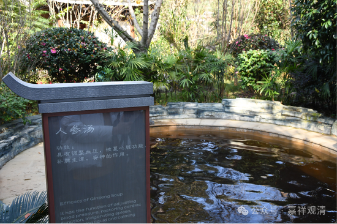

**“醉缸”和“晕汤”**

哈哈哈哈，这个名字取得好吧。

刚才说泡温泉……其实我泡温泉也不是一次了，在海南、庐山、丰顺、腾冲……都泡过温泉，其中三次……

一次是在海南的琼海。那天下午，先去看了个菜蔬农场，后来他们带我去泡温泉……我先在泳池里游了三五个来回，接着去小池子里面和俩兄弟泡温泉聊天。等要走的时候，一下子起猛了，就，黑屏了、耳鸣了，软倒在温泉里面了。还算清醒，马上招呼拿来两碗浓糖水……休息一下就好了，没啥事儿。那次应该是低血糖了。

第二次比较严重。在梅州丰顺，其实丰顺这里我也泡过几回汤了……那天温泉池子外面的热水管还爆了。当时还好，泡完第二天就发烧、盗汗……大病一场，休养了好几个月。后来我就躲着丰顺……

这回还是在丰顺……鉴于上一次的“教训”，这回某法师说要“泡温泉”我心里就隐隐有点犯怵。果然还是中招了，不过没上次严重，症状类似但是要轻得多了。养了好几天都还没养过来，（可能是之前有点累了，）于是就果断中断下个行程，回山休养也！

这不，人参、黄芪、西洋参、石斛、红枣、龙眼都煮上了，主打一个“十全大补”！

问下来，疫情以后，大家身子都虚……我看，都得补！

下次就得泡这种“人参汤”！

