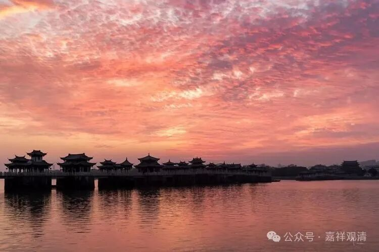

**《宗义略讲》004·013**

那么色呢？色可以说分两类，四大种和四大种所造色，这两种，有部说四大种和四大种所造色，都是实有的，比如说，四大种本身地、水、火、风是有的……

那么这里面又谈到一个，我们所认为的通常的地、水、火、风，和真正的四大种是不一样的，分别叫“假四大”和“真四大”。我们看到的那个“地”，是眼所缘的，这是“假”的……真四大呢，本质是“坚、湿、暖、动”，都是触的对境。

四大种和四大种所造色，都是实有，像眼根啊，色尘啊，它都认为是四大种所造的，而且都是独立的实有——就是他一定要讲这些东西是有的话，一定要承认它是独立的、实有的，所以他不能承认一个补特伽罗是独立实有的，补特伽罗他一定是假有的，它是在蕴上面的一个假施设，在蕴上面的一个假施设。

我们昨天没有展开，就是“五蕴聚”还是“四蕴聚”，不同的宗义教材讲的是不一样的。有的人说，“五蕴聚或者四蕴聚”，因为无色界没有色，所以无色界就不是“五蕴聚”而是“四蕴聚”；另有人说“无色界还是有色”，还是说五蕴，什么呢？它有定共戒。无色界肯定有禅定嘛，有定嘛，无色界的定嘛，有一种叫“定共戒”（有定共戒、道共戒），那么戒它是包含在色法当中的嘛，戒是“无表色”，这个百法熟悉吗？戒是法处所摄色，既然戒律是“法处所摄色”，那么他在无色界他有禅定，禅定可以有一个“定共戒”，禅定可以有“定共戒”，他应该有色，属于“无表色”……所以呢，他就还说“五蕴聚”。

那么有些教材，比如色拉昧的宗义就认为，要加字的，“五蕴或者四蕴”，它认为“无色界无色”，就是“已经说了无色界了，就是色没有……”

两种说法，我觉得他们讲的好像也可以啊，你们自己挑一个。我个人，我站“五蕴”这一边，因为比如在《集论》里也有说无色界不是全无色，是指没有粗色。（当然，现实中的表态呢，要看哪个师父在我面前……）

人是假，你看，人是四大所造，它有名色啊，然后人是依名色所假立的有啊，不是讲了，补特伽罗，施设假有，这些是假法，它是依这个而有的，所以它是假的。

其实我们前两天不是讲过吗？这里面确实有矛盾在里面，实际上它背后的确实有这个情况，他先立了一些东西，“哪些东西是实有的，哪些东西是假有的……”，然后他认为是实有的东西，他最后就说这个东西生出的是实法，比如四大所造的，它就变成是实法了，它不认为这个是实有的东西，你再造，它也是假法，它实际上是结论先行，他已经先有一个结论了。（比如眼根是四大所造，是实有，但是树林又是假有了。从中观师的角度，会觉得他双标。）

它绝不敢说补特伽罗是实有的，它一定是假有的。所以，即使他是由五蕴聚集才有的它，也是五蕴聚了以后才有的它，必须是假有。如果你是眼根呢？因为他已经定了这些必须是实有的，也就是你四大和合起来，生的这个它，“不管你，我不听你的，他就是有了，而且还是实有的”，这有点结论先行的味道，而这个结论先行他们又说是因为佛说的，“云何色啊，眼、耳、鼻、舌、身，色、声、香、味、触”，等等，“是佛说的！”，结论先行。

