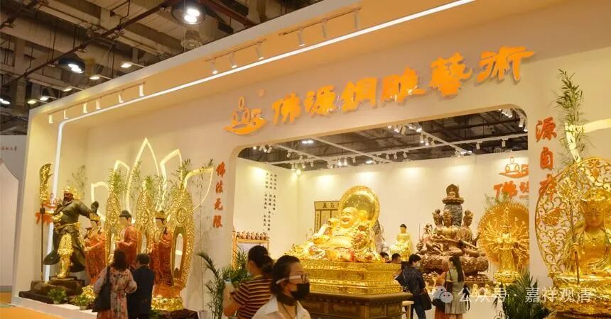
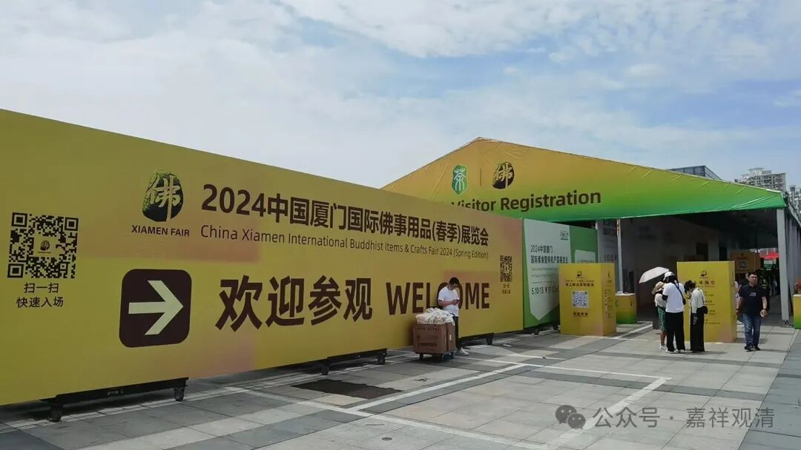
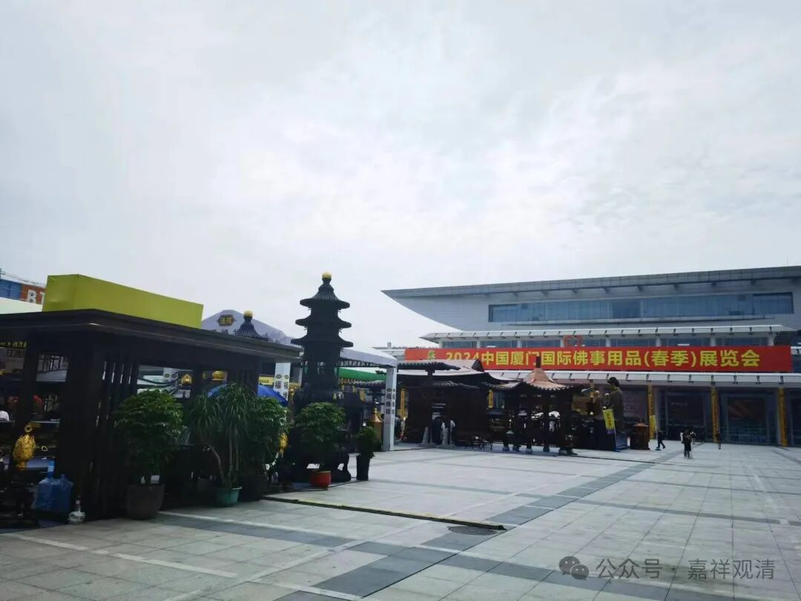
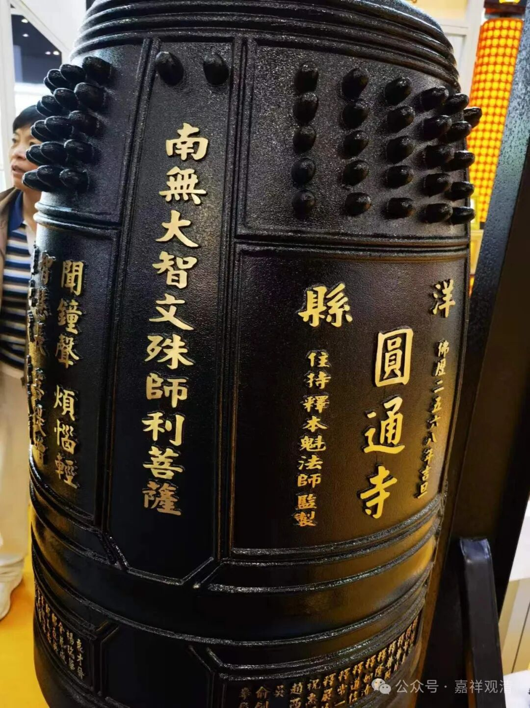
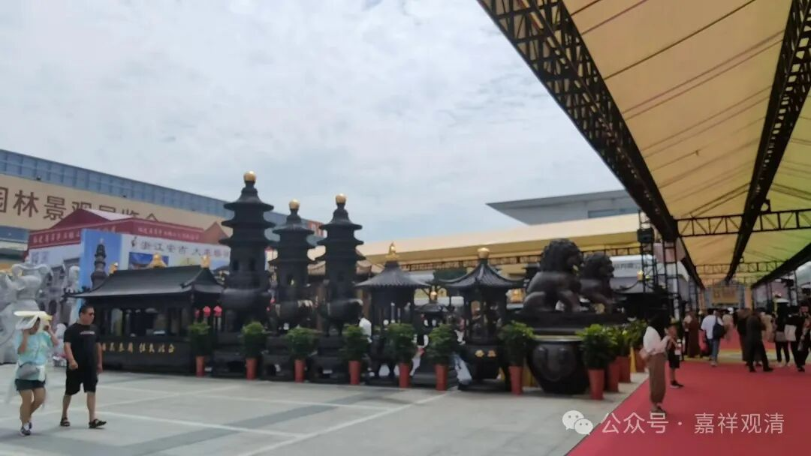

**厦门佛展会见闻（一）**

前些日子去了厦门佛展会，那段时间太忙，现在补上，叨咕几句。

厦门佛展会已经很“悠久”了，也成了“业内”第一品牌了。以前因为厦门佛展会办得好，其他地方也群起效仿办佛展会，但都办得都没有下文了。后来厦门佛展会一直坚持，品牌“做大做强”，最近几年开始每年两次，春季展和秋季展。前些年北京杭州宁波这些地方又开始办佛展会了，但是都没起多大浪花——厦门还是有优势的。

自从接了寺院，佛展会就经常来，采购，或者看看“业内”新动向。比如从“念佛机”到“播经机”的进化……现在连俩都不见了。以前的佛展会还有大型的石雕、木雕的雕刻机现场展示，现在也已经很久没看到了。还有车念珠的机子，也再没见过。

这次想看看铜钟的。咱庙里有一口三十多年前的铜钟、还有个俩铁香炉，这次想做一个钟楼，正好来看看展会上的铜钟。现在各个场子的工艺我们看着都差不多，不过……我问了一下现在的铜价，苦啊！说是正在历史最高位！愁啊！世界到处打仗，铜都拿去做炮弹去了，而且大宗商品金银铜都在涨……哎，等等吧。等世界和平，刀枪入库，我们就能搞个“世界和平钟”了吧。不过也可以倒过来想，先搞一个世界和平钟，祈祷世界早日和平——好像也说的通啊。

其实疫情前我也在佛展会打听过的，记得是一家在昆山的企业，是上海搬过去的，因为那时候上海的污染企业都要搬迁。那时候的铜价也在高位……好像每次我想买铜钟的时候铜价都不低。

我记得那年寂如师搞（化缘到）了一根很粗的铜棒子，用那东西专门去打了个铜锅，说是要做《西游记》里的“草还丹”，哈哈，也不知道有没有做成……他总是这么异想天开，我也不知道算是开窍还是不开窍……或者开错脑洞了，哈哈。有人劝我向寂如师一样自己买铜再拿去厂里做……我看倒是不必折腾两回了。

……

