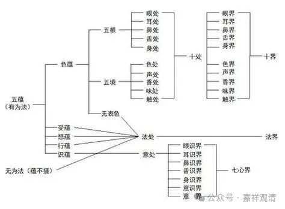

**《宗义略讲》004·014**

那么接下来讲讲“蕴处界”的“界”。

“界”呢，佛教里面早期指的是“六界”，地、水、火、风、空、识，“六界”。后来的“界”更多的说的是十八界：眼耳鼻舌身意界，色声香味触法界，眼识界、耳识界、鼻识界、舌识界、身识界、意识界，十八界。

如果按照早期来说，次序是这样的，“蕴界处”，是按数字来排的，“五蕴、六界、十二处”，所以早期叫“蕴界处”；后来叫“蕴处界”，因为按“五蕴、十二处、十八界”来的，所以就叫“蕴处界”，后来习惯了以后呢，就基本上固定了“蕴处界”，后来的“界”也基本固定指的“十八界”。

早期的《阿含》、“阿毗达磨”里的“界”是指的六界，次序是“蕴界处”，现在我们常见的次序是“蕴处界”，“界”排在了第三个。

那么界的实有，按照刚才我们所讲的，基本绝大多数的部派都是同意的。（我们现在也差不多是结论先行了）“蕴不摄无为”，五蕴是不包含无为法的，但处（十二处）、界（十八界）是包含一切法的。

这里面，我们看一下这个对照表：

这是经常可以看到的，把五蕴、十二处和十八界做了一个对应。

老实说，如果是有部的话，它可能泛泛的可以对应，但是他不能够真正的这样对应，如果真的这么一一对应出来就出问题了，因为一旦对应的话，那十二处和十八界对应，最后一个意处要和七个界相对应，那就变成“假”的了，不管你一个一个界是假的还是他所包含的七个识加上一个意处，是这样的话，他总有一个是假的，总有一类是假的，你一个是由其他七个组成，或者其他七个组成这一个。但我们要说，这个表格对照是“泛泛而谈”，他不能够，很确定的一一对应，如果很确定的说，那种类（界）、生门（处）这些概念就不符合了。

你们脑子里面有这个图吗？因为后面六个识，我要放在意处里面去，那既然意处包含它六个，那显然这六个是假的，而只有意处是真的，或者说意处就是假法，那个六个识，是实法，那就不是十八了，变成十七了，那么，如果要这么说呢，否则就变成自己要包含自己了嘛？

如果要这么说呢，那在讲十八界的时候，会很明确的讲，意界不是意识，意界就是“无间灭意”。前面讲的无间灭意，就是六个识的前面刹那的那个，无间灭意，它单独的。而后面那六个识呢，是单独六个识。然后这一些呢，全都是实有。

有时候要小心，我们平时做题目做的很顺的时候，划这个对照表的时候，很轻松，但你真的带到他的整个体系里去，他（在严格的情况下）不见得真的承认。我们觉得很轻松就画了起来，真的要照搬过去的话，他的理论当中要出点小问题的，有小的bug。

