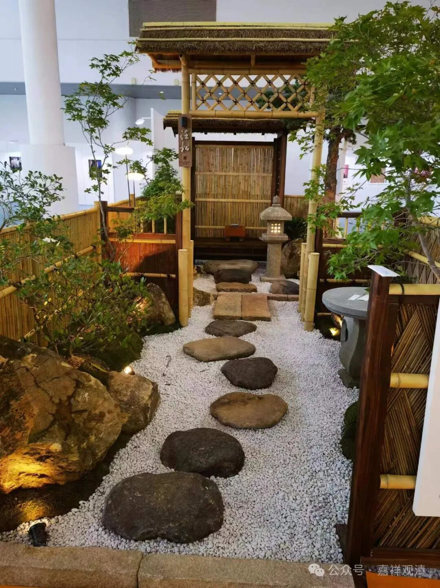
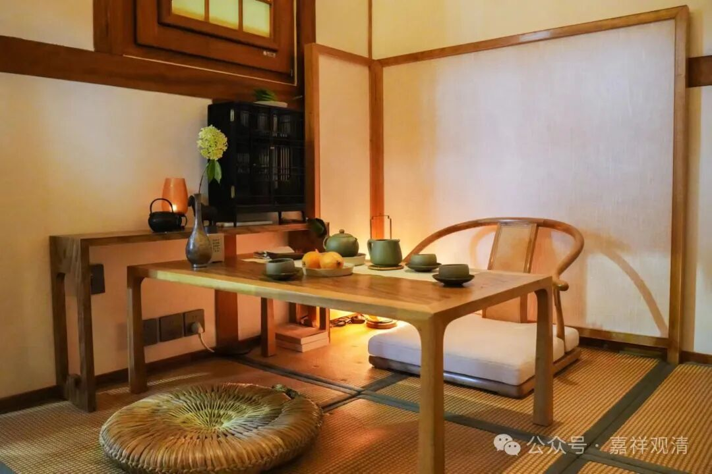
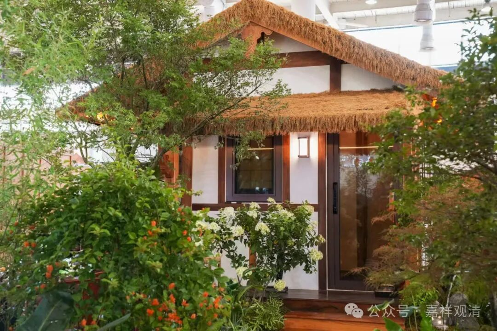
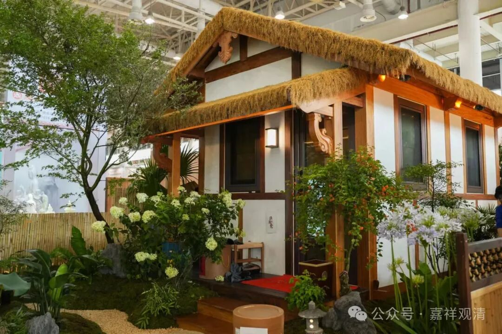
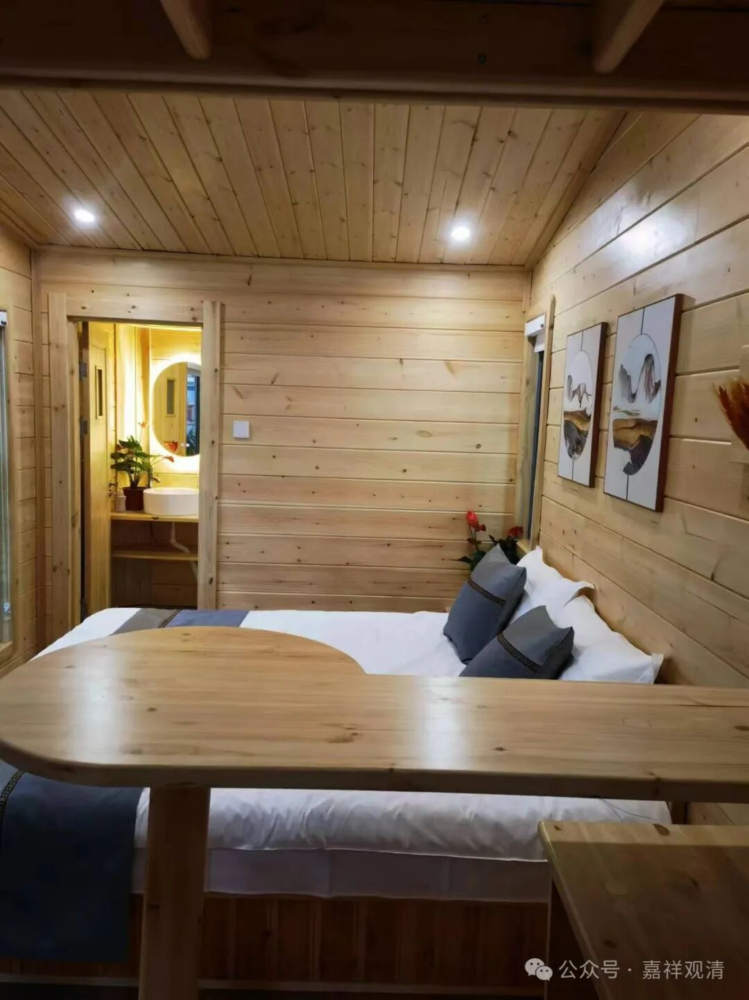
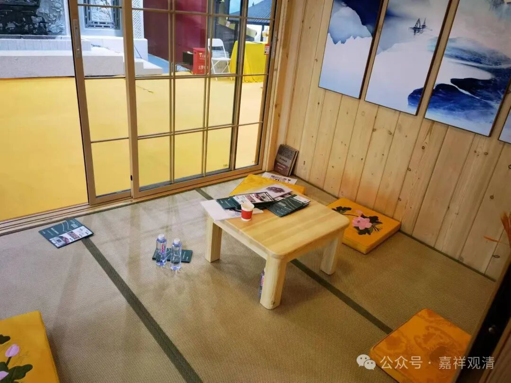
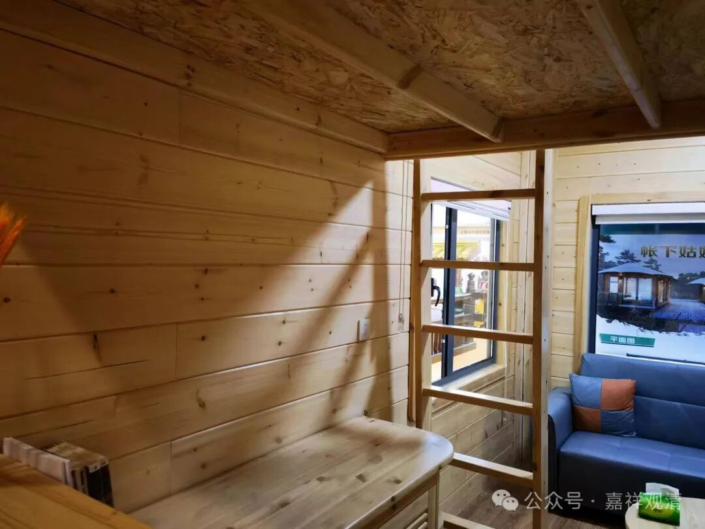
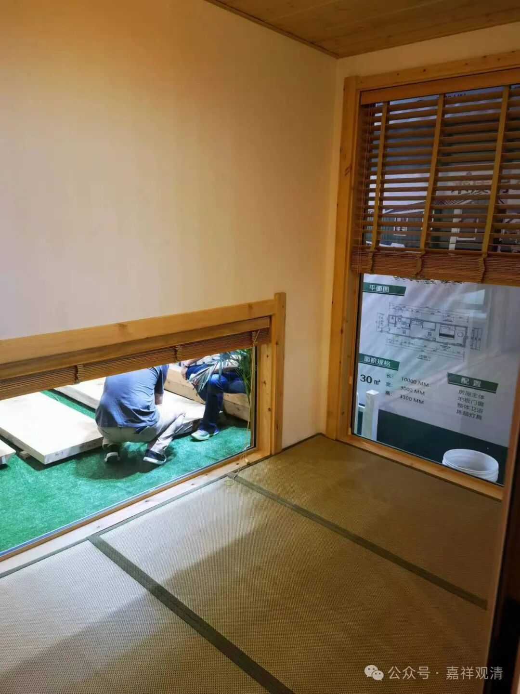
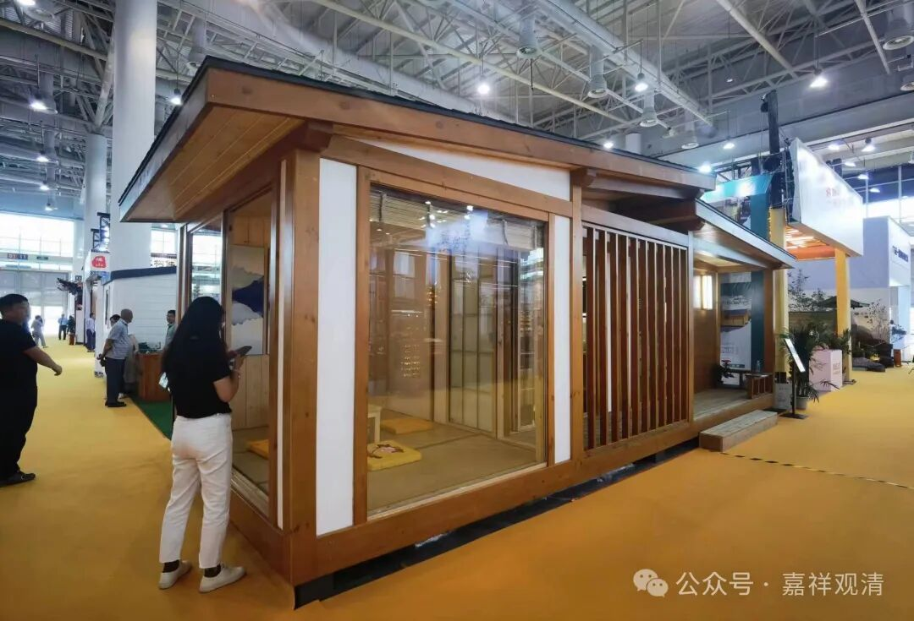

**禅意木屋**

这次佛展会，看到一个新的单元——禅意设计，好象是叫这个。占了整整两个厅。

我在谈铜钟价格的时候，我们中一个一起观展的法师逛“丢”了，后来发现了他的行李……原来他躲人家木屋里喝茶呢……

这个独立的木屋还真不错，介绍说是恒温恒湿，装修得很小资，进进出出很多观展的人都进来拍照。一问价格，38万！喔嚯！

后来和厂家喝茶，他们告诉我，这家是义乌的厂商，原来做大型家具的，现在也接做工程了……哦，怪不得家具都挺小资的呢，今天这叫“简中”，长在我的审美点上了。

走不多远还有一家禅意木屋的，木屋下面还带轱辘。厂家是东北的。其实这类木屋我一直很关心，以前师父在翠微寺就搞了42个茅棚，

实际就是类似的木屋，但主要装修风格用木头，实际还是水泥建筑，所以造价低。后来我一个师弟在滁州的寺院也做这种木屋，那就是差不多的预制的木房子了，地坪、上下水做好，工厂运来预制件直接就吊装了……但是看着就眼馋，觉得拿来做闭关房，合适。后来网上查，发现安徽和广东都有厂家。后来在琼海那个菜蔬园里也看到了，也是挺抓眼球的。

带轱辘的这家森林木屋的厂家是东北的，他们销售说着带来的展品就不想带走了，两套木屋，原价三十五万左右，说这里可以直接开走（可以挂在车后面运走）的话给20万。好多大和尚们都在问价，我也想，直接开回去，装上水电就能用了！

那谁怼我，预制板房一万一套不香吗……哈哈哈哈，也是。不过，工程队的预制板房，也太寒碜了吧

