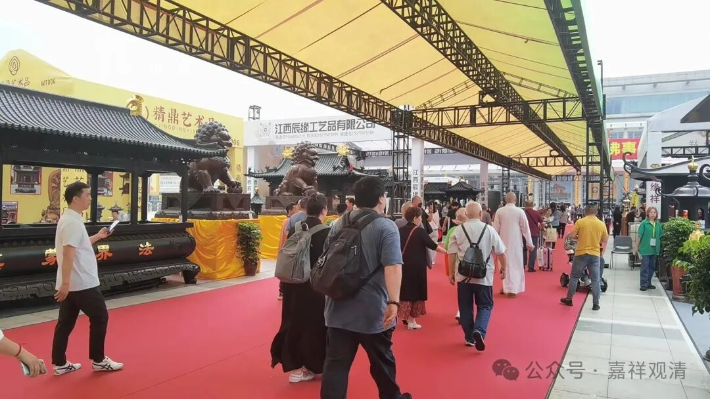

**佛展会上贪心起**

佛展会还有些东西我是挺喜欢的。

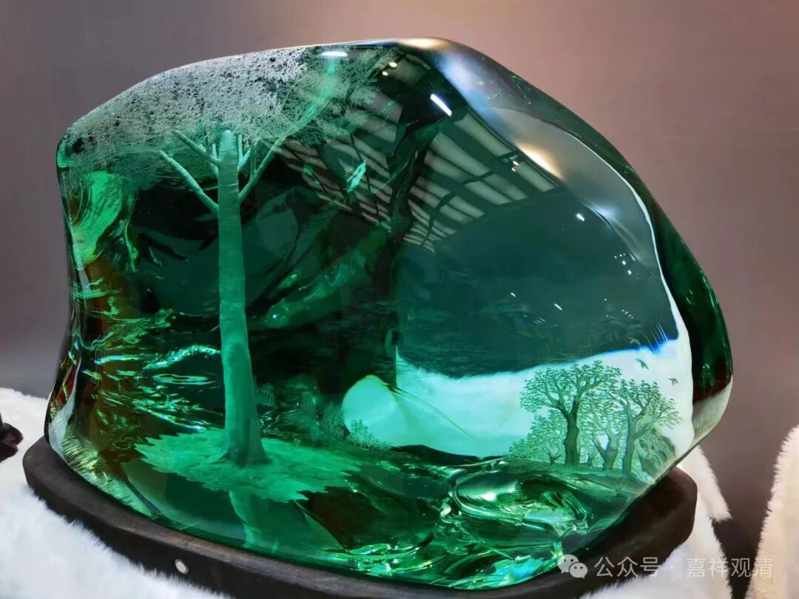

这东西是啥材质我不太清楚，每次都看到他们来展览，材料本身太吸引眼球了，但是，他家的人物雕工真的不行，看材料能给100分，看工匠-40分。所以就不放他的人物了。

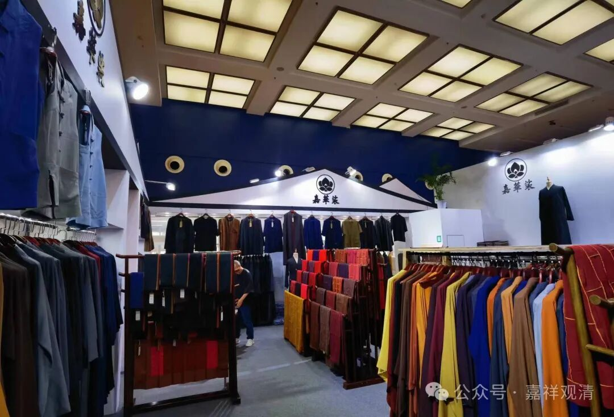

佛展会有卖衣服的，这次出来着急，大褂带了厚的没带薄的，咬牙在展会着急买了一件大褂，好贵啊！没办法，总不能五月份穿着棉袍在厦门逛吧。

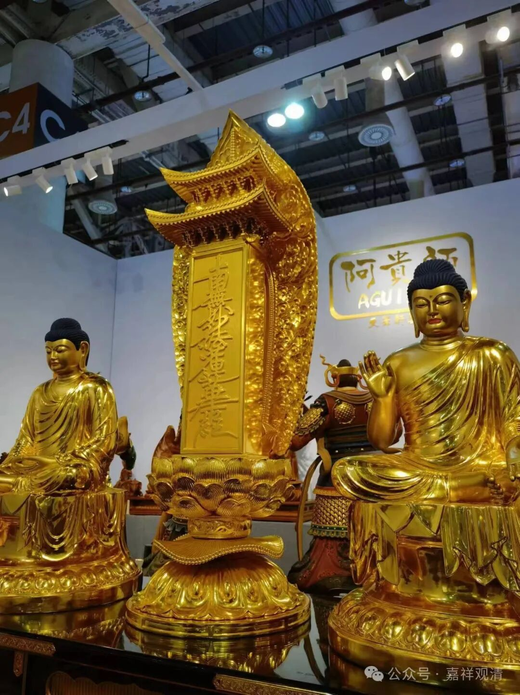

这是一个日本日莲宗系统的东西，“南无妙法莲华经”的“牌位”（？是这么说吗？）。我见过一个《水浒传》的版画插图里也有这个——武二祭拜他哥哥的时候，案上就是这个“南无妙法莲华经”的牌位。现在那张版画找不到了……以后要注意保存这些东西啊。（这东西厂家自己不知道是啥……）

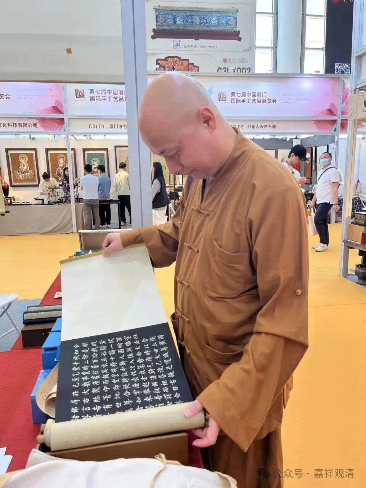

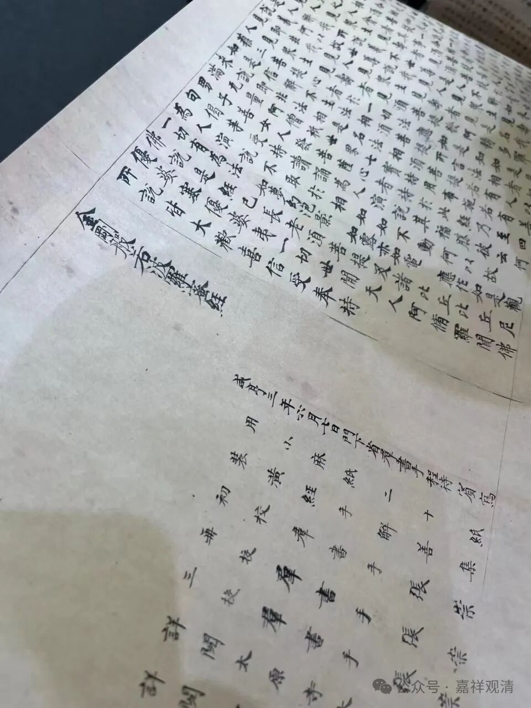

敦煌研究院也来佛展会摆摊儿了，还弄了俩摊位。这一件是敦煌写经的复制品。这件东西我应该写到过，校对的人里有唯识宗重要的几个人物，但他们在这卷写本里的信息现在佛教界、唯识界都还没有注意到。

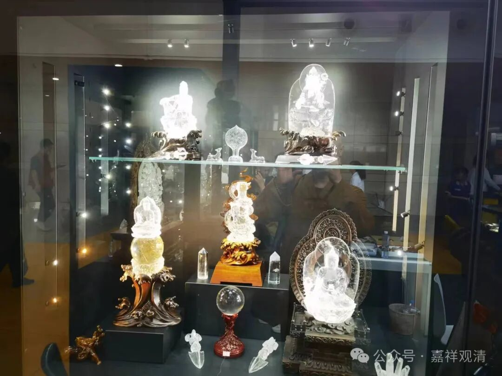

水晶佛像……太贵了。做工，依旧是没太打动我。

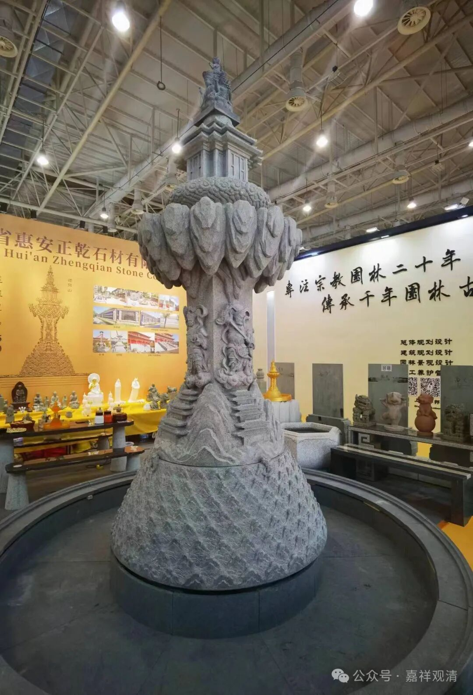

须弥山模型。现在石雕厂越来越专业了。这东西我考一起观展的几个法师，他们都一下子没反应过来这是“须弥山”模型。

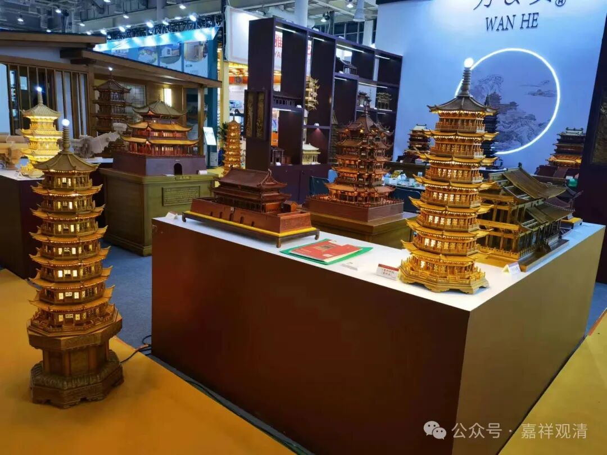

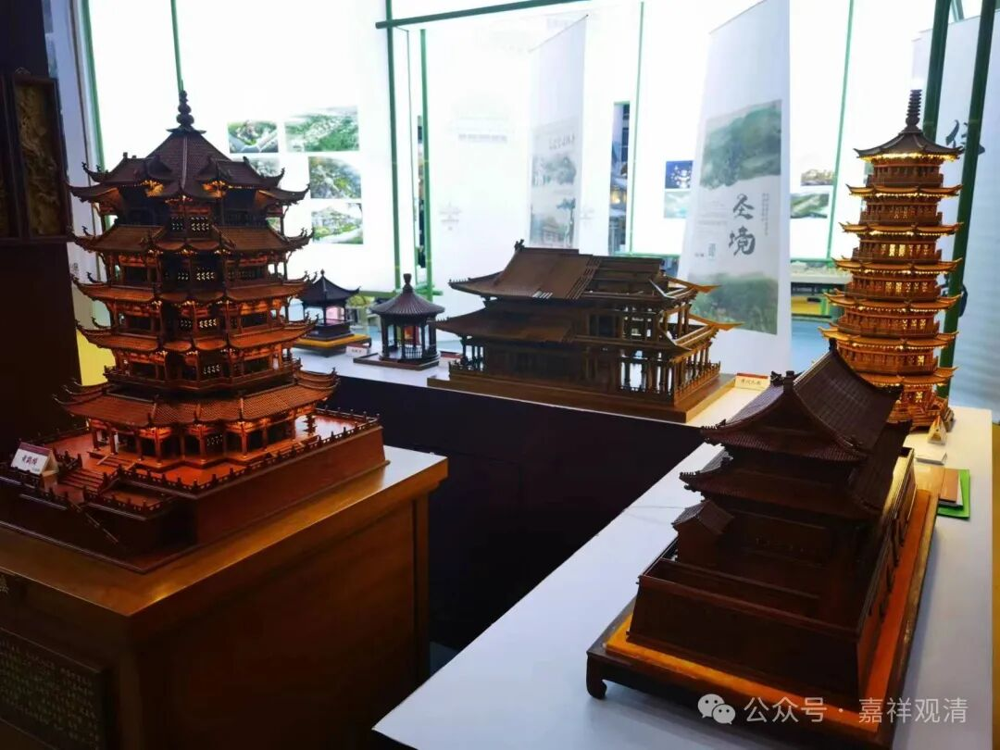

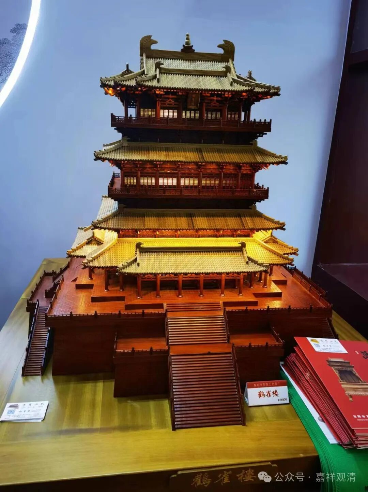

塔、楼的缩微模型。我一直想以后在庙里搞个展厅，把这些都搬过去展览……这算不算贪心、占有欲啊。

