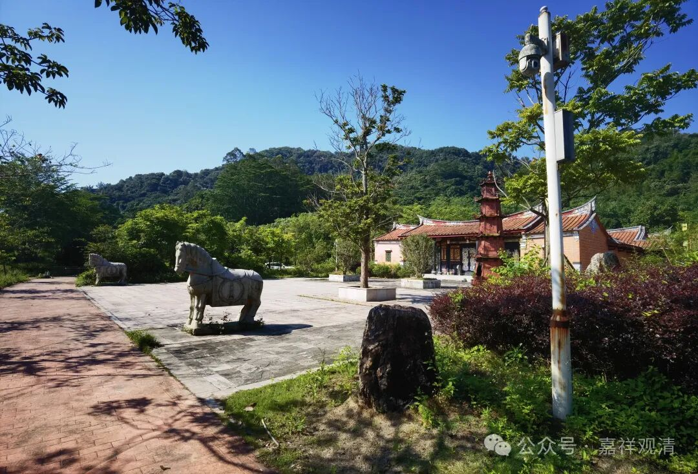
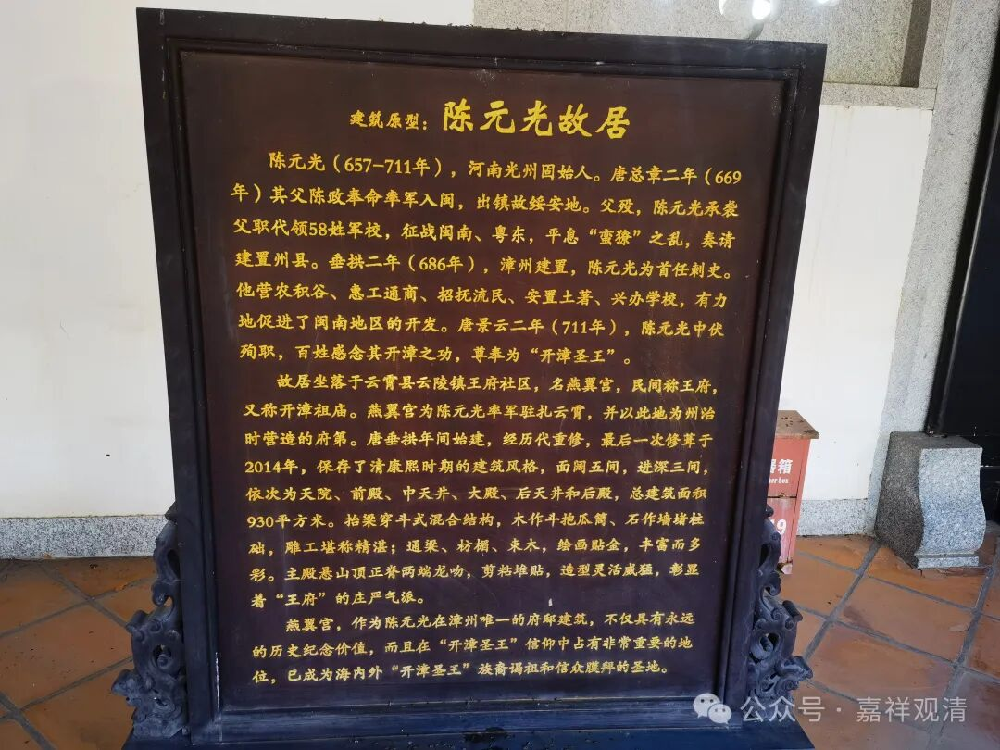
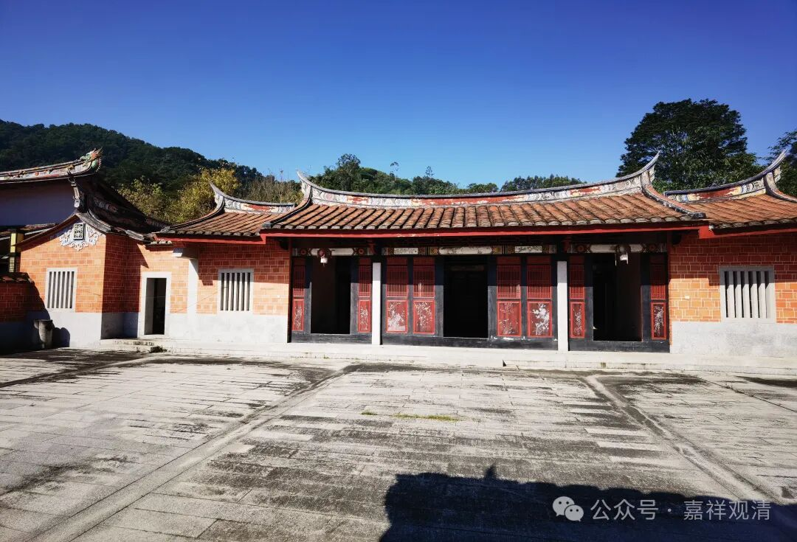
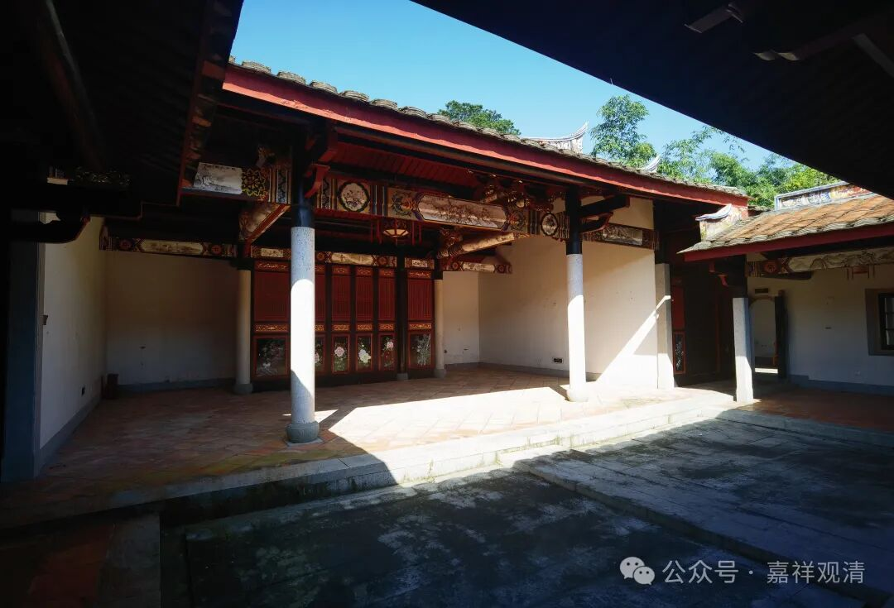
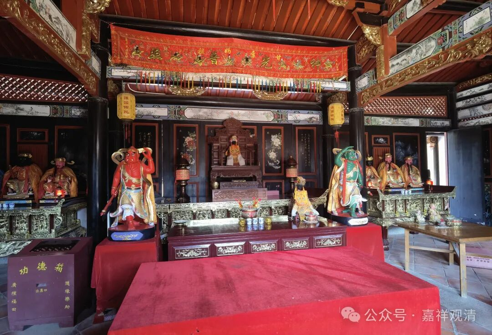
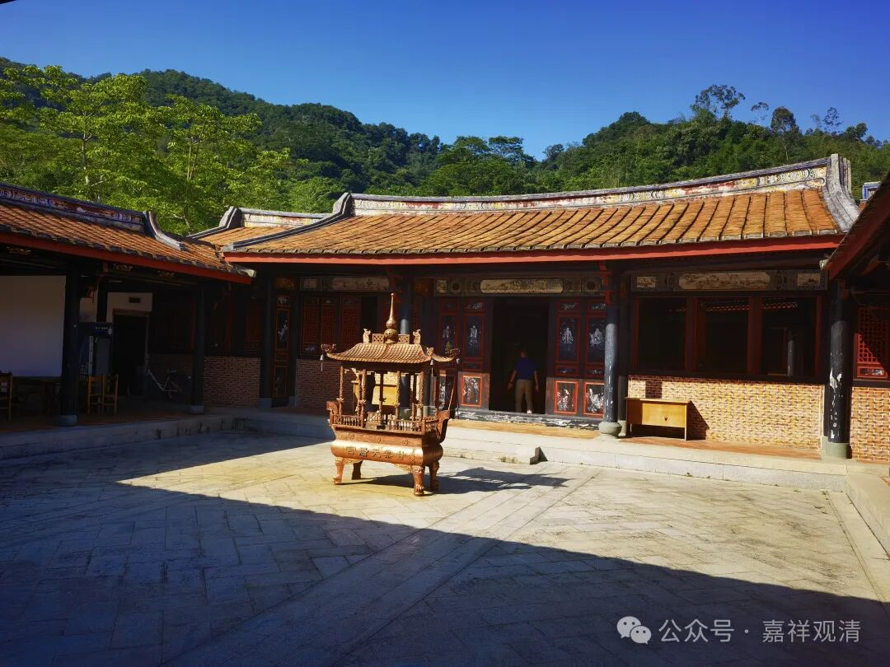
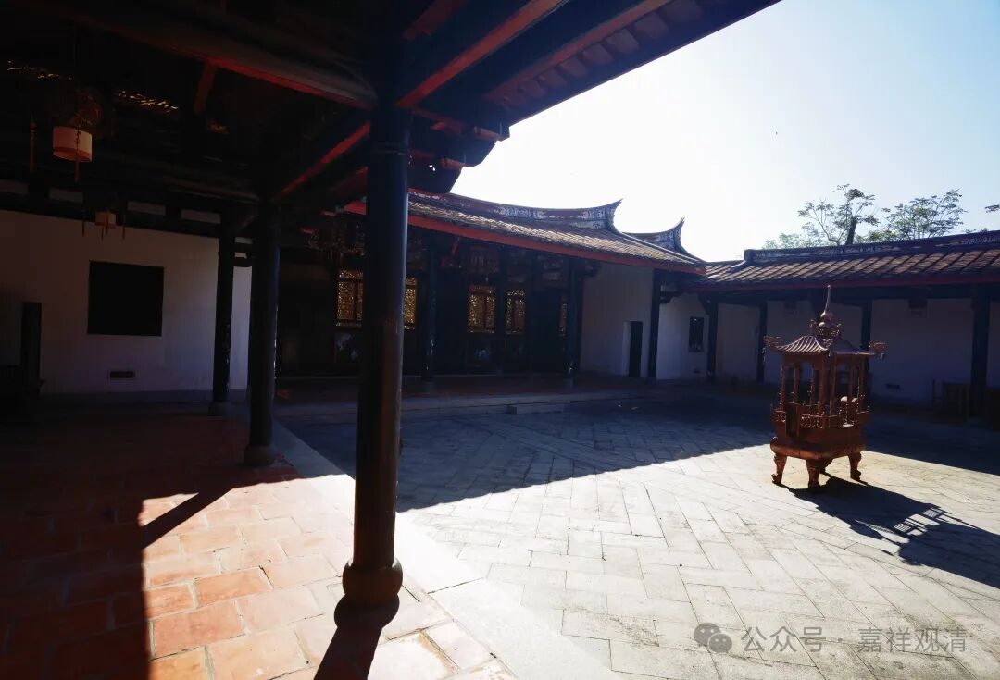
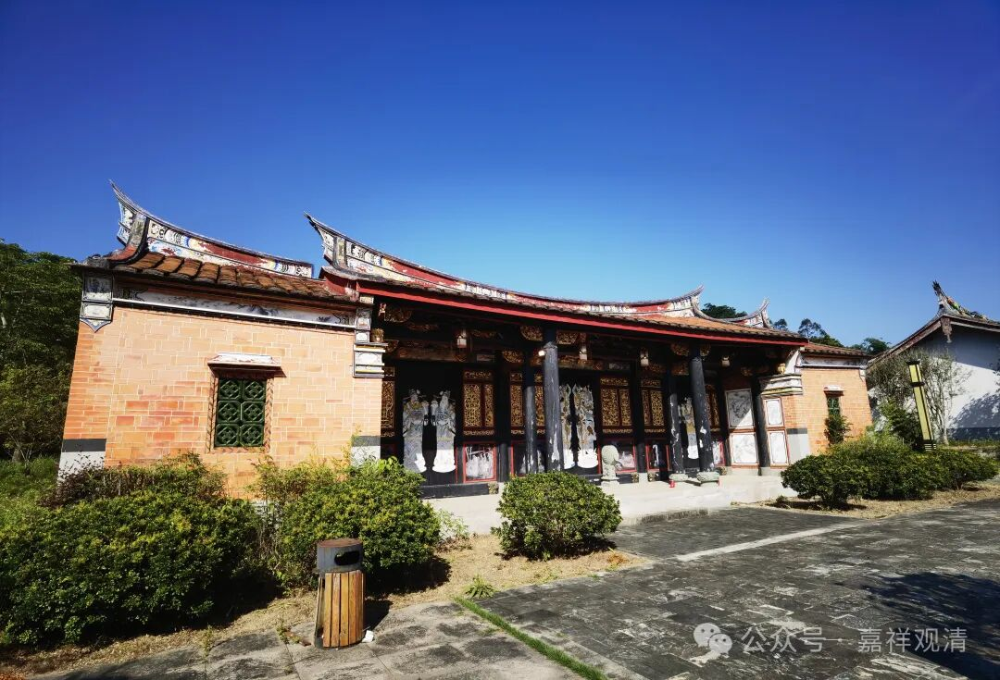
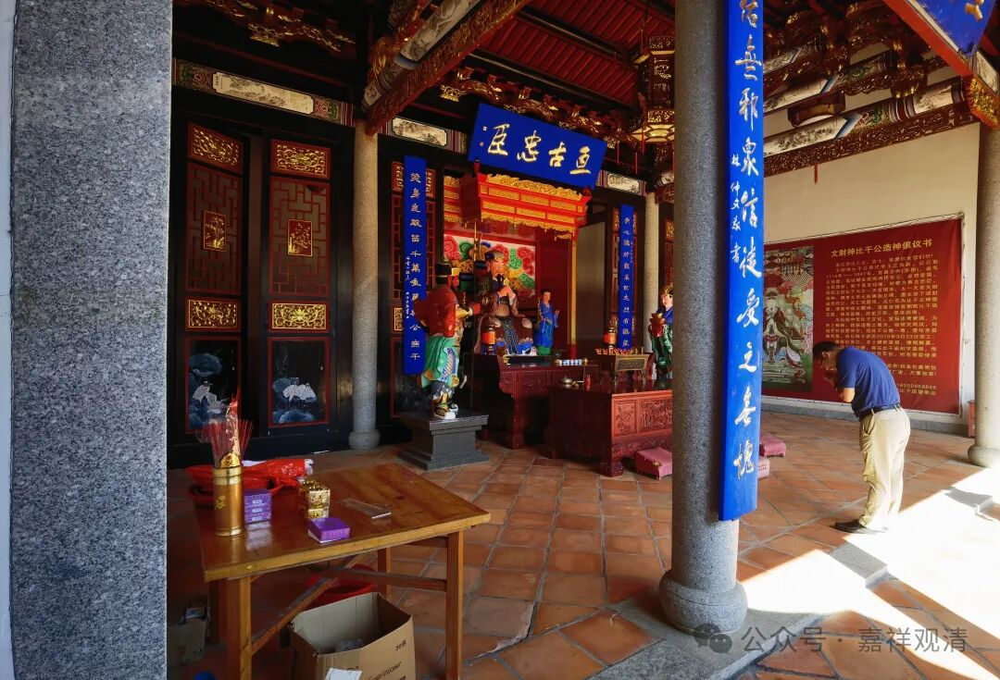
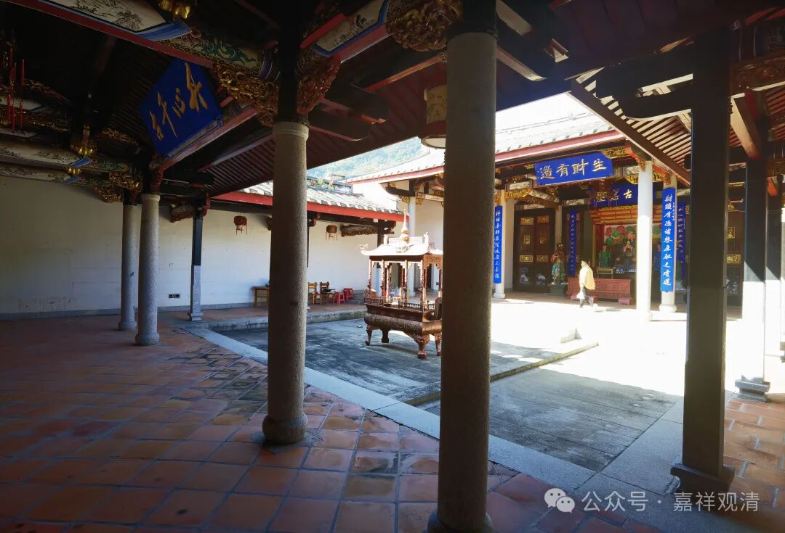

**开漳圣王·天后·比干庙**

在厦门参观佛展会之余，还去了几个周边漳州、泉州的寺院、村庙。

福建地方上的民间信仰是比较著名的，某种程度上，应该说“保存的比较好，破坏得比较少”。今年过年的那段时候，自媒体上比较火的“某神巡城”“某老爷巡境”就都是出自福建、潮汕地区的——潮汕在文化上更接近闽南的、客家的。

佛学院有个学生是福建的，从他那里我还知道，我以为只活在书里面的“三一教”，在他们老家的自然村里面还是活着的“准官方信仰”。

去了漳州的一个民间信仰点，那个地方现在是道教的活动场所，供奉着三位大神：开漳圣王陈元光、妈祖、比干。

开漳圣王陈元光是福建本地的信仰，陈元光原来是唐代第一任漳州刺史，开漳有功，殉职于任所……后被福建人尊为“开漳圣王”。漳州的这个开漳圣王的“王府”是仿福建云霄的燕翼宫（陈元光故居）而建的。

妈祖是宋代以后由民间而官方的（最初是福建本地）信仰，今天，妈祖庙、天后宫已经遍布东亚、东南亚沿海了，成为一个超越地区性的信仰核心了。有些地方的半官方调解室甚至也供奉着天后、妈祖，有些纠纷，到妈祖面前发誓就足以解决问题了，哈哈。我问过浙江某地的年轻渔民，他们说，原先他们这里并没有妈祖信仰，但看别人（渔民）都供，这些年他们也都供上了——哈哈。这还有从众心理呢。

比干则是当作财神来供奉的。以前，遍地的山西会馆成为了关公信仰的传播的推手，关公是山西人，而山西人做生意、开银号，渐渐地，关公也成了财神。不过这边还是以比干作为财神。比干为什么是财神啊？难道是没心（见《封神演义》）吗？

