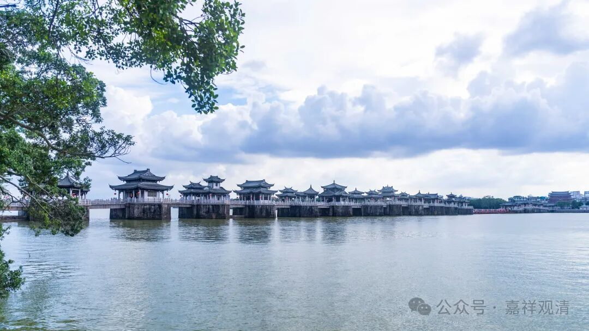

**《宗义略讲》004·019**

现在有部最重要的东西——“三世实有”，讲过了，这里我们也只能简单讲一下了……然后“蕴界处实有”也略略讲了点。实际上有部真的要想讲的话，也差不多是“一切法实有”，他这个“蕴界处实有”实际上说的是“一切法实有”。当然，什么是“一切法”呢？有部说是蕴界处，有的说（刹那论者）仅仅是“处”，《俱舍》说是“界、处”，其实也简单，界、处才是包括一切法的，“蕴不摄无为”嘛……

“一切法实有”当中，这个“一切法”还有一个分类，说又可以分两个，就是我们现在要讲的“世俗谛”和“胜义谛”。

“二谛”，这是我（也是中观师）经常比较关注的一个题目，世俗谛和胜义谛。但实际来说，宗义书这里对有部二谛的理解可能太理想化、太拔高了，有部的“二谛说”没有“二谛”在中观派里所有的核心地位，他只是顺带一说而已。宗义书的作者们对有部（其实除了中观自身，对其他宗派的学说，宗义书都有误解。哈哈，是不是太……）有误解。

我们说“活着”最重要，有部因为已经没有实际活着的传承师了，所以也就任人评说了……

活着！活下去！

有部当中各大论师其实对世俗谛和胜义谛也是各说各的，也就是他们认为这不重要，你有你的世俗谛、胜义谛，他有他的世俗谛、胜义谛……各说各的。

我们看一下原文吧——

《大毗婆沙论》卷七十七：

** “问：世俗、胜义，亦可施设各是一物不相杂耶？**

** 答：亦可施设。**

** （问：）其事云何？**

** （答：）尊者世友作如是说：能显名是世俗，所显法是胜义。**

** 复作是说：随顺世间所说名是世俗，随顺贤圣所说名是胜义。**

** 大德（法就）说曰：宣说有情、瓶、衣等事，不虚妄心所起言说是世俗谛；宣说缘性、缘起等理，不虚妄心所起言说是胜义谛。**

** 尊者达罗达多说曰：名自性是世俗——此是苦、集谛少分；义自性是胜义——此是苦、集谛少分，及余二谛、二无为。”**

这段文字大家看一看吧，我就不白话解释了。这里《婆沙》引来三个论师的四种解说——世友、法就、达罗达多。

《宗义书》是真的把《俱舍》当有部了，把《俱舍》的“二谛说”当成是有部的正义，《俱舍》的“二谛说”是可以理解为把“一切法”分为“二谛”，且二谛之间没有交集。

关于《俱舍论》的“一切法”分为“世俗”和“胜义”二谛的说法，《婆沙》卷七十七也提到了，但是说“世俗、胜义，亦可施设各是一物不相杂耶？答：亦可施设。”这是说：“能不能说世俗胜义二谛是各别独立、不相混杂的呢？回答：也可以这么说……”“亦可施设”，也可以这么说，表明这不是婆沙师所持的正义。

