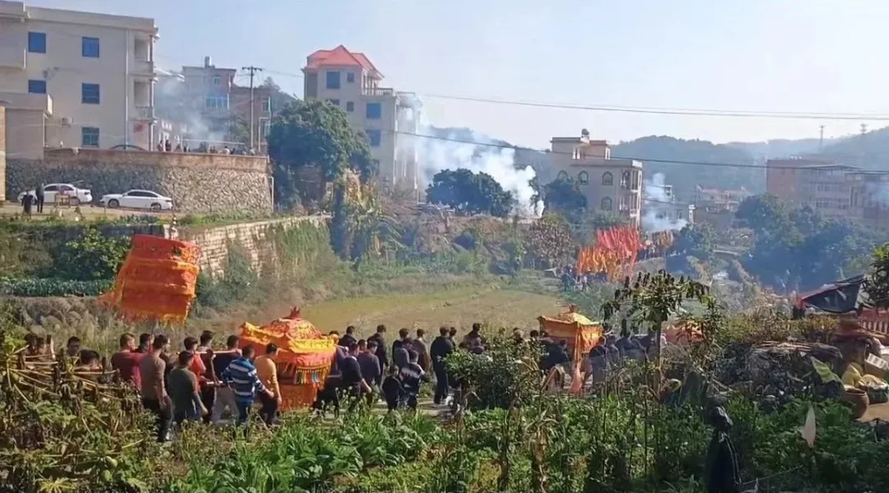
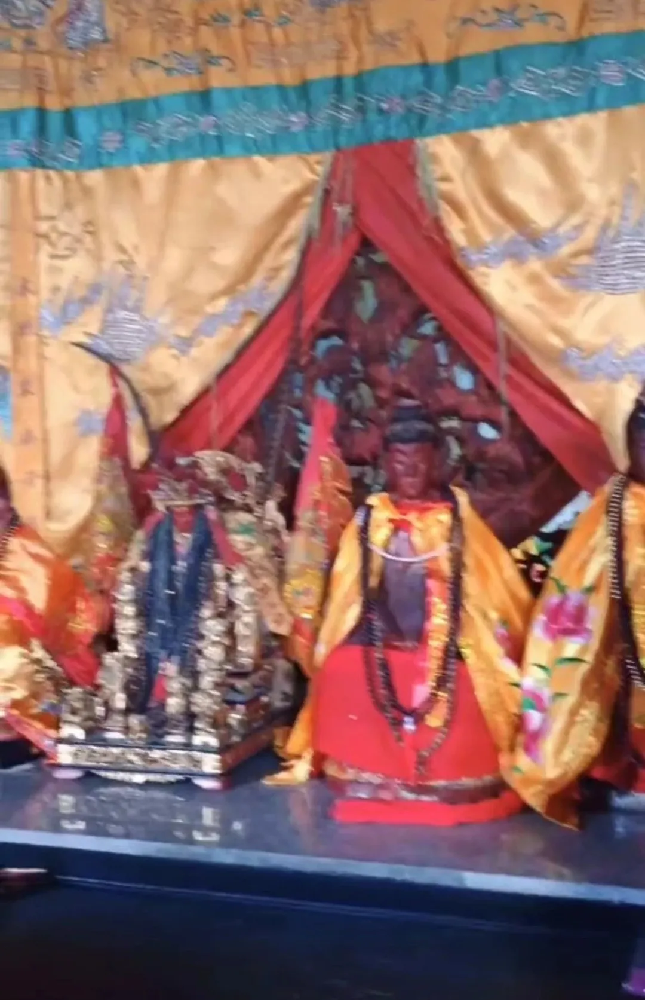

**观音菩萨和“大奶奶”**

抽空还又去了泉州的报恩寺。

县志里的报恩寺，叫“报慈寺”。后来成了村庙。解放前后从外地请了一个和尚过来管着，那和尚把亲戚（好象是侄子）带来就住在庙边上，现在那家人还在……

报恩寺也有闽南的民间信仰——山里有两个院子的“寺院”，有大雄宝殿、观音殿，村里还有一个殿。每年农历腊月二十三，要把村里供养的观音菩萨“请”回山上的庙里……等正月初四的时候，观音再被请出来“寻境”，被抬着到下面几个自然村走一圈。今年大年初四的时候我介绍过了。

“报恩寺”连带村里的“下院”，好像一共有三尊观音菩萨，当地的说法更民间，分别叫“大奶奶”“二奶奶”“三奶奶”……怎么看着都不像正统的佛教信仰，而是更贴近民间的那一套。

民间神灵的庙宇里经常会给地方神附带有“大奶奶”“二奶奶”“三奶奶”，潮州的“大老爷”是这样，上海金泽的杨震庙也是这样，“大奶奶”“二奶奶”“三奶奶”是附于其他地方神的。

这里的“大奶奶”“二奶奶”“三奶奶”被升格了，也许是历史上曾经有佛教僧人介入，“移风易俗”，把“大奶奶”“二奶奶”“三奶奶”一股脑儿改造成了在民间的观音信仰，也算是一种“礼下于野”吧……

