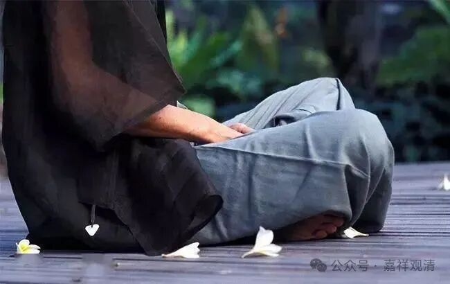
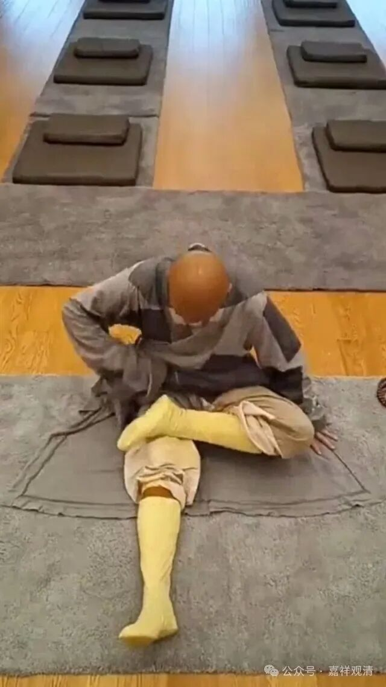

**一双腿子“五十亩地”**

晚期禅宗里面有个“破三关”的说法，所谓的“破初关、破重关、破牢关”，破初关又叫“破本参”，禅宗里还说起到：“不是菩萨不住山，不破本参不闭关”。众说纷纭，一贯的，禅宗里面的东西，没有像教下的那样有一个“客观”的标准，我很认识几个禅宗里面住山、闭关的人，但我也并不确定他们是不是都已经是菩萨、或者已经“破参”了。

对初学打坐的人而言，丛林里还有个说法，叫破“小三关”，这个说法一定更晚，至少不早于“三关”的说法，但是针对初学者的。

按照我师父的说法是，对初学禅修的人而言，有三个要突破的“关隘”：1、腿子；2、瞌睡；3、妄想。后面两个大致略等于一般所说的昏沉和掉举了。

禅宗很看重腿子，说，五堂功课是五十亩地，腿子是五十亩地，学会五堂功课，能够自如“打双盘”，就等于有了一百亩地（这里我们就按下这“一百亩地”不表了）。印度以外的人最初学禅修，最初的障碍就是“开垦”这五十亩地了。

其实单纯的“练腿子”很简单，就是拉韧带。这个拉韧带，童子功就很重要，我一个大学同学，韧带非常松，随便就可以双盘。老了再拉，怎么都不行了（我就不展开骨伤科教学了），但是类似练练瑜伽的相应动作就可以打开韧带……还是得提醒，不要瞎练，外行容易把韧带拉伤，找专业的教一下、带一下最好。我自己都算是专业的，也把自己韧带拉伤过。

昏沉关和妄想关，就需要对禅修内容的把握了。这个我在道次第相关昏沉、掉举的部分已经讲过，这里就不多讲了……

