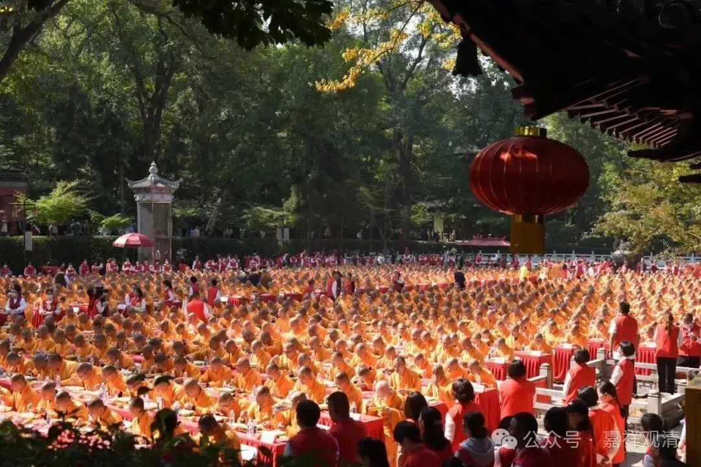

**关于高考的一个八卦**

明天又是一年高考的日子。

据说，有的小区入口还贴了对联：

“天王盖地虎，都考985，

宝塔镇河妖，全考211！”

有的包车送考，尾号985、211的抢手！

高考对中国家长来说太重要，太激烈了。

想起高考，我一直有一个八卦，那是整整二十年前了。

我师兄有一个新疆的居士，那年他们家孩子是第二年参加高考了。考前，居士给师兄打五千块钱，让他安排供千僧（一个人5块钱）……于是安排念经、供僧。

到发榜日子了，一家激动万分，考上了！马上打电话报喜，说是特别幸运——因为查分下来，发现计算机多算了他五分，那时候的技术，还改不了了。最后就靠这个五分，他过了投档线，顺利上岸。

哈哈，一家人乐疯了。亲自来寺院，再次供千僧，算是“谢谢大家”，哈哈。

那次我也在现场，大家都当一个特别有趣的八卦谈呢。后来每年高考的日子我都想起这个事儿。

好了，明天高考了，这里就祝考生们：

思维敏捷，考运顺畅，超常发挥，得偿所愿，金榜题名！

考得都会，蒙的都对！

身心健康，前程似锦！

        修改于