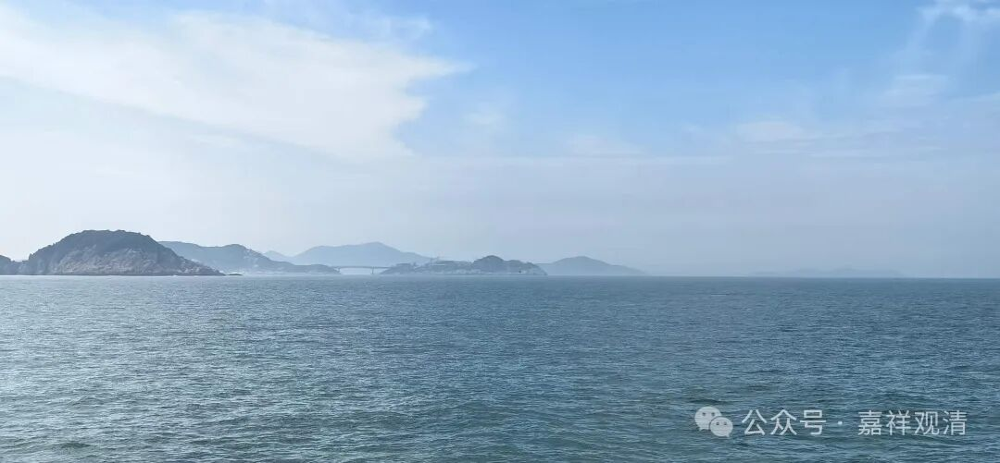

**再来普陀山**

好多年没来普陀山了……

疫情以来就有五年了，所以，感觉七八年没来过了。今年来，主要是因为师父。

师父圆寂了，有两个月了。火化后的骨灰，我们是兄弟商量，一部分要带来普陀山，撒到海里……

老师父当年因为全力负责建设寺院，用心太勤、太辛苦，有一段时间两眼近乎失明了。经过一定的治疗，又经推荐，说到普陀山朝拜可以有好处。于是，当年师兄就陪师父来朝拜了普陀山，朝拜梵音洞的时候，师父说看到了特别的光……这样眼睛就突然好了很多。后来又在沙滩上捡了几片“观音泪”，回去以后洗净，按传统的做法结合佛教的仪轨，把观音泪放到了眼睛里面（可能不太好理解，其实一看就懂）……后来视力就恢复很多了，戴着眼镜生活是不成问题了。

观音泪，中国古代的本草里也有收录，实际是蝾螺的口盖，古来就说有治疗眼病的功效。其实观音泪很多地方都有，海南我也捡到、收集很多，但传统上说起来是普陀山的“灵”。以前普陀山的出家人也传说这个有效，但实际知道的人并不多。

说远了……

这次和师兄一起过来，主要就是安排师父的这点后事，我们也不追求留什么舍利子，一切回归自然。以师父一生的修行，他自然不需要我们担心，也不需要我们攒着舍利子来加分。

……以后再来普陀山，还会带着一点特别的纪念

