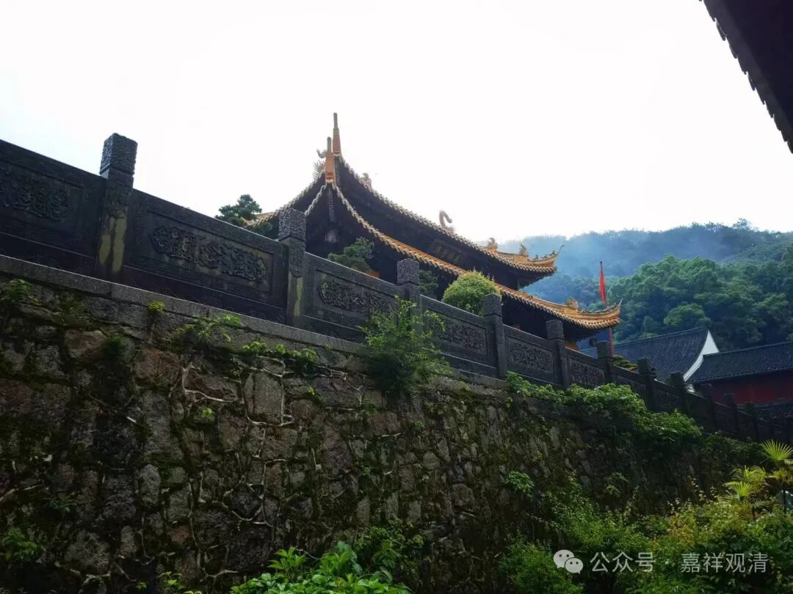
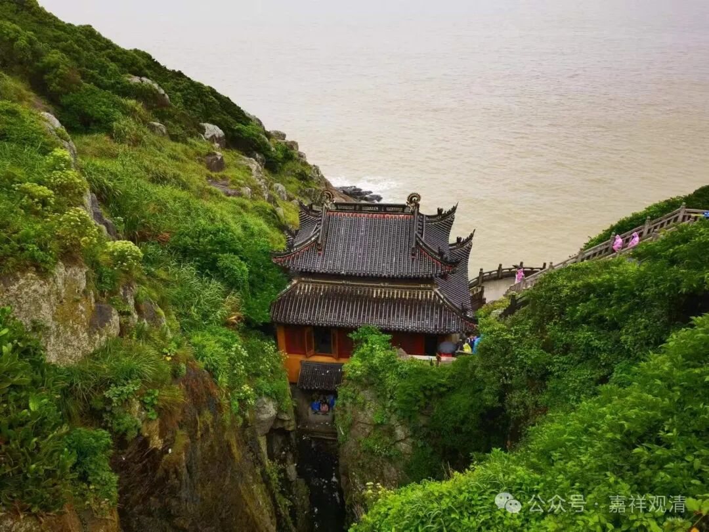
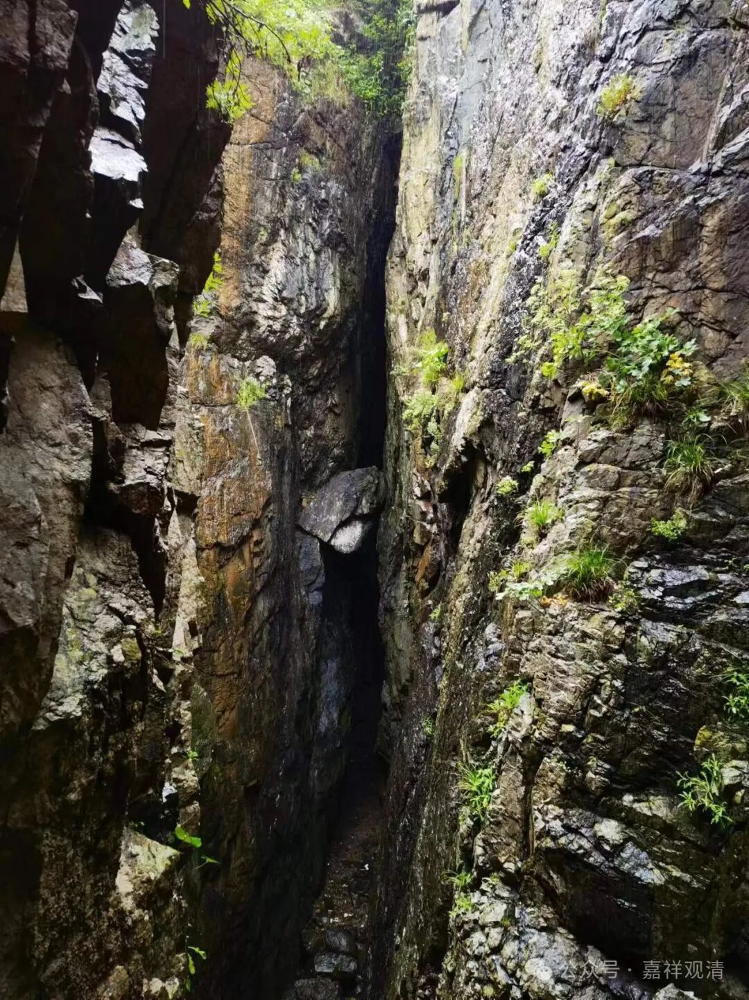
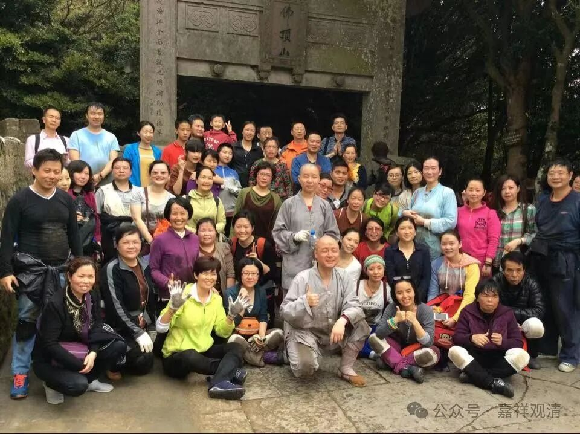

**普陀山·梵音洞**

一早去了梵音洞。今天的雨有点大，这不，刚喝了红糖姜茶……

梵音洞在普陀山一个相对比较偏的地方，来的人不算太多，以前更少。第一次上普陀山的时候，我还是大学生，那时候是纯靠脚力走过去的。从法雨寺走过去大概超过一个小时了，当时的路也没现在的好，走得口干舌燥。那时候路边还有几户居民，我去讨了口水喝，现在那几间屋子在盖新的旅游点了。

第一次来普陀山那是大二（大三？），刚献完血，拿着献血的补贴和挣来的假期，就上了普陀。那时候还是去上海十六铺码头上的船，夕发朝至，早上登的岛。

记得我买的是散席——起锚后要去广播室领草席，再在船上随便找个旮旯睡觉那种。好在咱有手艺——搭脉，船上号了几个脉，把那几个人的病情全都说准了，大家称“神了”！后来，他们几个挤挤，客气地硬是给我腾了张上铺出来……哈哈，谢了啊！

我上普陀山不下二十次了，来梵音洞大概只有五次左右，包括陪我师父来那次。师父说在梵音洞“看到了”，我也不知道看到什么。这次师兄说那次是“看到了光”。以前旅游的人没那么多，我们在梵音洞外面还丢了地藏宝瓶。

来普陀山，拜山有十几次了，前面很多次是带着弟子们从码头拜到佛顶山山顶的惠济寺，后来腰不好了，就改从法雨寺磕到佛顶山山顶。

今年十月中准备再来一次，还有报名的不？

