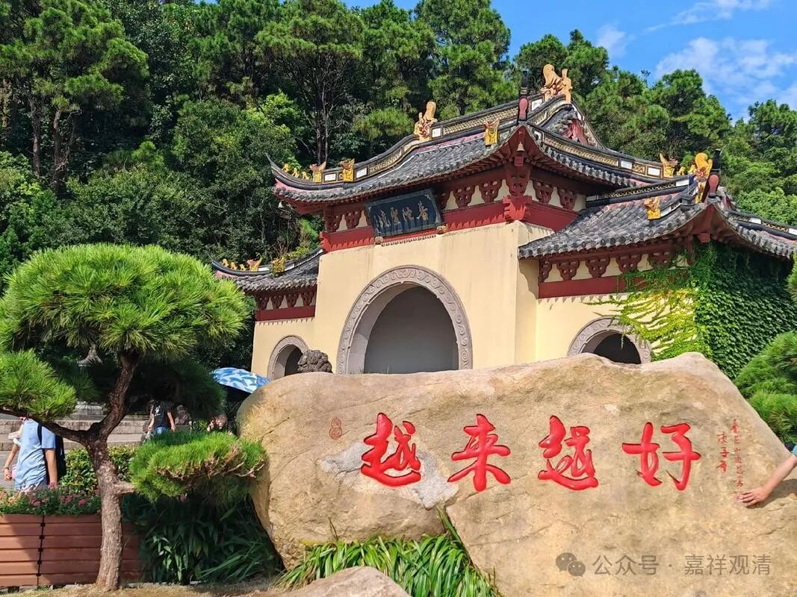

**《宗义略讲》004·028**

苦谛呢，简单讲，就是我们这世间周围，我们的环境，我们的身心，一切都是苦，这个苦，是我们烦恼的果，他这个苦和我们身心里面的“苦受”的意思不一样啊，苦受、乐受、舍受都是苦。苦受固然是苦，乐的本质也是苦，如果它的本质是乐，那它为什么在积累以后会变成苦了呢？……

这个苦谛是有其来源、有其原因的，那就是集谛。苦，是烦恼和业所造成的，基于烦恼而造业（也就是行为），由业而感果，这些果全都是苦谛——这里，烦恼和业是集谛。

如果苦就是真理本身，那也只能苦中作乐了——“苦就是人生”嘛！但是释迦佛说了，这个苦是可以解脱的，苦是可以灭的，这就是灭谛。解脱，就是解开束缚，就是free。有的人看中文的“解脱”看不懂，看到英文才反应过来，额，也行。现代人经常是英文比中文好可以理解。

然后，趋向于灭谛的方法，这个道路，就是道谛，五道是道谛，三十七道品是道谛，三主要道也可以理解为道谛。

（五道：资粮道、加行道、见道、修道、无学道。

三十七道品：

四念处：身、受、心、法；

四正勤：已生恶令断，未生恶令不生，未生善令生，已生善令增长；

四如意足：欲、勤、心、观；

五根：信、精进、念、定、慧根；

五力：信、精进、念、定、慧力；

七觉支：精进、喜、择法、轻安、舍、念、定；

八正道：正语、正业、正命，正精进、正见、正思维、正念、正定。

三主要道：出离心、菩提心、空正见。）

那么每一谛当中又分成四个行相（其实这个很机械啊），苦谛呢，无常、苦、空、无我；集谛呢，因、集、生、缘；灭谛呢，灭、静、妙、离；道谛呢，道、如、行、出。

四谛十六行相的行相是这个——“行相”，不是“形象”！

浙江某个寺院，建了一个塔，有一部电梯可以坐上楼。顶楼，一进去就是十六面“哈哈镜”，设计师骄傲地向我介绍——十六面镜子，你照出十六个形象，这就是代表“四谛十六形象”。我立刻苦笑着纠正，“四谛十六行相”的xingxiang不是你这个“形象”，是！行！相！

设计师落实了的误读，和尚居然没有监督、纠正，说明这庙里的和尚并不是那么有文化！

