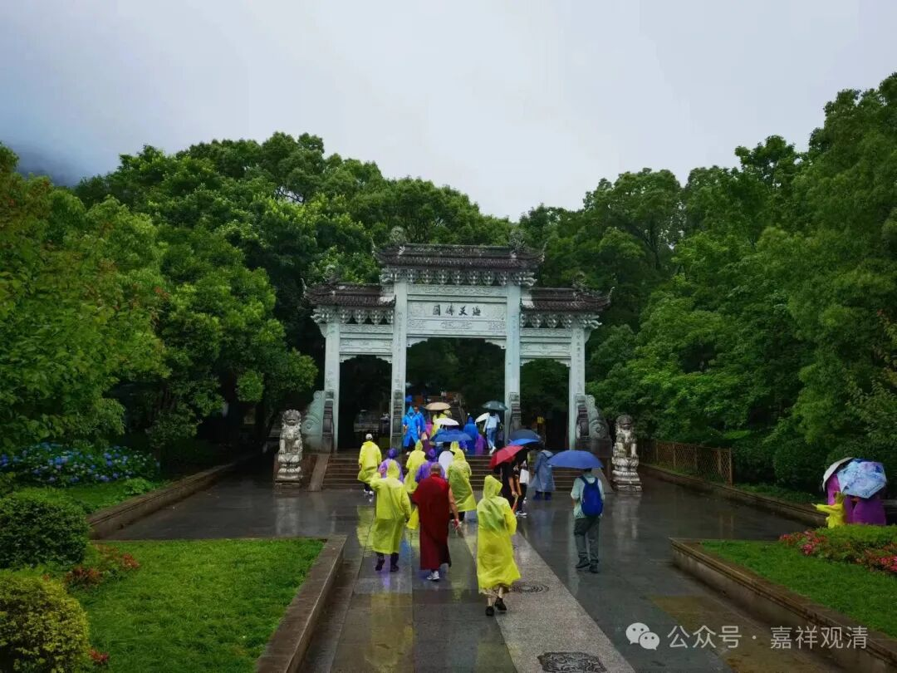
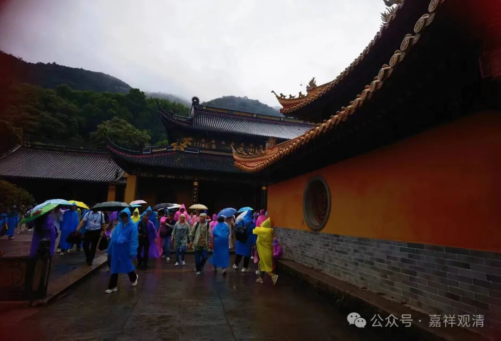
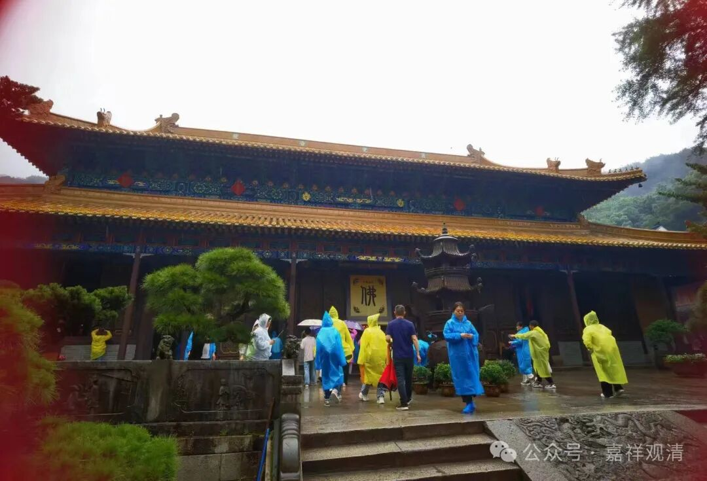
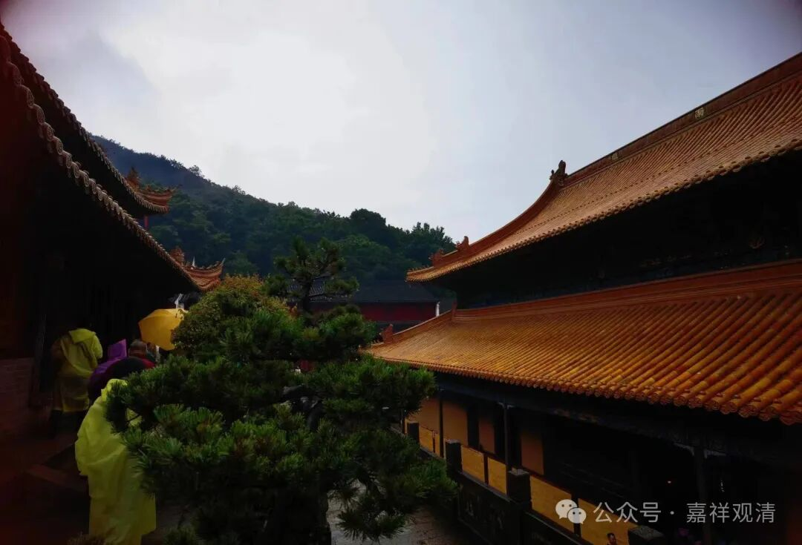
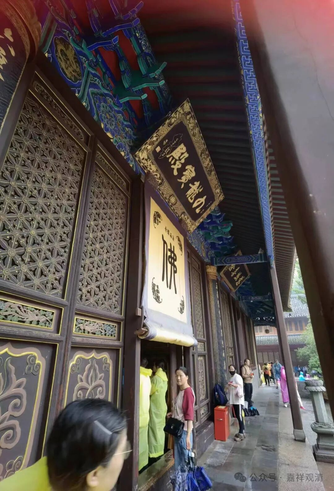
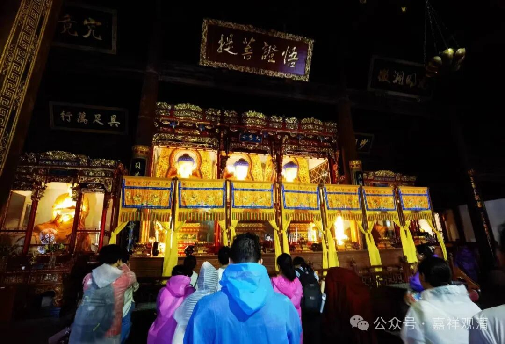
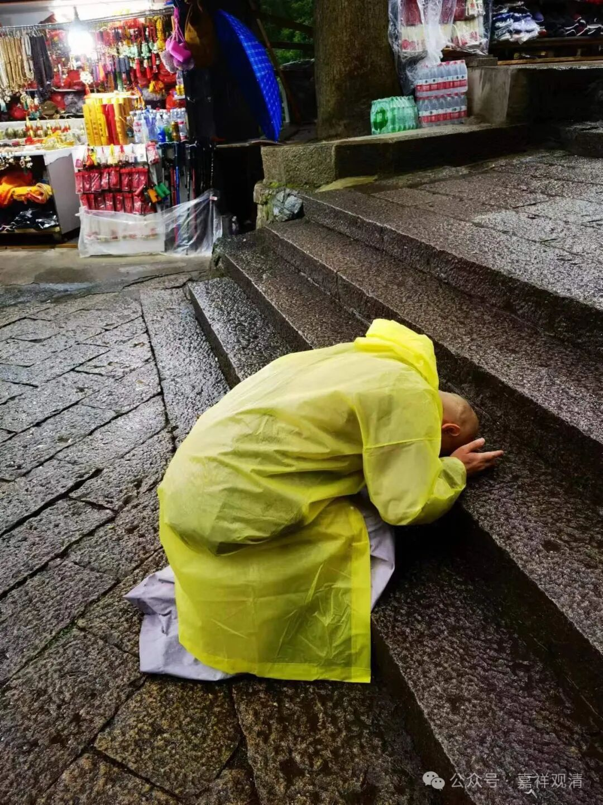

**法雨寺**

梵音洞出来，我们雨中去法雨寺拜拜。

民国前后，很多高僧和普陀山有关，太虚法师、印顺法师都出自普陀山，太虚法师好像就在法雨寺阅藏的。

以前我一个大学同学的父亲就在法雨寺协助当时的总方丈管理，相当于高级秘书。那个老居士很有文化，但根本不显露，他儿子甚至都不知道他爹学问有多高，甚至都不知道他父亲每天念什么功课，一直以为他父亲只会念佛……大学快毕业了才因为跟我们玩的关系知道他父亲很牛，他父亲这以后才准备给他讲一遍《现观庄严论》……

法雨寺有一尊玉佛，和上海的玉佛寺的两尊玉佛同源——当年（清末）三尊玉佛从缅甸运到上海，准备起运普陀山，后来设备等原因，只有一尊最小的上了船，两尊稍大的玉佛，后来由盛宣怀出面留在上海，后来又搬到江宁路安远路，就是今天的上海玉佛寺了。后来，上海的普陀区得名也和这个有关。

老的那尊缅甸玉佛这次看，不见了，换了一尊大很多的。能理解。

法雨寺有个九龙宝殿，是因为藻井上有九龙围绕。殿里供奉的是观音的报身相——正法明如来。

普陀山全山以前没有大雄宝殿，因为普陀山主供的是观音菩萨。法雨寺这里有唯一的大雄宝殿——释迦殿，“大雄”，这里指的是释迦牟尼佛。这几天法雨寺好像在念水陆。

法雨寺后门出来，就是我们“佛顶顶佛”的起点。十月份我们再来！

