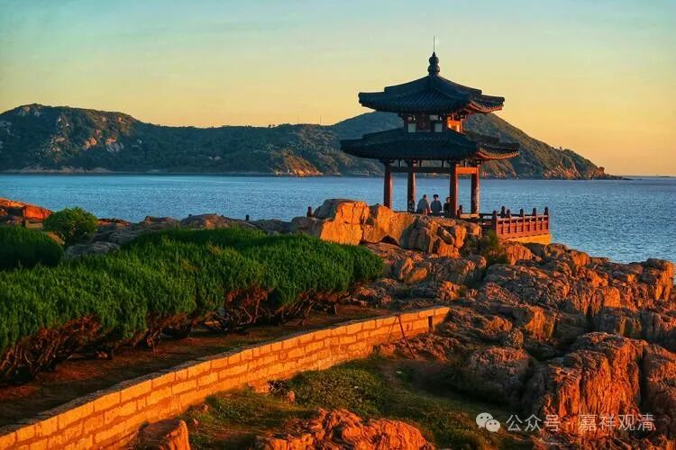

**真性有为空，如幻缘生故**

今天有人问起，给他找了清辨的《掌珍论》——

** “真性有为空，如幻缘生故；**

** 无为无有实，不起似空华。”**

……这样让我想起十几年前的事了。

那时候，某出家兄弟跟我一起住，聊到中观自续派，他说，他师父说“世俗谛上许有自性，这个观点，不论是直接还是间接都没法从自续派的书里面找到！”（他的意思是我们的教科书说自续派许“世俗谛有自性”没有依据。）

我当时就说：切，自己读书少，以为全世界都是文盲吗？！《掌珍论》开篇就说了“真性有为空，如幻缘生故；无为无有实，不起似空华。”这至少也是一个间接的证据了。（后来我又给他找了一些证据。）

《掌珍论》这段是立了两个比量——

“真性——

有为（前陈）空（宗），如幻（喻）缘生故（因）；

无为（前陈）无有实（宗），不起（因）似空华（喻）。”

这是说，在胜义谛（真性）上，有为法和无为法都无自性。

《掌珍论》自己解释说：

“故以‘真性’简别立宗。真义自体说名‘真性’，即胜义谛。就胜义谛立有为空，非就世俗。”

说这个“真性”就是胜义谛，放在这里做简别（“简别”的意思就是排除）用，排除了世俗谛。这个意思很明显了，胜义谛上“一切法（有为法+无为法）自性空”，世俗谛不然，也就是“世俗谛自性有”。呵呵，这不是很明显吗？！

清辨作为自续派的祖师，这一段还不具有代表性吗？！

