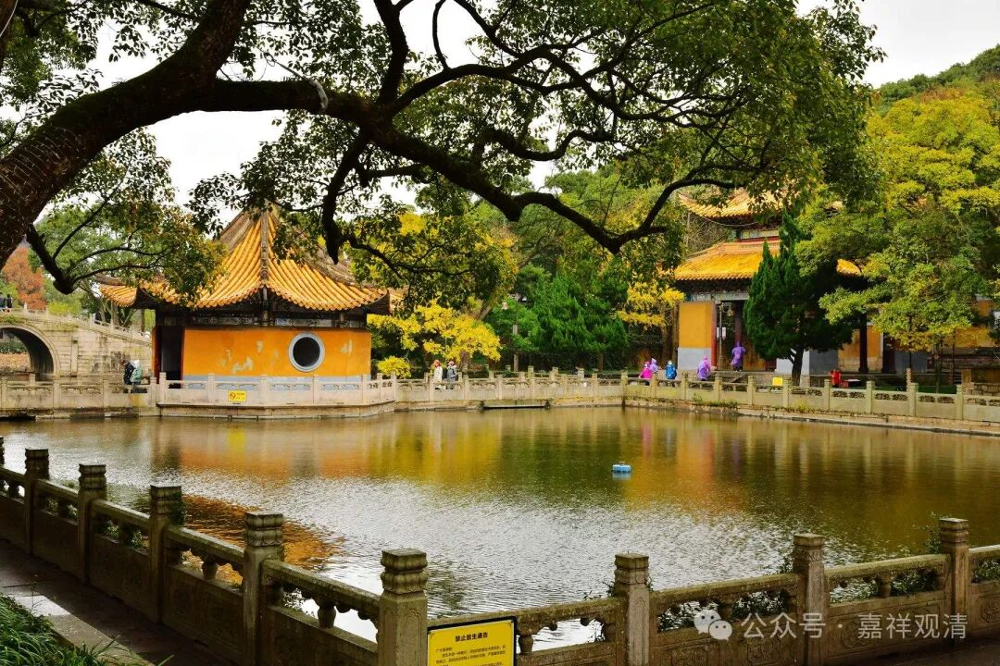

**《宗义略讲》004·029**

我们简单点，可以理解为是把苦谛当中分成四个部分，集谛当中分成四个部分……就这样，所以就不会有“在这四个以外会有其他东西”的情况出现了……我们说苦谛的无常、苦、空、无我，把这四个行相放在苦谛里面去，再把苦谛里面所有东西就一定放在这四个里面去，就行了。

“谛”的意思，真实，它的意思就是说，我们这里有四种真实，苦是真正的苦（苦谛）；业、烦恼是真正的苦的原因（集谛）；苦一定是可以断除、可以灭掉的（灭掉）；灭掉苦有这个方法（道谛）。这个“谛”的意思就是真实的意思，整个佛法就是围绕这个四谛来的嘛，《心经》也是提到“四谛”，“无苦、集、灭、道”（说四谛胜义无），是吧。

“许细分无我和补特伽罗细分无我是同一义”。

这个意思是什么呢？对有部师来说，传统上来说没有“法无我”的意思，所以只讲补特迦罗无我，所以对他来说，“无我”就是“补特迦罗无我”，没有那么复杂。这里的“粗”和“细”的问题是什么呢？实际这里“粗”的意思就是，“我承认你们宗派的那个‘无我’也是佛教里的‘无我’，但你理解的不够深，你是粗浅的，我是深细的。我说的是细分无我，你们宗派说的是细分无我……”

比如我们这里是五个部派，分别是：一、犊子部（正量部）；二、说一切有部；三、经量部；四、瑜伽行派；五、中观派。这五个部派，后后看前前，都是粗，自己，就是细。

比如说，以有部师看犊子——正量部，有部就是后，犊子部就是前；有部师认为自己的无我的主张就是“细分无我”，犊子部的无我主张就是“粗分无我”。他的意思是什么呢？“你的‘无我’嘛，我也不能说你这不是佛教，你说的也是‘无我’，先承认你这也是佛教，但是你这个‘无我’是‘粗分的无我’，我的‘无我’才是‘细分的无我’，也就是说，你的不那么对，我的比你更对，而且只有我的才是究竟正确的”。

那么经部师呢，他又会说，“你们两个（犊子部和有部）说的都是粗分无我，我主张的无我才是细分无我！”……乃至后后看前前都是如此，中观师认为唯识宗也只是通达了粗分的补特迦罗无我和粗分的法无我。

