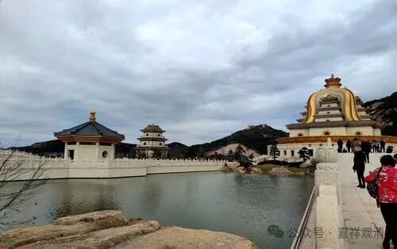

**《宗义略讲》004·030**

那犊子部怎么办呢，（教科书里）没有比他更低的宗派了，那他的对手就是外道了，他也就不分“粗”“细”的补特迦罗无我了，甚至，他还认为补特迦罗实有呢——他立“非即蕴非离蕴”的补特迦罗实有。

“** 而由‘补特伽罗独立实物有’空**”。

就是“独立实有”的补特伽罗没有。这个“独立实有”是“独立”且“实有”——单独的存在。

有部的实有法当中，它的“蕴、界、处”当中，它的“五位七十五法”（我们就泛泛跟着大众这么说了，其实不止七十五法）当中，没有单独成立一个“补特伽罗”的——他分析了那么多东西，成立了那么多，就是不能成立补特伽罗，所以对它来说，“补特伽罗独立实物有空”很简单，因为“独立实有”的“补特迦罗”在他的“一切法”里面是找不到的——它的独立实有的法就这些，你在里面找不到一个补特伽罗。

在我们中观看来，实际上他就是故意回避“实有的补特迦罗作为轮回的主体”，它其实后门还是把“轮回的主体”给拉进来了。是谁在轮回呢？你轮回的主体是谁呢？“不失法”（正量部）、“得”、“命根”、“异生性”（某些有部的分支用这些来“承担”轮回主体的问题）……其实他从后门又拉了一些东西进来。

比如说这个“得”，对他来说是在“七十五法”里面的，是实有的，因为这个“得”而有轮回的，他就说这个是实有的，是轮回的主体嘛，对吧。这个“得”，他是心不相应行法，又是实有的，然后还是轮回靠他的……

正式安立的“补特伽罗”，他不敢说那个词，因为释迦佛讲经的时候明确说“无我”，说“诸法无我”，大家都知道佛教的“无我”观念很重要，但又认为轮回不能没有一个承载者，于是在“诸法无我”的“诸”字上做文章。

在中观派看来，这个“诸法无我”的“诸”就是“一切”，但是其他宗派还是要给“轮回的主体”开个后门，他们认为，如果没有这个承载者，那“假使百千劫，所作业不亡，因缘会遇时，果报还自受”又怎么理解呢？有部师也是这样，他们也想办法要找到这个——这个东西他必须实有，必须存在，但他决不能是“补特迦罗”！（单纯给一个“补特迦罗”的名字他们是可以接受的。）

不敢想象“无我”，是人性真实的反应。

