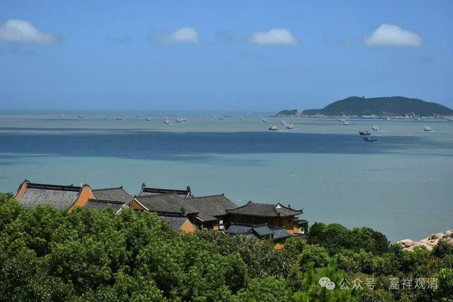
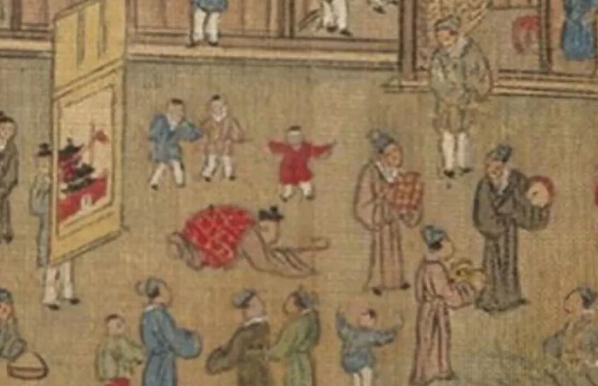
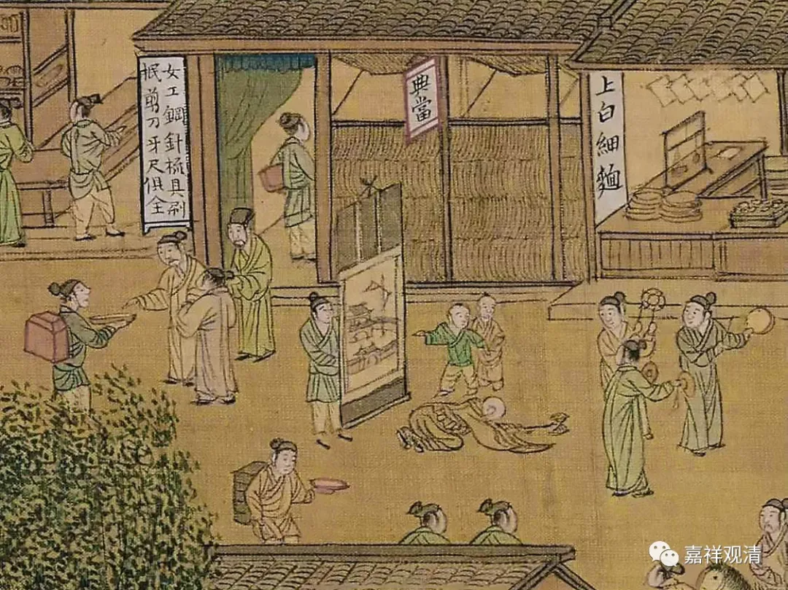
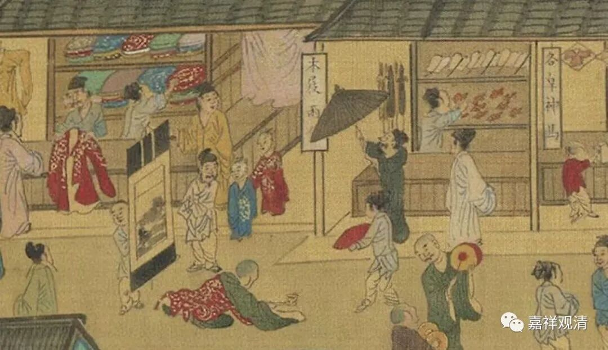

**三步一拜上普陀**

去普陀山“三步一拜”拜山的活动，我们已经搞过十几次了。

最早，大概有七八次吧，都是全程：从上岛码头对面的亭子开始，经过普济寺、法雨寺，一直到佛顶山的惠济禅寺。一般用一天半的时间，第一天从码头到法雨寺（大概要到晚上七八点），第二天从法雨寺到普济寺。（这个早上八点的话，二、三个小时就到了。）

后来，大家都老了，换个轻松的入门级的拜山了——仅仅从法雨寺的后门开始磕头，三步一拜，一直到佛顶山的山顶。疫情前，19年那次最快，仅用了一个半小时。不过那次人不多，人多的话，要照顾队尾的人，整体的速度会变慢。

其中，还有一次单独从码头往南海观音方向，一直磕到南海观音那个观音像前。

此外，我们去五台山也搞过两三次拜山的活动（我记得不止两次），那是从山脚下的智慧路一路上去，到黛螺顶。这段路相对轻松很多，因为台阶高，拜山不太费力。（全部五台都三步一拜那种……咱也是实在不敢想。）

以前在黄山翠微寺，那拜山也有好多次了，五次肯定不止了。相比较普陀山的“全程”，那是轻松多了。今年翠微寺不知道还有没有“华严七”，还有没有传统的拜山活动。

今年十月中，准备再来一回。谁想挑战一下自己？！

