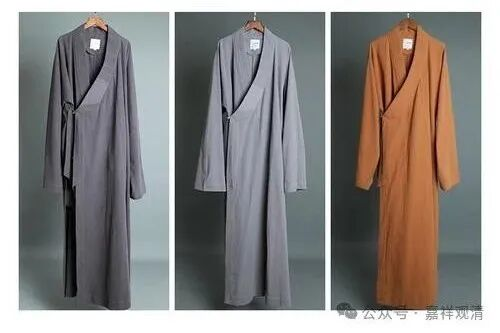

**给大师买一套僧服**

今天，要给某大师买一套短褂、一件大褂。

大师虽然不是我见过最胖的僧人，但绝对属于“号外”型的，（我见过最胖的是个上海的和尚，胖得面目狰狞……）曾经有我两个那么重。（当然现在我也，咳咳……）

简单，这种事情就得上淘宝。

满以为是很轻松的事，没想到……

第一家，“要足够肥的大褂！……”僧服厂回复！“（我们现有的号码他）穿不了。没有这个尺码！”

第二家……“均码里边最最大号的也不行！最大的只有45号！”哦，我42号。以他和我的对比来看……嗯（挠头），那确实不行！

看来只有定做了！说是定做要一两个月，一问价格，倒也不贵，而且非常浪漫——520元。

问了某大师，大师也笑了，报上自己的身高体重、腰围——身高175公分，腰围三尺五，体重250斤。（这还是上半年减肥过了的结果。）

厂家回复：定做了不能退！按43码的放大，腰围按传统放大八寸，就是四尺三；胸围算三尺五。土黄色。

OK了！

我跟某大师说：“你就是个桶型啊！上下一样粗”

