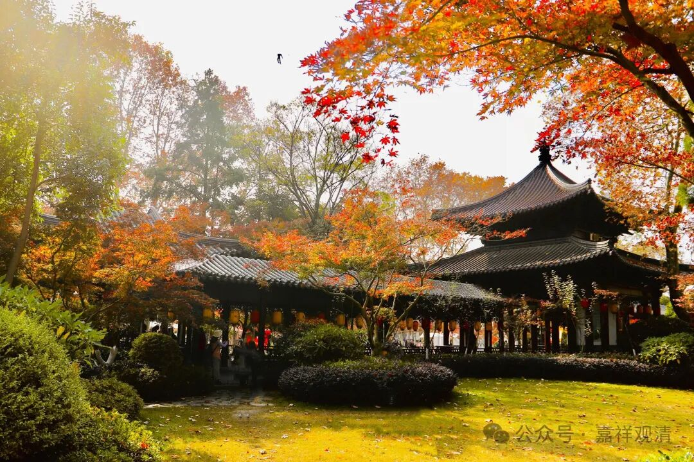

**“观待于他”——历史潮流中的三论宗**

假如我们把“三论宗”从“中国佛教史”里面单独抽离出来，再看他和中国其他宗派的互动，大概可以读出点新东西。

鸠摩罗什的引进、介绍中观学是“以我为主”，也对此前“般若学”的“各自表述”做了总结，他基本没有对“般若学”以外的中国佛教给予太多回应，但是表现为排斥有部（毗昙），扶助经部（成实）的立场，对唯识，尚未给予太多回应。行持上，扶律、谈禅也都是应有之义……罗什带来的印度佛教还是很全面的，包括了大小乘，只是在弘扬大乘（特别是对中观学）更用力一些。

摄山时期（以吉藏为下限）的三论宗，禅师的气质和论师的气质是被同等重视的，这几代大师明确破毗昙、抑成实，拥抱天台，并开始指摘唯识，和禅宗一系开始有了数次交流、接触，但彼此泾渭分明。他因在（南方）政治经济中心（建邺）而兴，又因赴（北方）政治经济中心（长安）而衰。（所以，还是要护好自己的基本盘啊！）

牛头禅时期（回到南方基本盘），禅师的风格开始抬头，经论的研习在其宗派发展过程中的实际配比开始急剧下降。这时候牛头和天台（虽然在传播地域上重合）也开始拉开距离，和北宗禅系统几乎全无交流，后期和马祖道一、石头希迁系统的南宗禅往来甚密。此时尚依于律寺而存在，但和唯识已经全无交流了。

后期的牛头——径山系，自身的特质几乎被扫光，慢慢地被南宗禅同化，仅成为一个略带地方性的“禅宗”了。

临时码的字，想说的是，在“潮流”、“学术热点”下的三论宗。以后可以继续完善这部分。

