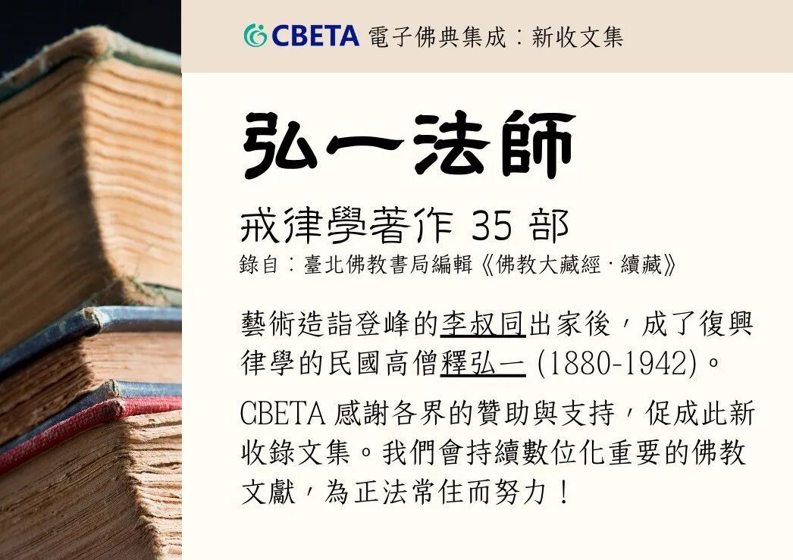
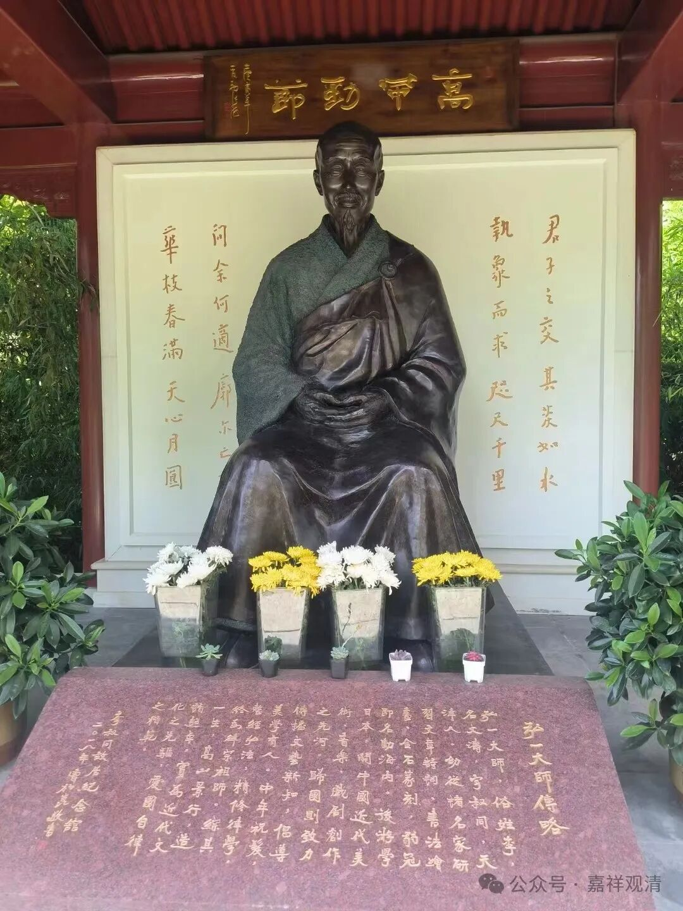
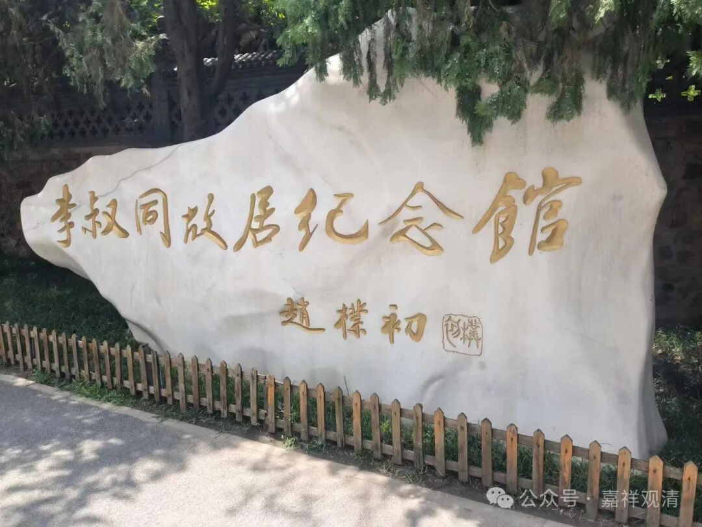
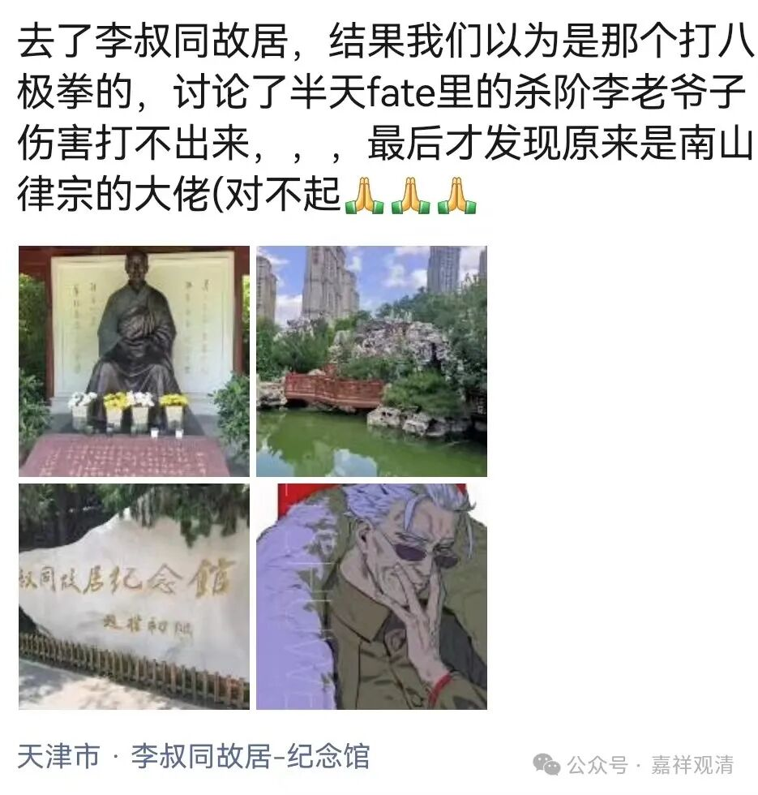
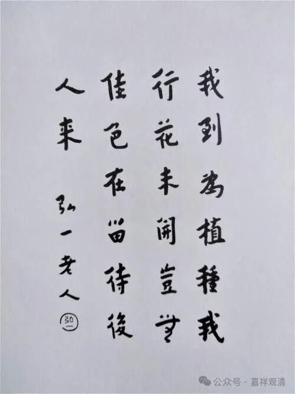

**被遗忘的弘一法师**

Cbeta今天上线了弘一法师戒律文献35部。真是非常随喜cebta团队一贯地摸摸在做这种基础工作。辛苦了。

刚学佛时，弘一法师的名字就经常被看到……他的事迹我也不用多讲了。有很多的传记和传说。

弘一法师离开我们还没有一百年，但感觉他已经快被遗忘了。

前两天一个刚认识的学佛的兄弟去天津，专门拜访了“李叔同故居”，但是，乌龙了……实际他心里以为这里是“神枪李书文”的故居，属于错拜了码头。可能因为八极拳背景的“神枪李书文”又叫“李同臣”，又是“李”又是“书”又是“同”的，给搞混了。

另一个现在已经“晋升”某团体大佬之一了。当年跟她提及弘一法师时，看到了一脸的茫然……给她介绍完，人家回了一句“我只要知道我的师就可以了”，呃，无知而拒绝新知，又标榜自己是学智慧的，这是我们这种人很难理解的“境界”。

我并不是说学佛的人必须知道弘一法师，只是在感慨历史推进的速度……

“** 我到为植种，我行花未开；
**

** 岂无佳色在，留待后人来！**”

还是感谢cbeta团队，感谢他们做着最辛苦、最基础的工作

        修改于