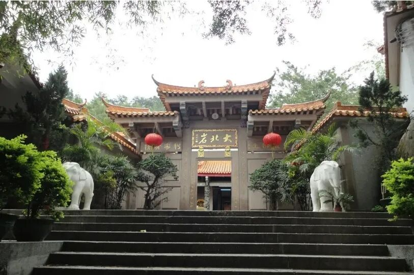
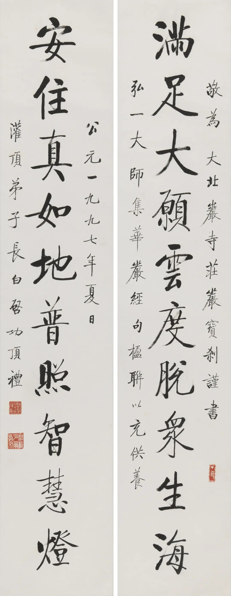
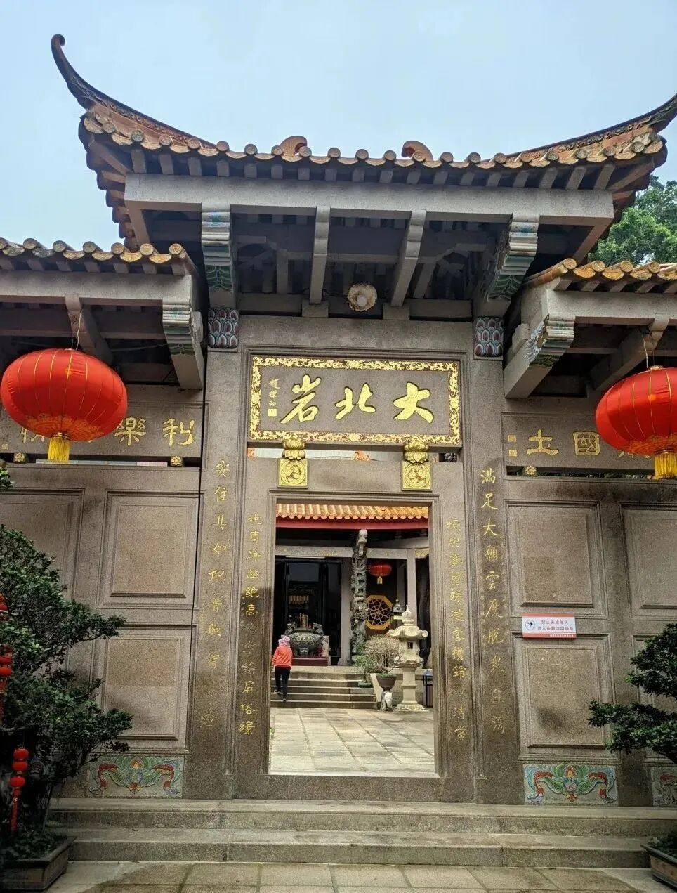
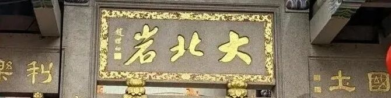
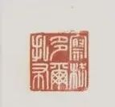

**寺院流出的启功书法**

“开拍”今年春拍又有古籍拍卖。去年他们做了一次古籍专场，据说是他们的第一次，看来去年成绩不错，今年继续……

看到这次的春拍，开拍征集到一件启功先生给寺院书写的“华严集联”。

** “满足大愿云，度脱众生海；**

** 安住真如地，普照智慧灯。”**

对联的文字出弘一法师的《华严集联》，也可以说出自《华严经》。

这一幅对联，原来是汕头的潮阳大北岩（寺）的老住持心印法师请启功先生写的，镌刻在门廊两边。

寺名“大北岩”是赵朴老的笔迹。“大北岩”就是寺名了，福建、潮汕很多寺院就叫“某某岩”，我记得就去过“悟道岩”“仙峰岩”“海月岩”……

心印老法师2010年圆寂……这以后不知道因为什么情况，寺院里的这幅启功老的书法就流了出来，被征集到了，出现在了拍卖场。

启功老先生此联有一方印——“察格多尔扎布”，这是他师父——当年雍和宫白普仁LM给他起的名字。

白普仁大师在中国近现代佛教史里也出现过，他也是大勇法师的师父。大勇法师（太虚法师弟子）从日本学密归国，后来遇到雍和宫的白普仁大师，颇为折服，遂礼为师。大勇法师后来翻译了《菩提道次第略论》（第一版汉文）《止观章》以前的部分（《止观章》由他的弟子法尊法师补足），入藏求法，中途圆寂（这里还有一段公案……）。

