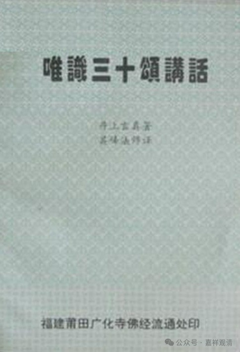
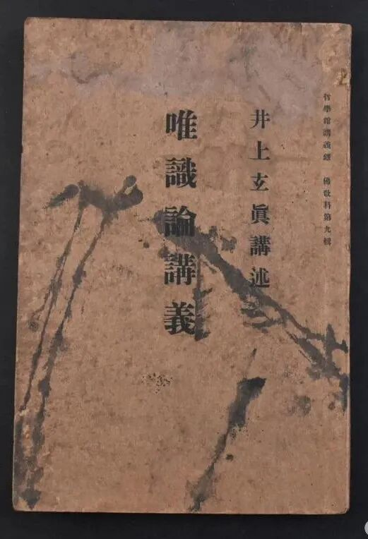
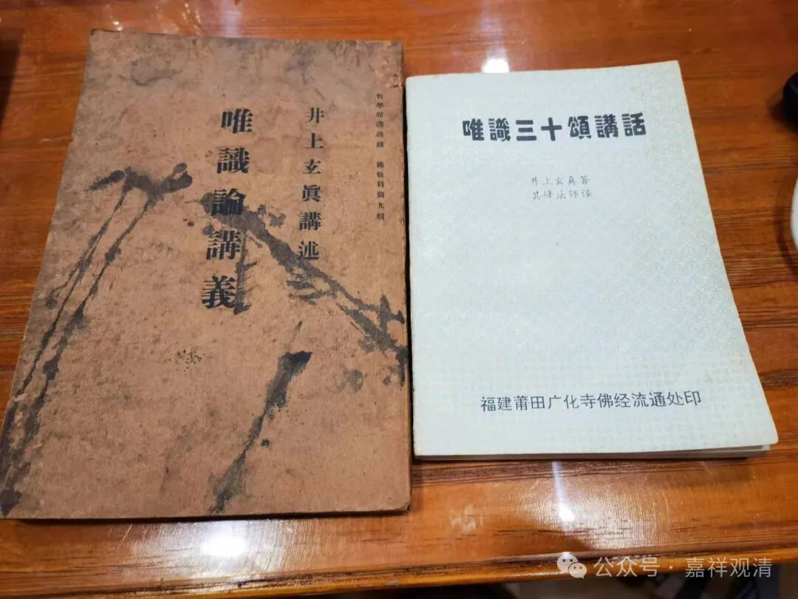

**扯点《唯识三十颂讲话》的“闲篇”**

今天买了本井上玄真的《唯识论讲义》。

我买这一本，是因为我记得国内有一个翻译本的，果然在书堆里找到了，是莆田广化寺的排印本。

《唯识三十颂讲话》，是芝峰法师翻译的，封面上说是“其峰法师”，错。我发现有的法师也在用这个本子讲《唯识三十颂》，但沿用“其峰法师”的名字，这个属于看书不仔细了。不过说实话，现在一般的法师仔细的不多。

我查了一下，井上玄真还有一本《唯识三十论讲话》，看起来应该是同书的前后两次印本，《唯识论讲义》是明治三十八年（1905年）出版的，《唯识三十颂讲话》是昭和二年（1927年）出版的。芝封法师用的本子应该是后者。

芝峰法师最早翻译《三十颂讲话》刊登在1931年6月的《现代僧伽》，后来《现代僧伽》改名《现代佛学》，就继续在《现代佛学》上连载。

芝峰法师，也是太虚法师门下一位大将，参与了当时很多佛学院的建设和佛教刊物的编辑，其中包括《人海灯》（后来是岭东佛学院的院刊了），抗日战争时期陷于沦陷区，长期借住在上海静安寺，解放后还俗……

他们那个时代的法师，通常出身于底层，稍有新兴思想而肯学习的很多都被太虚法师收拢了，但这些人有个通病，就是寡闻而固执，慈舟法师、芝峰法师等之与太虚法师闹意见都是因为这个，包括当时这些佛教刊物，能中立、平和的可说罕见了，很多文章类似佛门加强版的《二十年目睹之怪现状》，确实连我这么激进的人看到都要觉得批判太过了。大家如果还记得法尊法师骂人的文章，那就是这种风格了。

所以，老牌的传统势力是非常抗拒这些新僧势力的，太虚法师晚年说他的佛教改革失败就是源于此——新僧革命太过，传统势力则全不接受，确实很难走下去了。抗战胜利后太虚法师的事业略有起色，是因为借了政治力量接收了很多沦陷区的大寺……

说回来吧。芝峰法师的翻译看起来也不是全文照录的，又或者，这种差异是原版《唯识论讲义》和《唯识三十论讲话》的差异（？）。另外，关于译者也看到有好几种署名，但看起来都是芝峰法师本人了。

