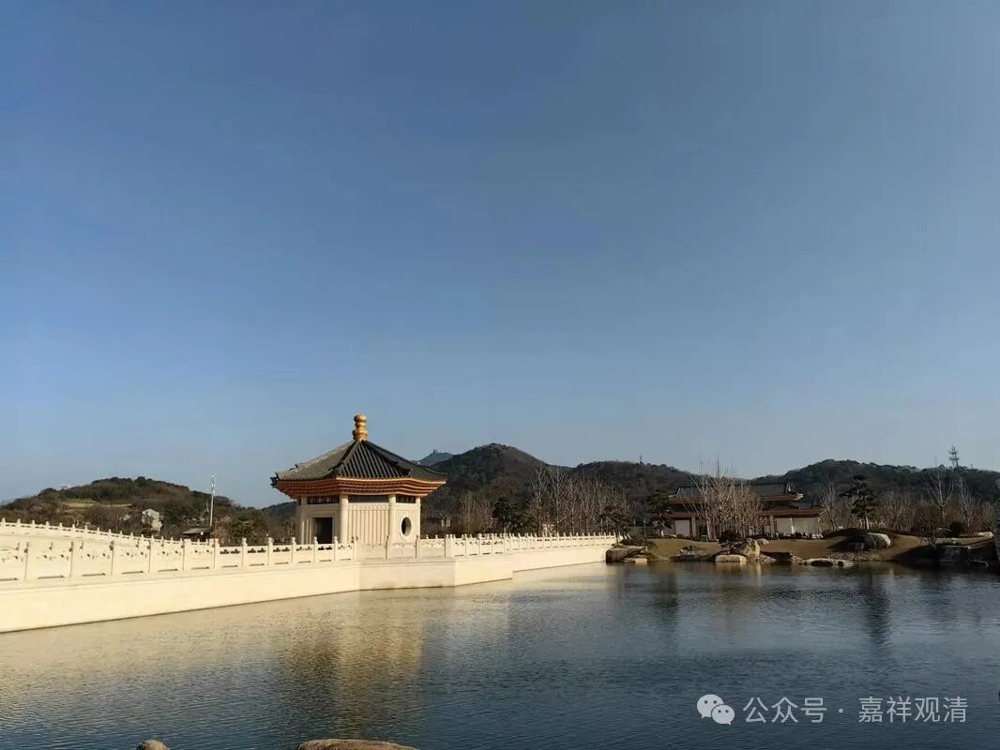

**《宗义略讲》004·035**

** “道之所断，又分为有染污无知和不染污无知二种。”**

《俱舍论》一开始就讲这个“染污无知”和“不染污无知”，后者又叫“非染污无知”，或者叫“不染污无明”，都是不同的翻译。

“染污无知”就是，染污本身就是烦恼，这种无明、无知本身就是烦恼，叫“染污无知”。“不染污无知”呢，它本身不是（罗汉必须要断的那种）烦恼，但是它是一种无知、无明，比如说这幅字画，是用哪一个牌子的墨，不知道的话，这个也是一个无知，这对我们来说，或者对于某个罗汉来说，也是一个无知，但是它不是烦恼，所以对罗汉讲，这个没必要断，不一定要断除他，有没有这个无知和他是不是罗汉、断不断烦恼没有关系，“跟我没关系”，那（对罗汉、对声闻来说）这个就不重要。它是一种无知，他确实不知道答案嘛，无明就是无知嘛，它是一种无知，但是它不是烦恼。烦恼就是令身心不寂静，有的无知（非染污无知）本身不直接“令身心不寂静”……

对小乘的行者来说，他不认为“非染污无知”是他们主要的、必须的所断——意思就是说，这个虽然是“无知”，但是觉得没必要（必须）去断它，对它来说，只要能够走向解脱、走向涅槃就可以了，不需要知道那些枝枝叶叶的知识。比如说你们开车也有这种情况，可能买了很好的车，很多功能就没用过；买手机也是，其实我就会几个功能……所以他们认为，没必要花精力去对付这些“非染污无知”，应该全力投入断除“染污无知”，他们的想法是，手机嘛，买个便宜一点的嘛就可以了，手机我们只有两个功能，发微信、打电话，其他既然不用，花那个钱干什么？所以估计罗汉们到今天只需要一个老人机，打打电话、收收短信。

但是反过来呢，大乘就要求连这些无知（最终）都是要断的。我们以前搞智力竞赛也是一样啊。做智力竞赛啊，我们会熟悉当时最新出、最流行的（最少，我是这么玩的）“装备”，我要发现、找到比厂家给我们看的这些功能背后更多的功能，我要发明出，他没有教过我的这些功能，隐藏的，有点像隐藏的功能，或者说，类似搞手机的人自己也没想到有这种功能，然后你要去学会用它，那样，你把几件东西组合起来，结果就很出彩了。

有点像我举的那个例子，我有个同学是警察，他去抓人……（下面故事省略，不方便让大家知道）

再举个例子，二战著名将领古德里安，他原来学过无线电，无线电和坦克看来是不相干的……古德里安后来做装甲兵总监，就把无线电技术集成到坦克上来，于是吊打其他类型的战车。另一位德军元帅隆美尔则发明了88毫米高射炮平射打坦克……可见，“无用之用”（专业以外的知识）还是很有用的。

当然，找到“无用之用”也不容易。对大乘菩萨而言，他的朝向是一切众生，也就不存在真正意义上的“无用知识”了。

