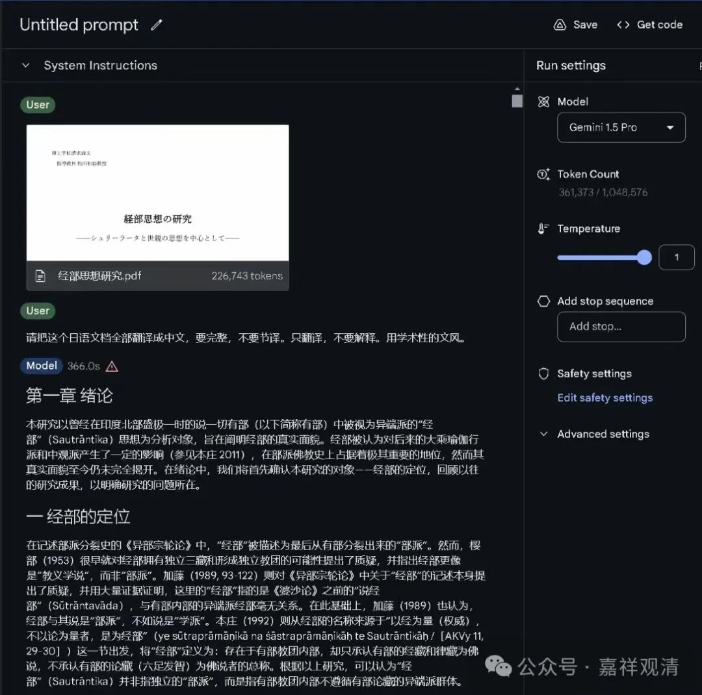

**聊几句AI翻译**

下午，“对法研究”公众号介绍了一篇关于经部的论文——日本佛教大学博士论文：《经部思想之研究——以室利罗多和世亲思想为中心》（作者：中岛正淳）。

我一向对经部很感兴趣，又对机器翻译“略懂”，所以转给龙相法师让她试着用现有（免费）的AI走一遍……

没想到不到两小时，AI就弄出来了。我粗看了一下，文从字顺的（这里面，提示词很重要），足够我们阅读了……

其实七八年以前我就提出要做AI翻译，（我自己下围棋，所以算是最早关注人工智能的一批“非专业人士”吧。）那时候AI人才在市场上奇缺，出来一个就被抢掉，做一个项目要五年上千万的投入，所以活动了半年，伸个腿弯弯腰，也就偃旗息鼓了。

到疫情结束这个点，人工智能这个行业已经突飞猛进，由于有了很多大公司的投入，各种资源的开源，让原先这个行业入门的门槛瞬间降低了，机器翻译这边的主要压力其实倒是给到了硬件和“挖矿”这种基础工作，这里的“挖矿”是指大量的录入、对齐、“清洗”，给机器输入大量的“语对”（两种语言的互译，每一句作为一对，一般在7～20个字，少量可以少于或者多余这个限制，总共不少于十万条，期望达到两百万条）。

这时候，我又想“冲”进去了，这个时间点AI翻译的资金需求已经降到百万级的了，比原先整整少了一个零！当时是准备并入一个20个小语种（原先是18个，加上梵藏语，就是20个小语种）的机器翻译项目……

但是这个时代发展太快了，在我们AI智能翻译项目马上就要启动的时候，谷歌和埃尔法狗都正式推出了梵藏语的AI翻译功能，由于他们推出时的初始状态已经超过了我们的结项预期（当时谷歌和埃尔法狗的人工智能梵藏汉的翻译准确度肯定已经超过了90%，而我们自己的项目预设是超过86%），所以，还没开始，我们就被打败了。不过，这也是我们乐于看到的。

不久的将来，翻译这个赛道基本就被AI霸占了，兄弟们都说：“我们可以躺平睡觉了！”某师说，他准备改行抓鬼，抢张天师他们那个赛道……

