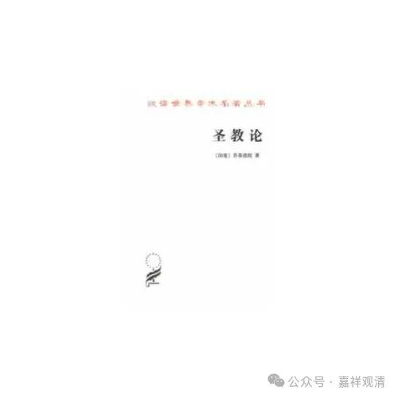

**高文达和商羯罗**

《圣教论》是印度吠檀多派VedAnta早期奠基人乔荼波陀GuadapAda的作品，乔荼波陀的再传弟子商羯罗我们就相对比较熟悉一点了。他们二人的作品都受到婆罗门教和大乘佛教的影响，甚至一直有人（吠檀多派和佛教的都有）认为商羯罗实际是一个佛教徒……呵呵，这是一个神佛之间商量分配的问题，我们就不介入讨论了。

（佛教里唯识派有一部《显扬圣教论》，这和《圣教论》不是一部书啊。《显扬圣教论》的作者是无著大师。）

想到一个事儿，大概是七八年前吧，有人在论坛上找我给孩子起名字，（大家知道我喜欢开玩笑嘛）说家长姓高，我就开玩笑说可以叫“高文达”，没想到人家还真用了好像。这个高文达，其实就是Govinda，印度至高神奎师那的别名，商羯罗的师父（乔荼波陀的弟子）就叫高文达Govinda，而商羯罗Sankala也是天神的名字。

我们佛教里面经常有些人会把这里吠檀多派的“商羯罗”和陈那弟子“商羯罗主”混淆起来，也能理解，外国名字感觉长得都差不多。

翻佛教杂志，读到《圣教论》（巫白慧译释）第二章《虚妄章》的第一颂，很唯识的感觉——

** “梦里所见一切有，**

** 智者说言是虚妄；**

** 诸有生起于内在，**

** 故受覆障因制约。”**

（“覆障”，成书时做“封闭”。）

感觉前半颂就是在说唯识的梦喻；后半颂，假如我把“覆障”理解为“世俗”的话，可以理解为内识生起现象界。

呵呵，只是外行的随口一说而已，顺便敷衍了今天的推送。

