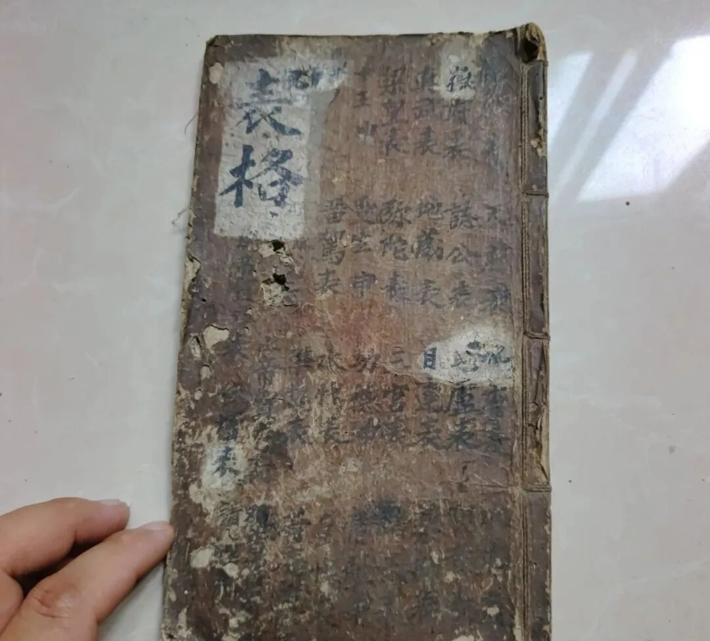
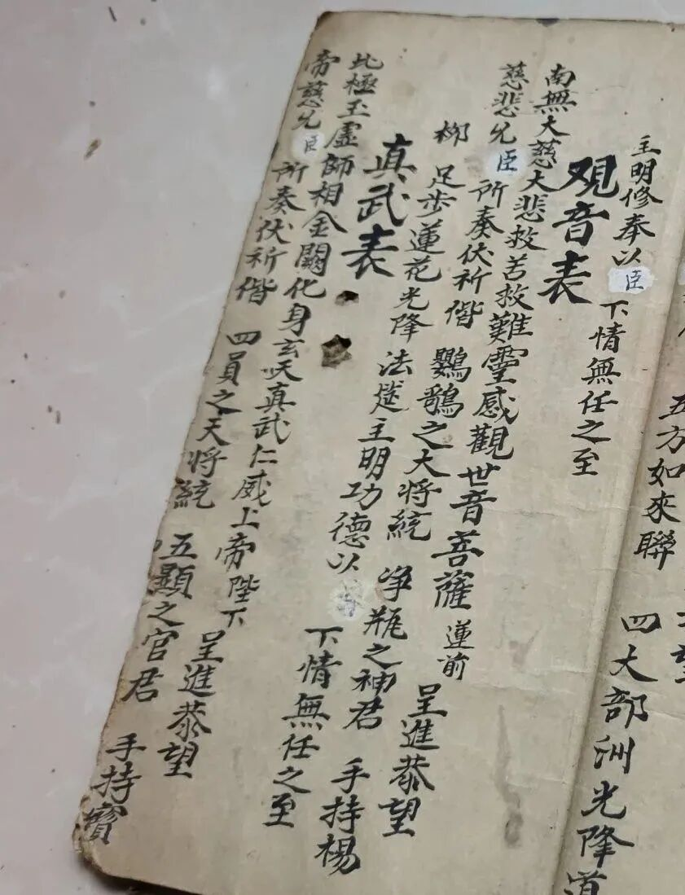
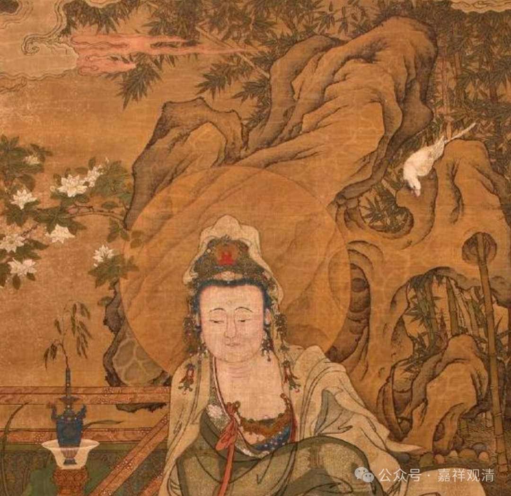

**《观音表》一则**

看到一份民间手抄的《表文集》。

最初应该是某个应赴僧整理抄写备用的，有“佛表、誌公表、毘盧表、观音表、真武表、地藏表、目连表、药师表、梁皇表、弥陀表……”。

这个文献里，自称“应门”，“应门”的“应”，就是应赴僧、瑜伽僧、经忏僧、香花僧，就是赶经忏的人，“表”，就是表文。应赴僧做完法事要“上个表”，用戏腔念一遍，把法事的“回向”的内容等等大概地“公告”一下，然后“焚化”，就算是和佛菩萨们打着招呼了。

我们来看一则，《观音表》

录文：

** 《观音表》**

** “南无大慈大悲救苦救难（广大）灵感观世音菩萨莲前呈进恭望/**

** 慈悲允臣所奏伏乞携鹦鹉之大将统净瓶之神君手持杨/**

** 柳足步莲花光降法筵 主明功德以X下情无任之至。”**

清案：

注一：

第一行，“灵感”二字前面，明显是抄漏了“广大”二字。

注二：

第二行小字“臣”，明显有改动痕迹，仔细阅读并查看其它的表文，发现这里原文应是“僧”字，后改为“臣”。看来原件抄写的人是个出家僧人，后来应该是转到俗人手里，遂不自称“僧”而称“臣”。也可以看出民间宗教的“佛僧关系”类似“君臣关系”。

注三：

“鹦”后面那个字不认识，左“奇”右“鸟”，什么字，联系上下文，暂读为“鹦鹉”。

“鹦鹉大将”、“净瓶神君”不知为谁。很可能和汉地观音的形象手持净瓶，并有白鹦鹉作伴有关。具象化就变成了“鹦鹉大将”、“净瓶神君”。

右上角有白鹦鹉

《西游记》有“然后（观音）手执净瓶，白鹦鹉在他面前叽叽喳喳，孙大圣也跟着他。”可见“白鹦鹉”确实是汉地观音菩萨的一个标志。

注四：

“以X下情”，"X"认不清楚。查看本件其他表文，则知和注二相同——原文是“僧”，后涂改为“臣”。

