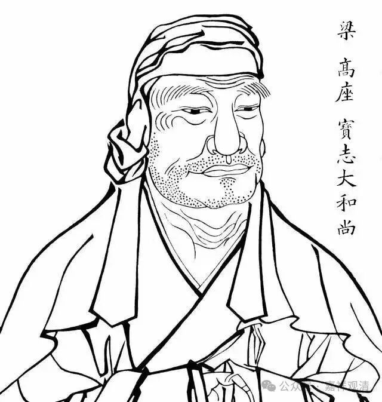
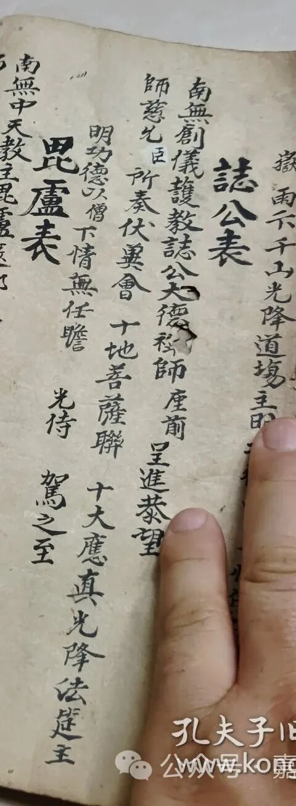

**创仪护教的誌公大德**

接着昨天的《观音表》，今天再读一段吧——

** 誌公表**

** 南无创仪护教誌公大德禅师座前呈进恭望/**

** 师慈允臣所奏伏（单共）会十地菩萨联十大应真光降法筵主/**

** 明功德以僧下情无任瞻 光侍驾之至**

注一：

这里的“誌公大德禅师”应该就是指的宝志禅师。宝志禅师大约生活在南北朝晚期，约和梁武帝同时代，后期经由禅宗史家神话后很得（主要是浙江地区）民间崇拜（或者反过来，民间传说被禅宗史家吸收）。他在民间和达摩并称，年代、事迹也都接近，大约是神僧、圣僧、济公一类的人物设定。

创仪护教，不知道具体指什么。说不定民间有专门供奉的“堂口”（？）。

注二：

小字的“臣”、“僧”在这段就比较明显了——原文应该是“僧”，比如后面保留未删改的原文。

其他一些民间手抄本里面，相应的地方也是“僧”“臣”都有，“臣”字也没有改动的痕迹，可见民间表文里确实这两种用法都有。

注三：

（单共）这个字不知道正确该怎么读，其它同样的地方是“伏乞”的“乞”。但这个字不太像“乞”。

注四：

“应真”，就是罗汉。十大罗汉，出自《维摩诘经》。民间的文献里经常可以看到“应真”这类古译的词。

