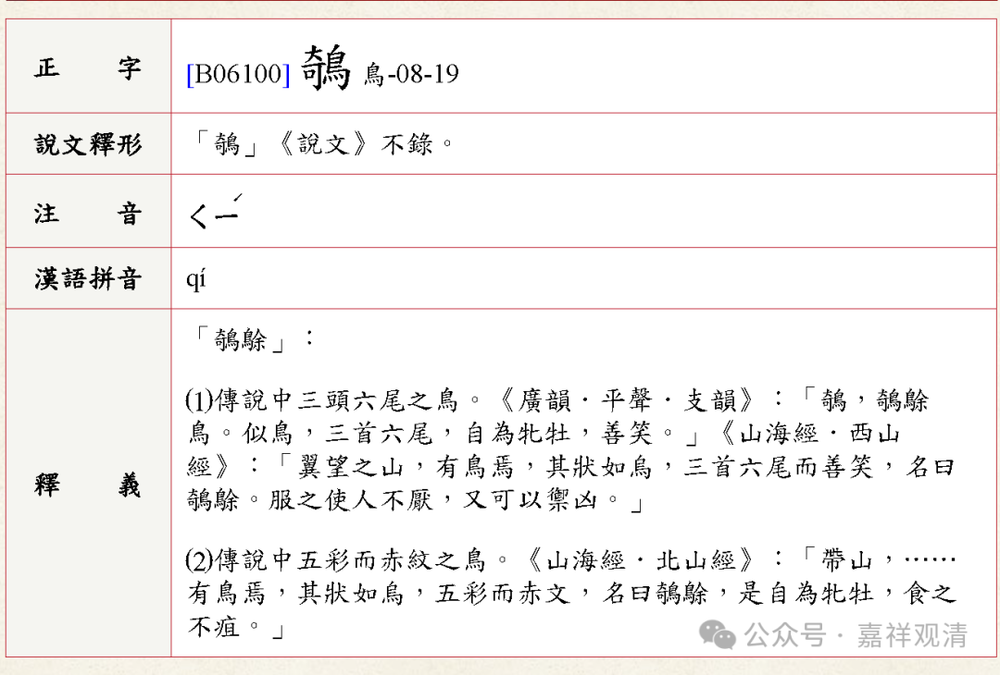
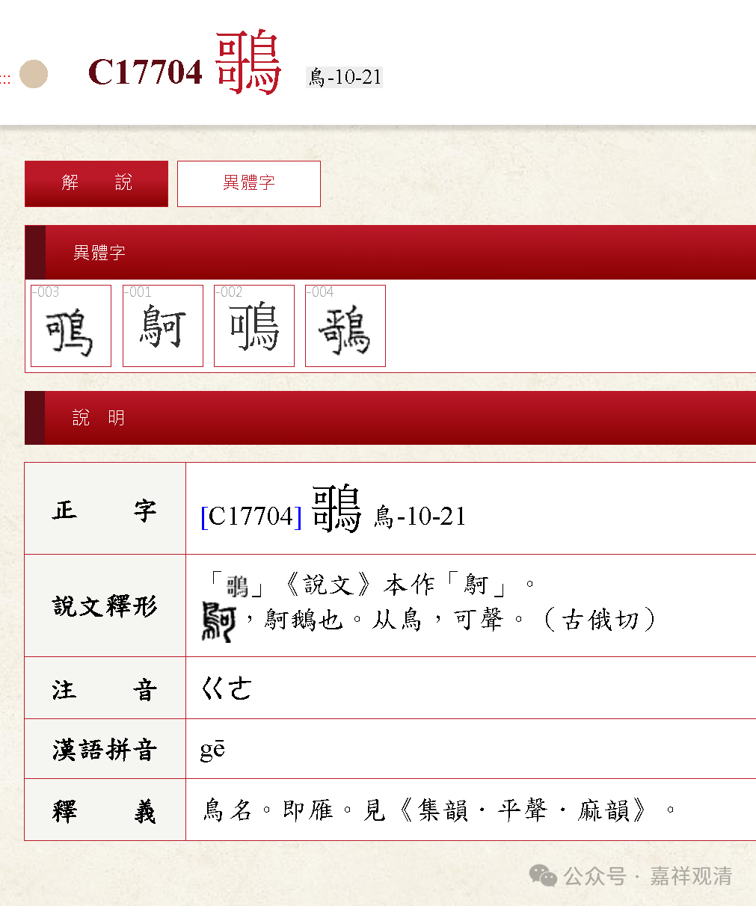

**认字：鹦鴚的“鴚”**

昨天那一页《观音表》里那个（左奇右鸟）字，我读作“鹦鹉”的“鹉”，被几位提醒，长了见识，实际应该读为“鹦鴚（ge）”，也就是俗语里的“鹦哥”。

左奇右鸟的话，是这个字（电脑字库里没这个字），qi，但是不像。

按抄本的原件仔细读，那个字的左半边其实应该不是“奇”，而是这个——“哥”（这是“哥”的异体字，电脑字库里也没有这个字）。

这个“哥”，是一个民间的俗字，不正规的俗写法。

继续按着这个思路，这个字就是左“哥”右“鸟”，那就是——

咦，果然找到它了，是个异体字，著名的俗字宝典《龙龛手镜》里有他，还是念作ge。电脑可以打出来这个——鴚。

单独出现的时候，“鴚”字是鸟名，就是大雁的雁，那么这里呢？……鹦鴚，就是鹦鹉了！

那么，现在破案了——原文的”鹦X“就应该正确地读为”鹦鴚“，也就是”鹦哥“。方言、俗语里，鹦鹉、鹦鴚就是叫做”鹦哥“的。

小时候，听到的“乾隆下江南”的故事里就有“红嘴嘴，绿鹦哥”，里面的“鹦哥”就是鹦鹉，“红嘴嘴，绿鹦哥”指的是菠菜，小时候，家长就用这个故事来骗我们吃菠菜的！我们那时候还没有大力水手。

