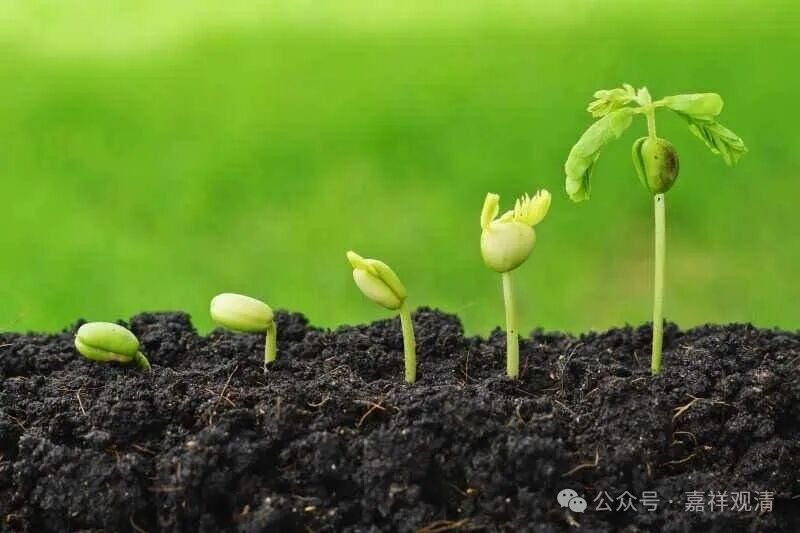

**是谁在说“种子即芽”？**

《入中论》在“破四生”的时候，主要着力点在“破他生”部分，其“破自生”部分仅有五颂半，这是因为许自生的宗派、观点不多吗。

上面讲了，大众部系统的大众部、一说部、说出世部、鸡胤部这四部的“末宗异义”许“有少法是自所作”，所以他们肯定要算“有”“自生”（也有“他生”“共生”“无因生”等）的说法的。

其实他们还有一个观点也可以看成他们确实是许“自生”的——

月称《入中论自释》在“破自生”中曾代替对手说：

** “……又，种子与芽非异，亦非不从自生……”**

说，种子因为光、水等条件，生出了芽；因为此时已经有了“芽”生起了，就不再有种子生起的（时空）位置了；但这个新生的芽和此前的种子不是相异的“他”，而是不异的“自”，所以仍旧是自生。

这一段单独看起来是有点怪的——既然种子生出了芽，芽和种子明显不同，怎么会许为“自”呢？但是我们看《异部宗轮论》，大众部、一说部、说出世部、鸡胤部这四部的“末宗异义”还真就是这么许的！

《异部宗轮论》说：

** “（大众部、一说部、说出世部、鸡胤部……末宗异义……）种即是芽！”**

《部执异论》说：

** “……种子即是芽！”**

这是和《入中论自释》里这一段完全对的上的，也就是说，确实有一些佛教部派的师资在传授“种即是芽”的观点——既然“种即是芽”，那么，“种生芽”就（勉强）符合他们（自许）的“自生”了。

假如我要代大众部、一说部、说出世部、鸡胤部这四部的“末宗异义”来立言的话，那我认为他们大概是这么想的——

我小孩的时候去存钱，成年以后改变了模样去取钱，你不能因为我“改变了很多”就不认我这个储户了，“我还是原来的我”！小时候的我就相当于“种”，成年的我就相当于“芽”，所以，“种即是芽”！拿后来的名词就是，“种子和芽是同一相续”。

但问题是，即使在这里引入“相续”这个词，但“种”仍然不能是“芽”——你今天的地位、状态等等是几十年前的你所没有的呀！这不是直接可以观察得到的“异”吗？

