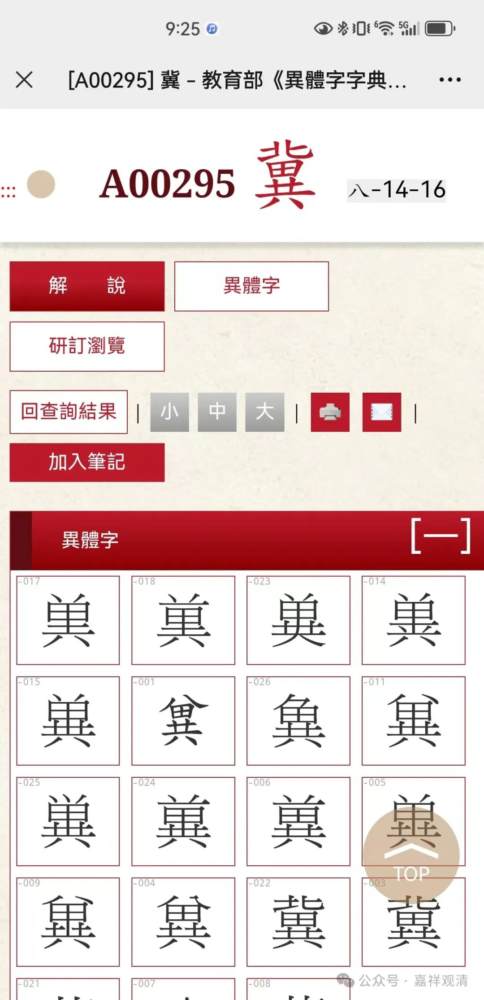
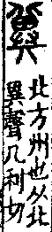
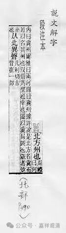
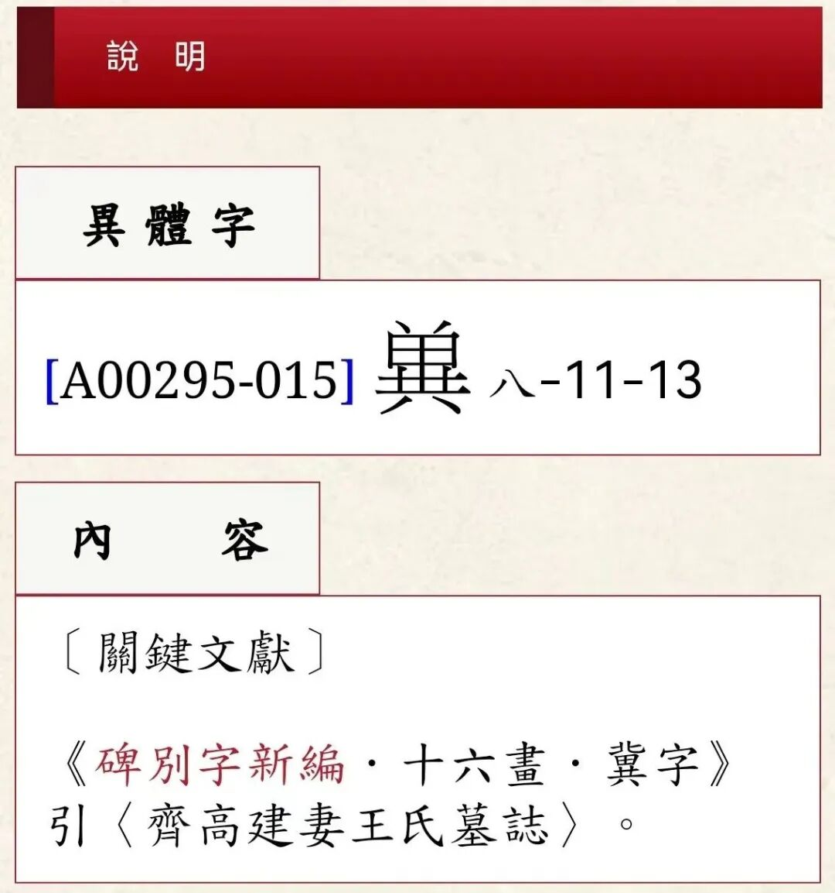
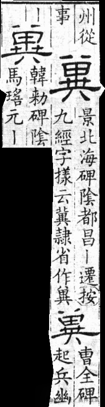

**“冀”字字形的变化**

几天前抄读那本民间文献“志公表”，里面有一个字没认出来——

“伏（单共）会十地菩萨”的“（单共）”

后来经人提醒说就是“冀”字。查在线的某《异体字字典》，果然是“冀”字！

第二排第一个，还有几个也类似。

冀，有“希望”的意思，那么，《志公表》里的“伏冀会十地菩萨、联十大应真”，就是希望（宝志和尚）和十地菩萨们以及十大罗汉们一起……

我们看一下，上面这个就是《说文解字》里的“冀”字。

这是《说文解字·段玉裁注》里的“冀”字。

《异体字字典》里说，“单共”冀的这种写法，可以在《齐高建妻王氏墓志》中找到。

可以发现，“冀”的篆文，上面的“北”，这里的异体字里变为了两点。

从上面“冀”的隶书里可以看到，“冀”字上面的“北”字变为两点，在隶书里面就已经出现了。

古旧的木刻刊本、民间抄本里这种异体字很多，所以我买了好几本《异体字字典》备用，不过现在有网络版的“异体字字典”，那就简单多了。

