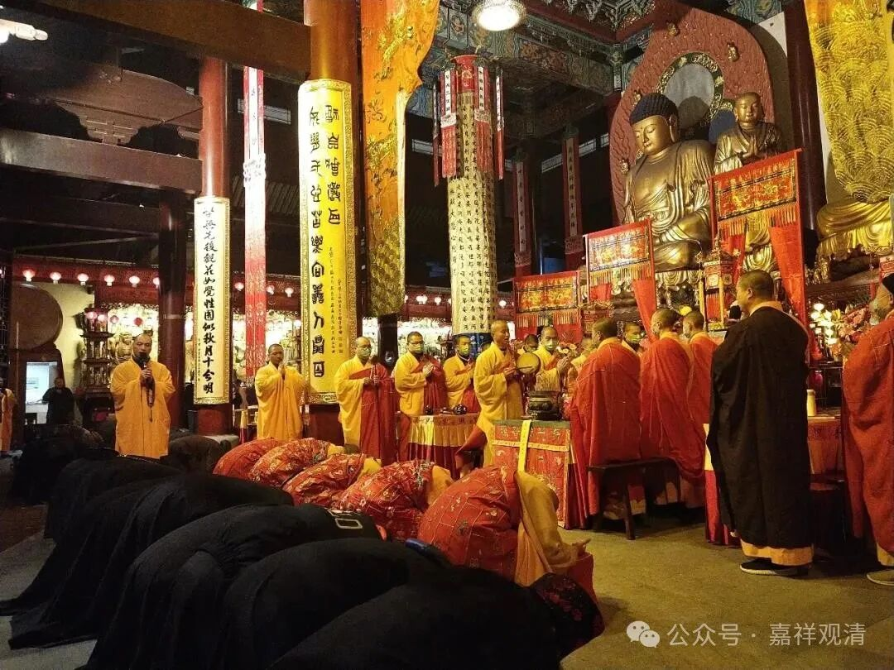
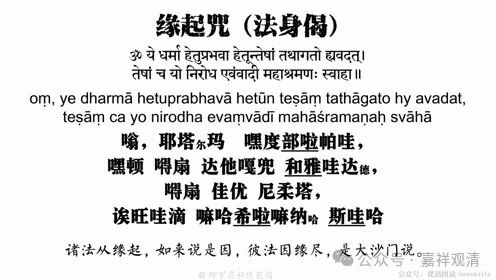
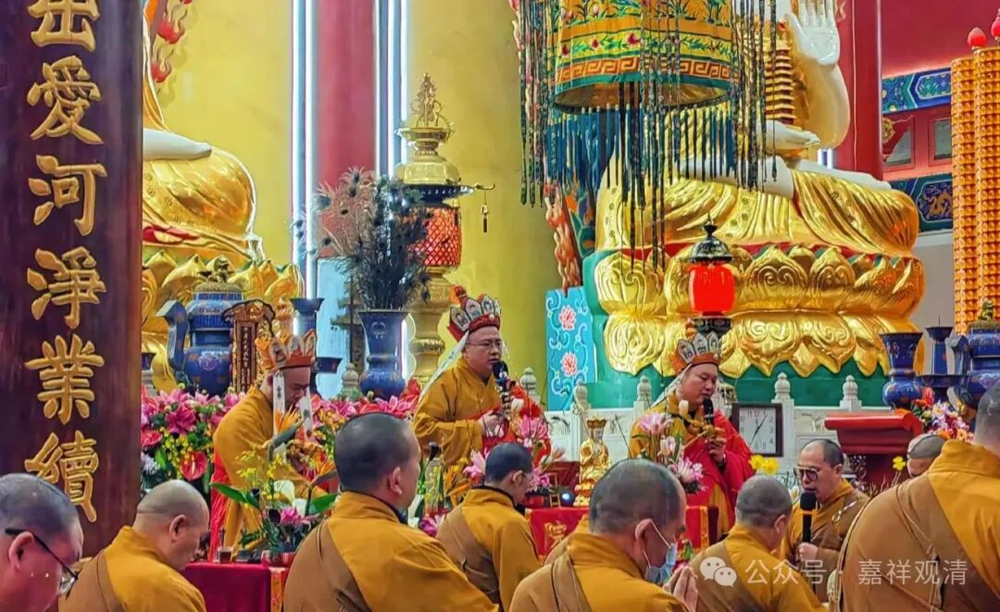
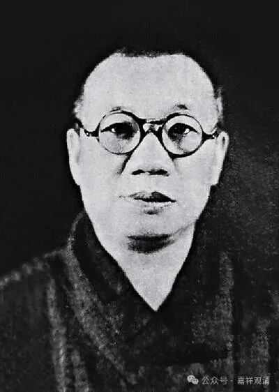

**水陆、焰口，及其它**

前述《表文集》录文的时候，《志公表》里有一句“创仪护教”我没读懂，呵呵，这确实不在我的知识区间。

后来经人提醒，说这句“创仪护教”说的是梁武帝时宝志禅师创制《水陆（法会）仪轨》。有道理！传说中《水陆仪轨》确实就是宝志禅师“创仪”的。

作为汉地出家人，我真的是一次都没参加过“水陆法会”，而且对此一类流行的法事基本无知……

此生列席的唯一的一次“瑜伽焰口”，是在报祖寺夏令营以后，老和尚硬留我参加的……倒也有惊喜，我发现小时候课文里的“远看山有色，静听水无声；春去花还在，人来鸟不惊”居然是《瑜伽焰口》里的（也许是收入《瑜伽焰口》里的），后来在黄山翠微寺听宣济师唱了这段，感觉好听极了。

第一次列席瑜伽焰口法会，等于我在现场读了一遍原文，倒也发现几个问题。《瑜伽焰口》里有一段“缘起咒”，说这是“十二缘起咒”，这种说法是错的，这里的“十二缘起咒”实际只是“缘起咒”，与“十二缘起”没关系，编纂者可能看到“缘起咒”就顺手写上“十二缘起咒”了，其实“缘起咒”就是“缘起偈”——“诸法因缘生，如来说是因；法灭亦如是，是大沙门说”——的梵文版而已。

以前，南通有个老和尚劝我要学这些“（瑜伽）法事”。他说，当年大醒法师（太虚法师弟子，当年帮助太虚法师管理过很多佛学院）应邀去南通讲经（老法师那时候还是居士，但是人送外号“经忏王”），讲经结束以后当地邀请他放一堂焰口，大醒法师不允。（当地很流行焰口，居士们很多都能背诵、熟悉手印做法。）大家说，“你只管在上面坐着，其他东西都我们来……”最后拗不过，只能登坛。后来整个焰口法会上，他坐在上面啥都不会，下面居士们热热闹闹、唱念作打地玩全套……就非常尴尬。法事一结束，大醒法师就连夜过江回上海了……

老和尚的原意是，“你为了以后避免这类尴尬，这些法事也应该学”，但我的解读正好相反——不是我的业务根本就不应该接！大醒法师当时就不应该“慈悲”答应留下来“受刑”。

老和尚文革的时候都没有还俗，我还是很佩服的。组织找他谈话，他说：“我有肺结核，我不能害人啊！……”这事儿就不了了之了。

