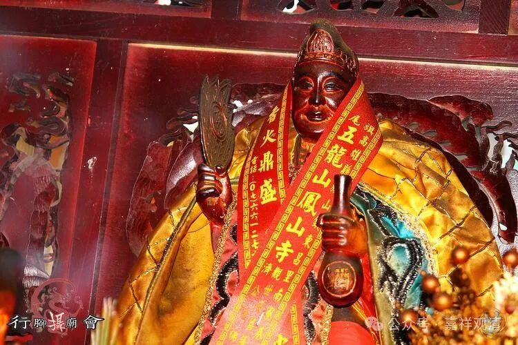

**咦，“德教”！**

听说某法师在潮州接了一个道场，这个道场的前身是“德教”门下的。被问到：“知不知道有一个民间宗教叫‘德教’？”呃，我还真不知道。

内事不决问遍知百度仁宝哲——

“由潮阳县和平人杨瑞德创立的德教，如今已盛行于东南亚各国。德教的宗教活动场所称为阁。在阁中，设有道济师尊（济公）和观世音的拜殿。”

那个道场果然是供奉“济公”的。而且还是东南亚华侨捐资造的。

有的人把它当作“邪教”，这有点过了，假如我们对妈祖、关公这些信仰不称邪教的话，“德教”也不能理解为邪教，对他，“民间宗教”是比较合适的“身份牌”。

其实像妈祖、马王爷、关公这样的也是在历史上获得过朝廷正式封号（有明确品秩）的，在历史上要算是正式的官方信仰的，现在封建皇帝没有了，这些从民间而升格为官方信仰的，又落回了民间……（也就是说，“德教”只是成立时间太晚，放在某个时间点上，他未必不能获得官方地位。）

那么，在佛教的背景下，他们算不算是“（附佛）外道”呢？

这就很难说了，要具体分析。据潮汕地区的实地调查，民间这些信众普遍认同自己是在“信佛”，在这个背景下，（辩论场上）是认可他们佛教徒的地位的。当然南方某省的一些民间信仰是排斥佛教而认同道教身份的，那就不能算是佛教徒了，哪怕他们供的、附体上身的是“千手观音”。

“德教”，哈哈，又长见识了！以前我管的一个床位的一个病人，是信“理教”的，“德教”、“理教”，五教合一的套路都差不多。

