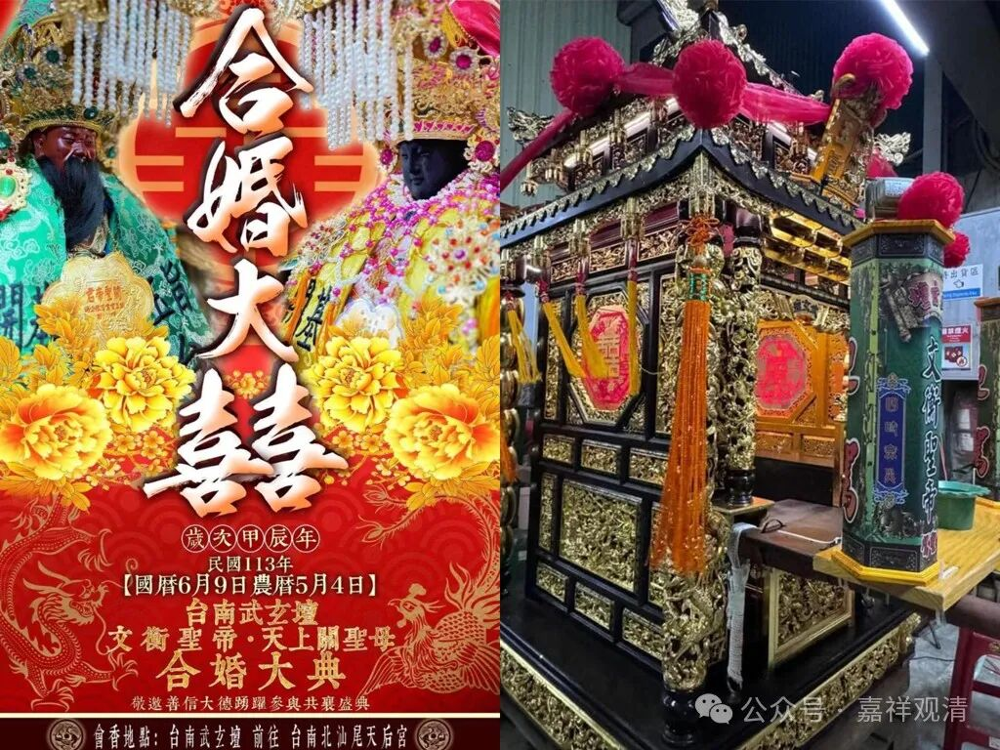

**玉帝逊位与关公娶妻**

“理教”还有一个特殊的说法，就是“玉帝辞职，关帝接位。”说天上的玉皇大帝辞职退位，由关帝在甲子年（1924年）登基。据说这种说法来源于上世纪二十年代一本叫《洞冥宝记》的小册子。我们大概可以理解，这是此前清帝逊位的历史现实“如实地”被反应到了“天上”（民间宗教界）的“禅让”了。

曹丕说“舜禹之事，吾知之矣！”那我们通过地上的历史，也知道了天上的“改朝”了。哈哈，人生充满了“活久见”！

“玉帝”而“关帝”，这倒是也很符合民间宗教思路的联想了。

前段时间，弯弯的民宗界也搞了个大新闻：关公迎娶妈祖！——

“最近台南武玄坛突然发布公告讲坛内供奉的关公将要去鹿耳门天后宫迎娶宫内供奉的妈祖，更在活动告示上把妈祖的诰封“天上圣母”改成了“天上关圣母”，俨然是冠了夫姓……”

我想过了，按民间的思路，这也不是不合理的——“关公”既然正了“帝”位，那“帝”“后”岂不正是合适的一组？

这理教和武玄坛，正可以拉起手来，哈哈哈哈……

