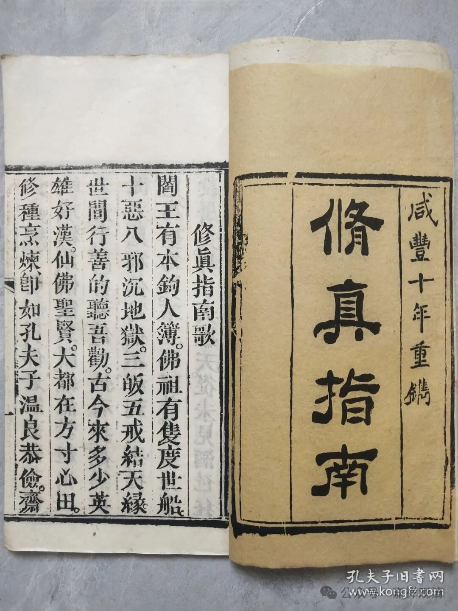
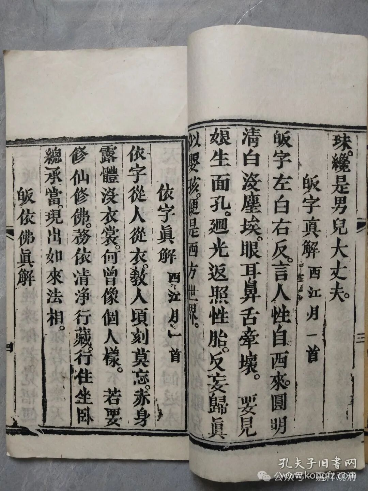
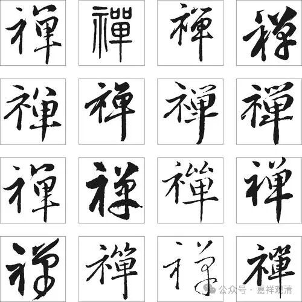

**禅，就是“少一点单衣”……**

看到一本《修真指南》，咸丰十年刻版印刷的。

哈哈，他对“皈依”做了一番非常中国化的解读。

上图！

** 皈字真解 西江月一首**

** 皈字左白右反，言人性自西来，圆明清白没尘埃，眼耳鼻舌牵坏。**

** 要见娘生面孔，回光返照性胎，反妄归真似婴孩，便是西方世界。**

清案：

“白”而解读为“西来”，因为白属金，五行中肺金为西方（这对我们中医来说就是送分题），所以读“白”为“西来”。从上下文看起来，上阙中的“言人性自西来”，或当作“言人返自西来”。

又，现在人多写作“皈依”，其实正字应该是“归依”。

** 依字真解 西江月一首**

** 依字从人从衣，教人顷刻莫忘，赤身露体没衣裳，何曾像个人样。**

** 若要修仙修佛，务依清净行藏，行住坐卧总承当，现出如来法相。**

清案：

这个“依”字的拆字，就基本全无道理了。不过这也是初学喜欢玩的（又菜又爱玩）。

大一的时候，二年级有个学长也学佛，他神秘地告诉我“禅，就是少一点（的）单衣（示单），就是赤露无牵挂！”当时觉得神级解释，眼冒心心……现在觉得，只是一个纯粹的文字游戏啦。（我已经不菜啦！）

