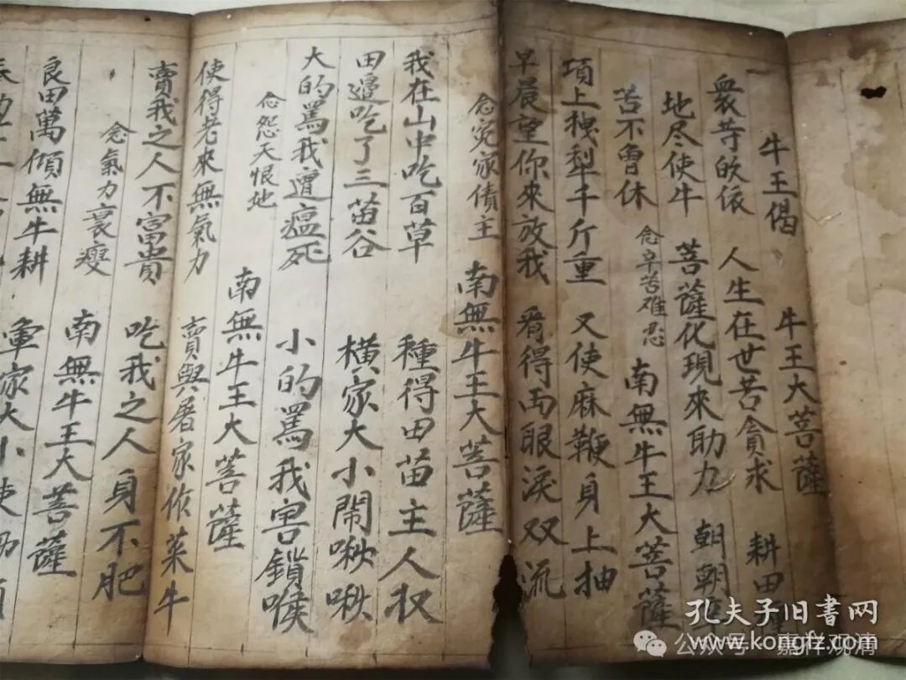
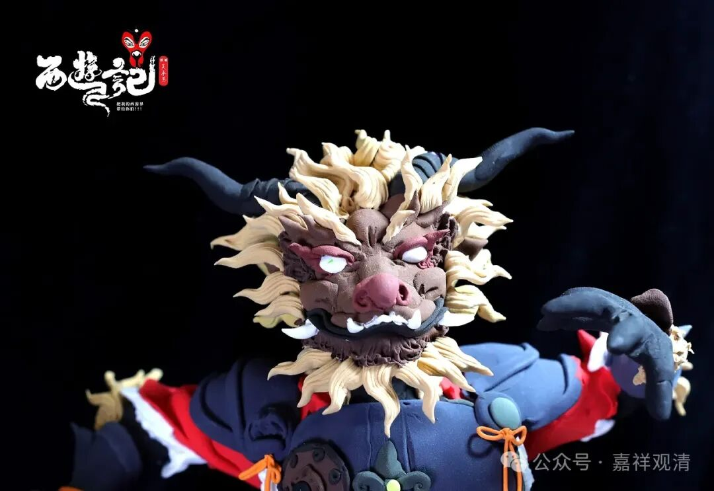
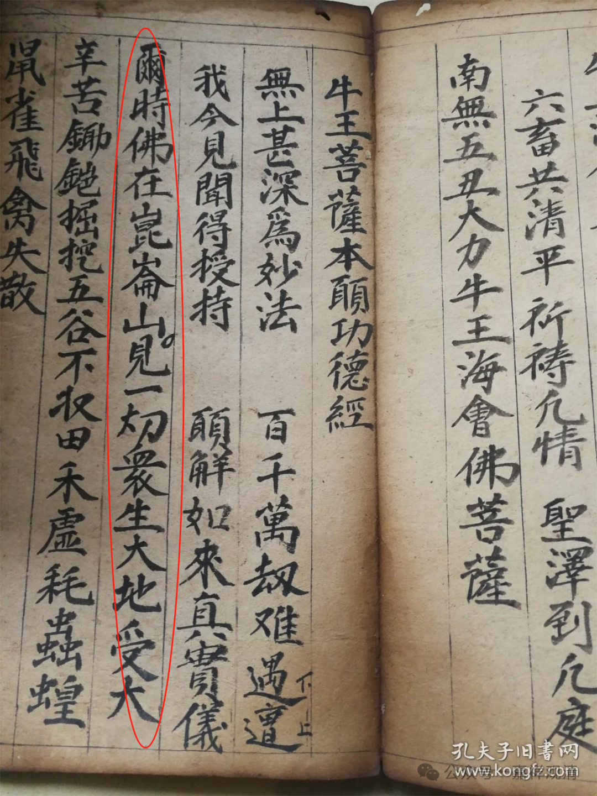
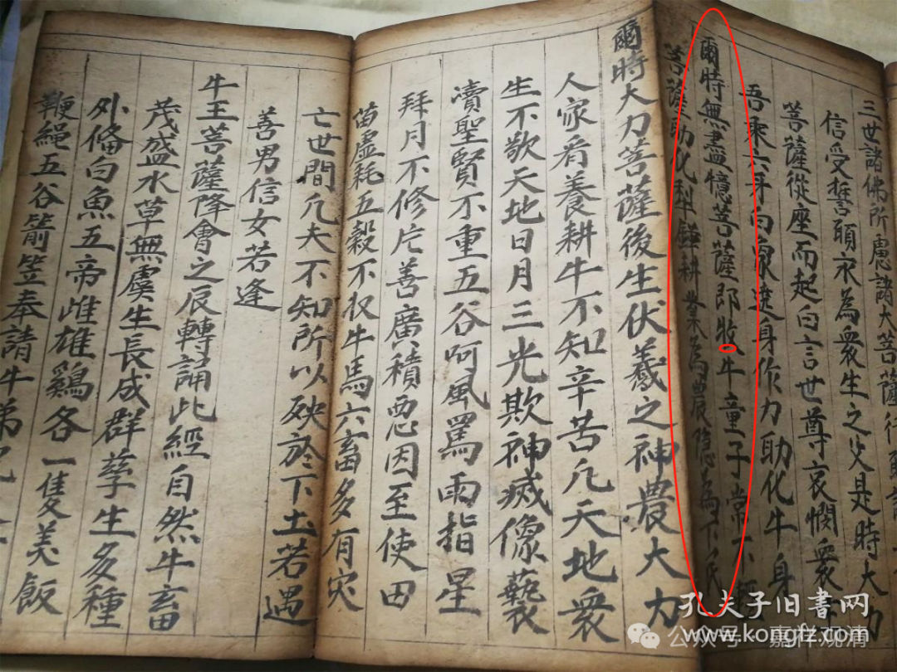

**基层创意无穷**

这又是一部民间宗教的经典——《佛说五丑大力牛王本愿功德经》。咸丰元年的手抄本，经折装。我是第一次见这部“经”。

有人把这一类归于“伪经”，可能还“轮不上”这么高档的名词，以正统佛教叙事的角度来看，这应该算是介于民间宗教和民间佛教之间的东西，但他的出现受到很多佛教因素的影响，比如经典的组织形式。它的仪轨部分，明显是介于民间的佛道教之间。某种角度上我们甚至可以大胆的说，今天汉传佛教的很多仪轨（实际上）的来源，并不出自正统佛教。

“大力牛王”，这个形象固然有其民间思维，另一方面可能来源于某些特别的佛像、神像，我怀疑有可能这里的“大力牛王菩萨”是“大威德”形象的民间解读，因为如果是中国人的“牛头马面”形象的来源的话，不可能发展出现在这种完全不一样的套路。（假如我们理解《西游记》的“狮驼林”实际来源是“尸陀林”，就可以理解密宗造像的民间化石可能的、现实的。）

此经起始就是“尔时佛在昆仑山……”，这一句就很“混编”了——“佛”而“昆仑山”，一上来等于就明显地告诉我，“我来自江湖”！

“而是无尽億（意）菩萨即（及）牧牛童子、常不轻菩萨……”

这一段里的“无尽意菩萨”和“常不轻菩萨”，明显是受到《法华经》的影响。

