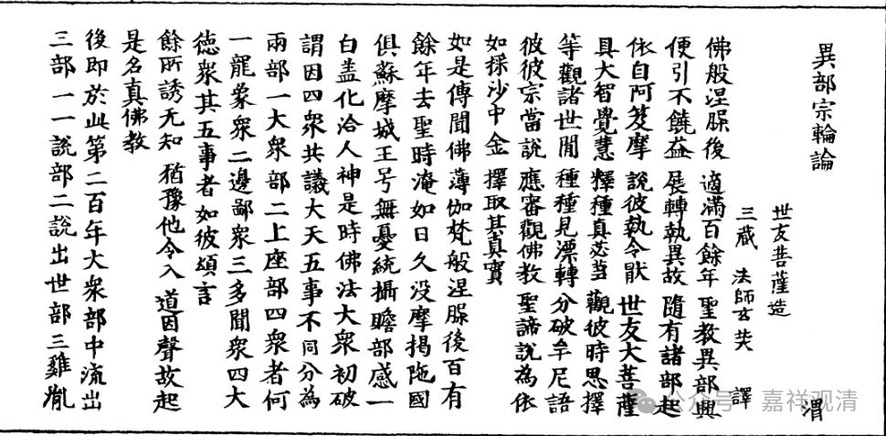

**关于圣者果位有退无退**

关于圣者果位有退无退，在部派佛教里分歧是比较大的。

先说“二果”斯陀含、“三果”阿那含退不退——只要许“预流、阿罗汉”中任何一种有退的，必许此二有退；只有认为“预流、阿罗汉”中任何一种都不退的，则“二果”斯陀含和“三果”阿那含必不退。所以部派佛教里面一般不专门谈此二果退不退，因为它包含在“预流、阿罗汉”退不退果位的问题里了。

下面来看《异部宗轮论》里对预流、阿罗汉退不退果位的相关表述。

据世友《异部宗轮论》，明确许“预留有退义，阿罗汉无退义”的有五：大众部系统的四个：大众部、一说部、说出世部、鸡胤部；上座部系统的一个：化地部。

许“预流者无退义；阿罗汉有退义”的是说一切有部。

据基大师《<异部宗轮论>述记》，犊子部系统里，法上部和密林山部明确许“阿罗汉有退”，但不清楚对预流退否有没有表态。

同样，《<异部宗轮论>述记》说法藏部，“未必”许阿罗汉位有退，估计意思法藏部是更倾向于阿罗汉位无退的。

对于其他部派，由于《异部宗轮论》的表述是“余多同某某部”，则不确定具体在这个问题上是如何表态的。

大致上表现为，大众部系统的部派多许阿罗汉无退，上座部系统的部派多许阿罗汉有退。

