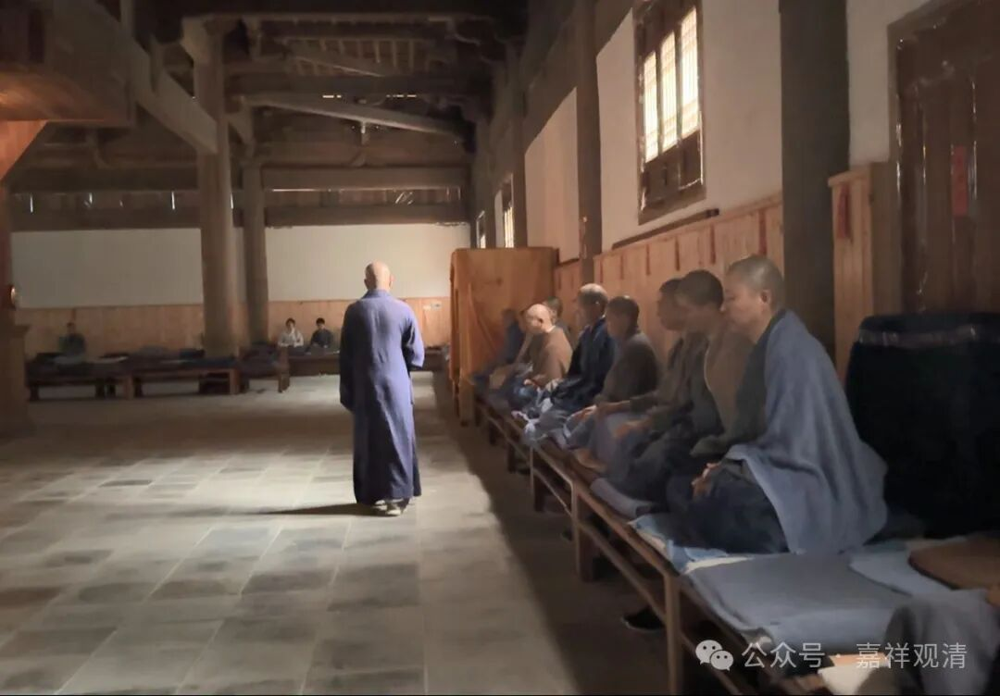
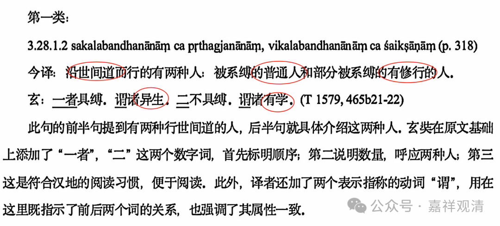

**若要明白此处，试坐三十年！**

今天看到一则禅师的“金句”——

** “若要明白此处，试坐三十年！”**

真是被“一语道着”！

很多人学禅宗，看了点故事、禅话，蔡志忠漫画，就喜欢斗嘴打机锋，天上一句地上一句地瞎扯，我知道有些师徒就在网络上“我咬你一口”“我也咬你一口”“我再咬你一口”“我还咬你一口”……来来去去“咬”了很多口就算是“禅”了，感觉就是一帮“走出疯人院”的跑去华山论剑。

我们在网上也经常遇到这类“禅小白”，是古文、是俗语都还没搞明白，两千篇公案没学到一分，抱着些二手禅宗故事搬运些些禅话，到处来斗机锋……看到他们来“请教”，真是“一个头两个大”，后来我经常回复说“没做过三年禅堂不要来说话”！

是啊，就像没学过阿毗达磨跟我聊什么唯识、中观，没学过站桩聊什么传武——没学过阿毗达磨的去“研究”唯识、中观一定会贻笑大方，就像前两天交大讲师的那篇论文，“世间道”“异生”“有学”的概念都没搞明白，急着要去搞白话翻译，这不是骗人+骗自己吗？

所以今天看到这句“若要明白此处，试坐三十年！”真是说到我心里了，以后就用它了！

当然这位禅师还有一句：

** “若是不明此处，一生虚过也！”**

