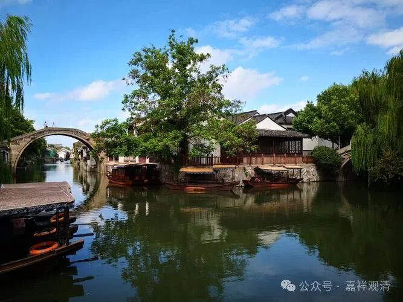

**《宗义略讲》004·051**

有部说的菩萨在资粮道分位（阶段）的时候，要经多长时间呢？有部师说要经过“三大阿僧祇劫”（三无数劫），他说菩萨在这三大阿僧祇劫的时间里还都是凡夫，在这三大阿僧祇劫的时间里菩萨要圆满成佛的（上品）资粮，然后再以百劫修相好（三十二相八十种好）……这么长时间作为凡夫在修福德资粮，真是累啊！

然后这里明明说“百劫修相好”，一会儿又说释迦牟尼佛超越证，超越弥勒，快了九劫成佛，因为有个故事。

本来呢，弥勒菩萨是在释迦佛前面成佛的。燃灯佛（定光佛）那个时候，弥勒菩萨和释迦菩萨都是他的弟子，燃灯佛一看，释迦菩萨的修行水平逊于弥勒菩萨，但释迦菩萨坐下弟子的水平则要超过弥勒菩萨的弟子，所以释迦菩萨更容易先成熟成佛的资粮……

于是燃灯佛就设计了一个场景——一次释迦菩萨在走向燃灯佛的时候，发现燃灯佛全身在放光，他一下子“定”住了，一只脚踩着地、另一只脚一直没放下去（因为在走路中间“定”住、愣住了嘛），然后就释迦菩萨就说了佛教里著名的一个偈诵：

“天上天下无如佛，十方世界亦无比；

时间所有我尽见，一切无有如佛者！”

因为这个事情，这个燃灯佛专门为释迦菩萨单独设计的“精进”的桥段，释迦菩萨超越九劫，先弥勒菩萨成佛。

龙树菩萨看到这类说法就说了：你不过是看到那本经里有那个故事嘛，要给你多看几部经，什么短矛船长和五百海盗的故事……再多一点这样的本身故事，那你又要设计“超越”的桥段了……所以龙树大师看到有部就摇头，摇头：你们学得太少了，这个所知障太重了。

