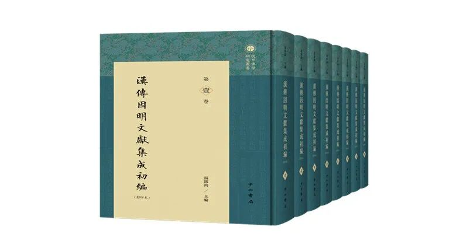
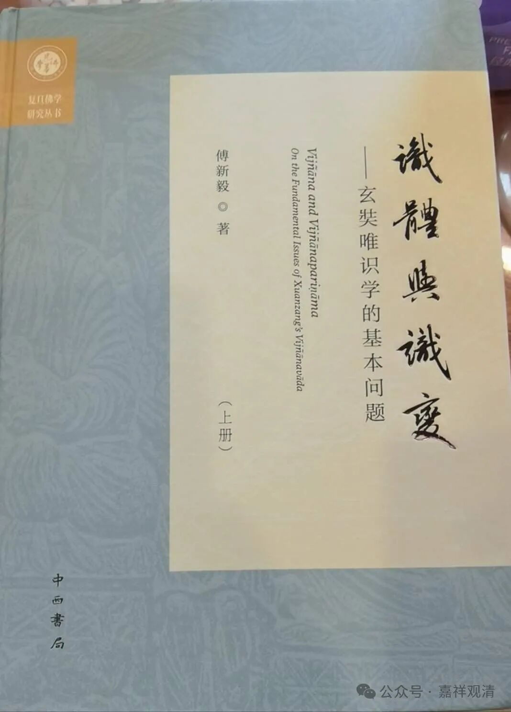
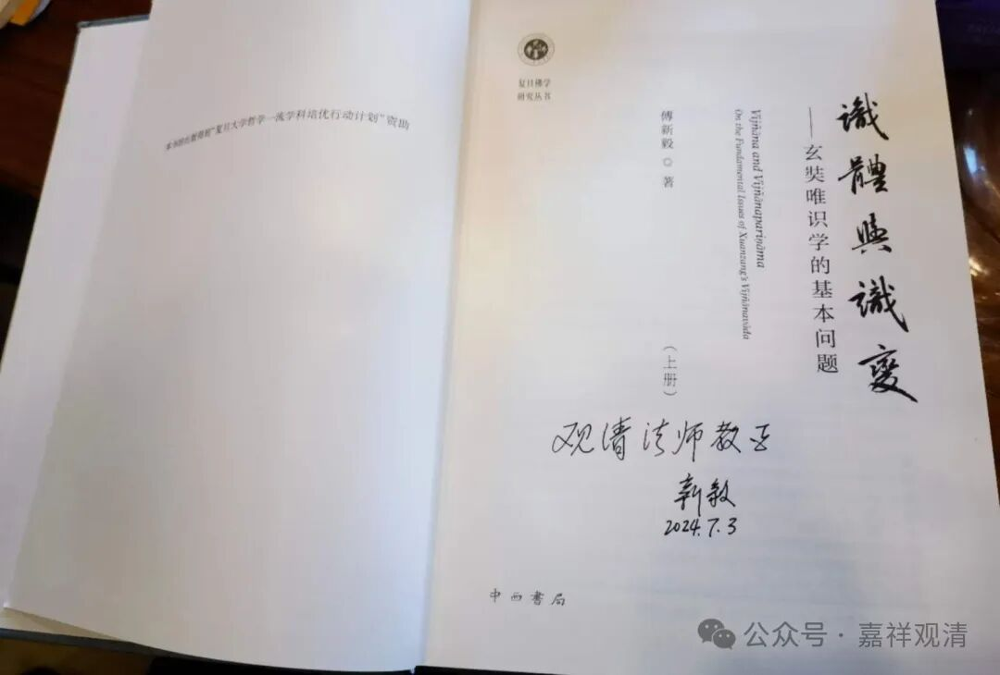
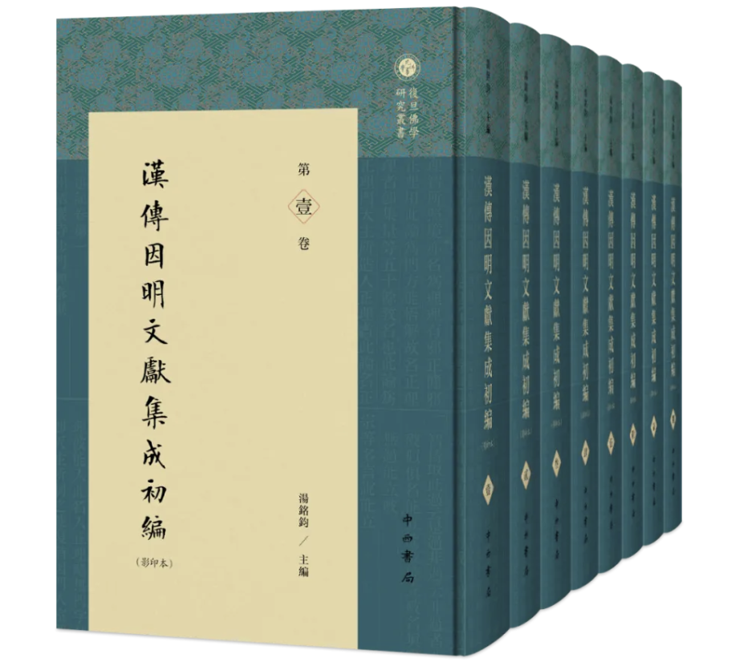
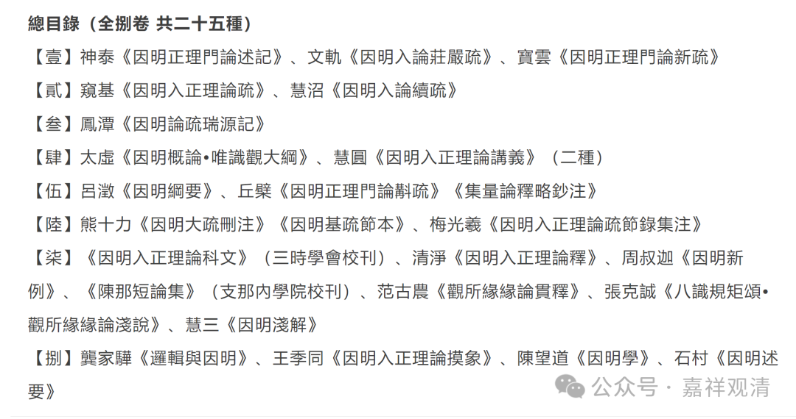

**中西书局的新书：**

** 《识体与识变》《汉传因明文献集成》**

最近中西书局又出了几套佛教的书啊。

这些年来，中西书局倒是出了不少重量级的佛教书籍了，比如叶少勇老师的梵藏汉合校的《中论颂》、《中论佛护释》……《中论颂》我大概买了七八本，有段时间总带着一本随身；《佛护释》我买了五六本。

傅新毅老师送了我一套他的新作——《识体与识变》。

很早就听说傅老师的这本书要出版了，这回终于拿到了“识变”的“实体”了，哈哈，还是签名本。我去配完眼镜就看……老咯，最近啥啥都出问题了，眼睛、腰、膝盖这些“实体”都出了点问题，另外，疫情以后一贯地“太虚大师”，这到底是训练不足还是锻炼太过啊？

前两天又看到有公众号介绍中西书局出了一套《漢傳因明文獻集成初編（影印本·全捌冊）》。这套书也出自复旦，由郑伟宏老师监制，汤铭钧老师主编，影印本的。我一看到就猜这就是亦幻法师——黄石村先生——郑伟宏老师有序传承下来的一批藏本，看了序言，觉得应该没猜错。

个人观点吧，这套书的价值不高，因为（除了极个别的几篇以外）基本都有单行本了。而且原价差不多六千，太贵了。

