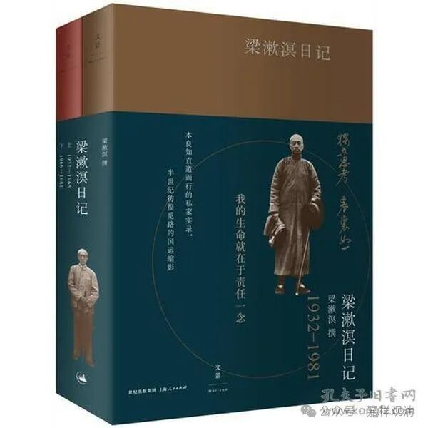

**梁漱溟先生问静于能海法师**

今天看到一则“故事”——梁漱溟先生曾向能海法师请教禅修之法。

梁漱溟先生一向被与马一浮、熊十力合称为“三大儒”，被称为“最后的儒家”，但他一向自称为佛家，并从青年（二十岁）起一贯茹素。

《梁漱溟日记》中，记载了他曾请教禅修之法于著名的能海法师。（据隆莲法师《能海上师年谱》，此时法师应在成都，与《日记》符合。）

《梁漱溟日记》1947年3月29日记载：

** “愚（向能海法师）求教言，师先问年齿，愚答：五十五矣。**

** 师曰：一日间当有一时间习静。愚敬志之。**

** 又问：方法如何？**

** 师答：方法可任择一种，不必拘。”**

梁漱溟先生说他想能海法师求相关禅修的教导。能海法师则先问了他年龄（五十五岁），然后建议每天都抽出一段时间打坐。梁先生记录下来了。

梁先生继续问用何种禅修方法，法师则回复说不必拘泥一种，可以挑任何一种（自己能上手）的禅修方法。

估计这次相见，能海法师应该也向梁漱溟先生展开介绍了一些入门的禅修之法。

而在这次两位大师相见后不久，梁先生就“闭关习静”了一段时间。

