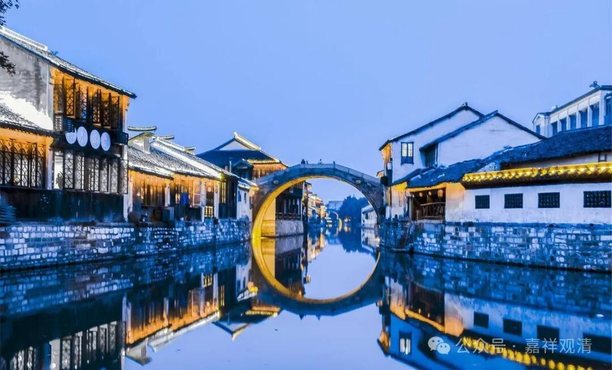

**《宗义略讲》004·054**

** “只承认佛说八万法蕴，而不许八万四千法蕴的建立。如《俱舍论》云：牟尼说法蕴，数有八十千。”**

折腾不折腾，今天看来，八万和八万四千都是一个约数，对某些宗派某人“较真”的人来说都是实数！全是实数，不是约数啊，它算的出来的，八万和八万四千，他们对“法蕴”还有具体说法的，比如说一个《法蕴足论》的篇幅，或者一个法类，一头南瞻部洲最大的大象所能背的经书的重量就是一个法蕴……他很明显地带着时代的烙印，很明显的带着知识分子当时“实有的”、什么东西都要具体化、客观化的那种烙印……

当然我们今天也可以“同情的理解”，确实在那个时代的佛教界的一部分知识分子，渴望为佛法引进一种定性、定量的东西，希望这种定性、定量化的东西能够被大家接受的、被大家赞叹，“体系严谨，次第明白”等等。

今天来说，或者说在中观师看起来，就是“美则美矣”，灿烂虽然灿烂，但是生死人还是生死人，体系建立得很好，但是基本可以无视……

我们经常说，中道很难！这里也差不多，一方面要学习佛教的基础法类，另一方面还要有一种超然点的态度，就是既要有徐庶的“务求精实”，也要有诸葛亮的“观其大略”、有陶渊明的“不求甚解”……但恰好的把握这个度又很难。

哎，这正是：

“若务精实生固执，不求甚解复散漫，

此界等转极难得，我心扰乱云何修？”

** “菩萨由最后有证菩提之处，决定唯在欲界，”**

小乘说成佛是在欲界成佛的，大乘说是在色界成佛的，是吧，波罗蜜多乘说是十地菩萨在色界成佛的。有部师说成佛决定唯在欲界，而且一定是在欲界的南瞻部洲。

** “不许在色究竟天密严宫和报身的建立。”**

他不许色究竟天密严宫——大乘说的十地菩萨成佛的地方，他不承认。

报身是什么呢？他不承认“大乘报身”的建立，他承认有“报身”的，他承认的报身就是释迦佛的身体叫报身，业“报”的“身”。他承认的化身是什么呢？九色鹿，佛的那个身体他不说是化身，佛的那个身体他说是报身，业报之身，释迦牟尼佛的身体是业报身。化身呢，就是九色鹿、顶生王这些，他说这个属于化身，他也有法身、报身、化身。法身是什么？五分法身，戒、定、慧、解脱、解脱智见，他也有“法、报、化”三身，但是跟大乘的“法、报、化”三身完全不一样，所以不是说“小乘不许有报身”，是没有大乘所讲的那种报身，或者说没有大乘所讲在色究竟天密严宫的报身。

