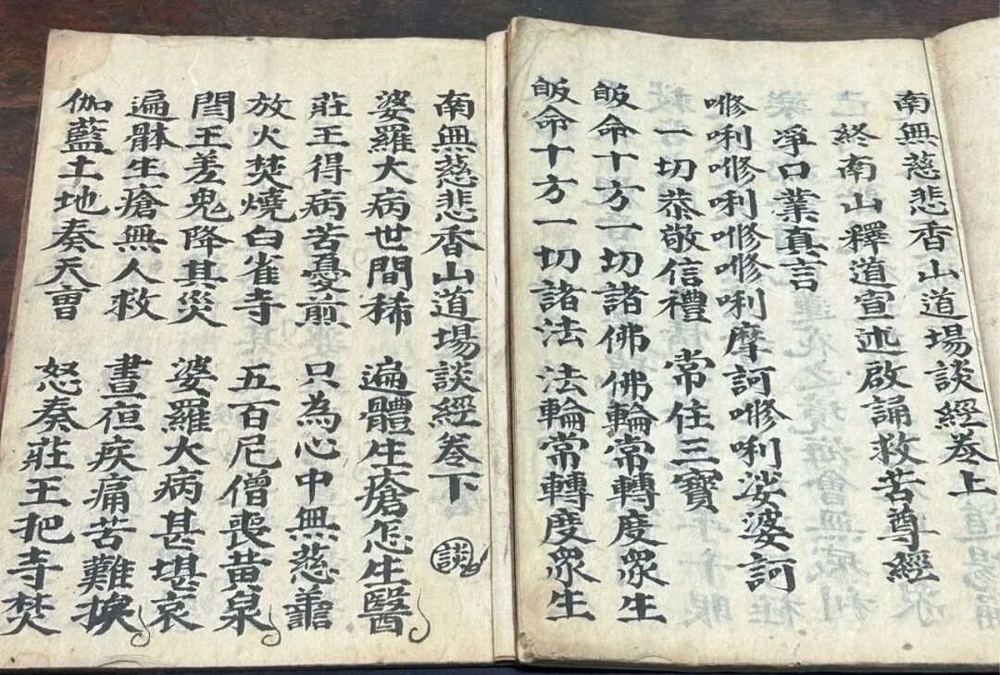

**俗讲、弹词、宝卷和“谈经”**

这是一份民间的《南无慈悲香山道场谈经》。

我不是很清楚这个《谈经》的“谈”是什么意思，难道是“弹词”的“弹”吗？或者“弹词”其实就是“谈词”？

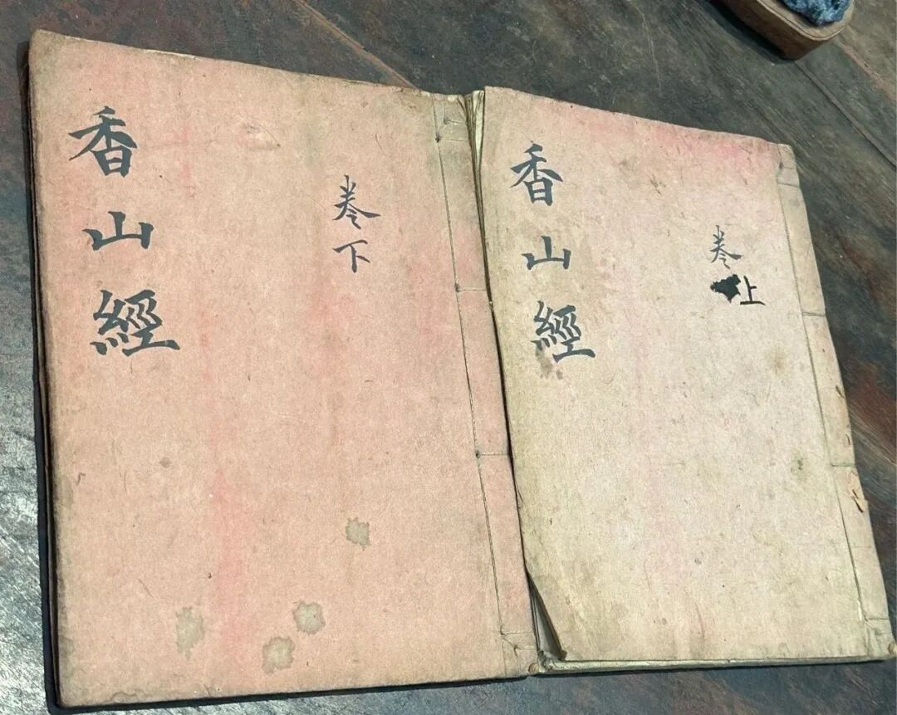

“香山”，就是《香山宝卷》的香山，因为“观音——妙善”故事里妙善公主的修行处便是“香山”。本件（上下两卷）的封面也写的是“香山经”。

这个《南无慈悲香山道场谈经》的内容，是在妙庄王和妙善故事（民间的观音菩萨传记）里插入《妙法莲花经·观世音菩萨普门品》的的原文，其格式颇类似于唐代的“俗讲”、苏州的“弹词”、靖山的“宝卷”——

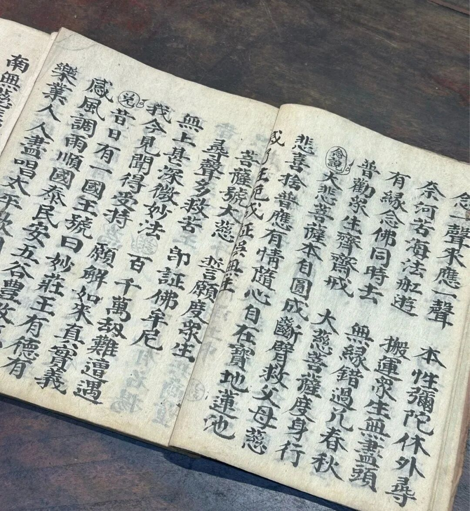

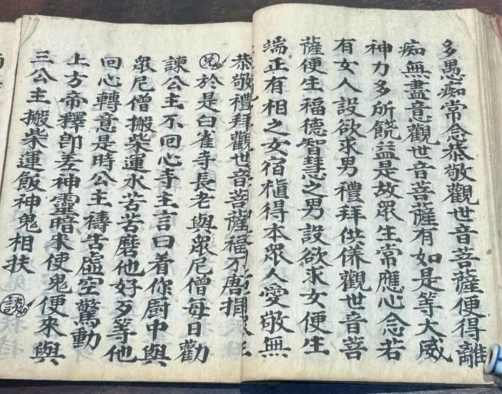

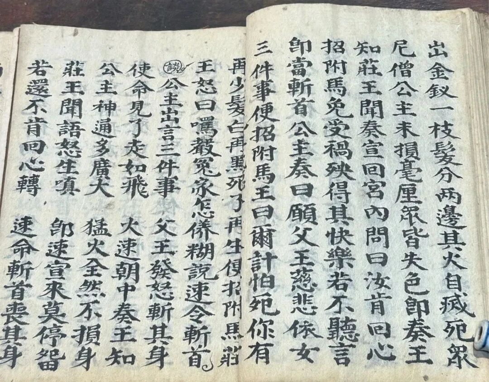

大家注意本子里用墨笔圈出来的这几个小字——“谈”“念”“念说”“诵”“兑”，还有一个云纹符号……我不知道这几个字的明确意思，不知道有谁知道，正好可以请教大家，有线索的可以教教我。

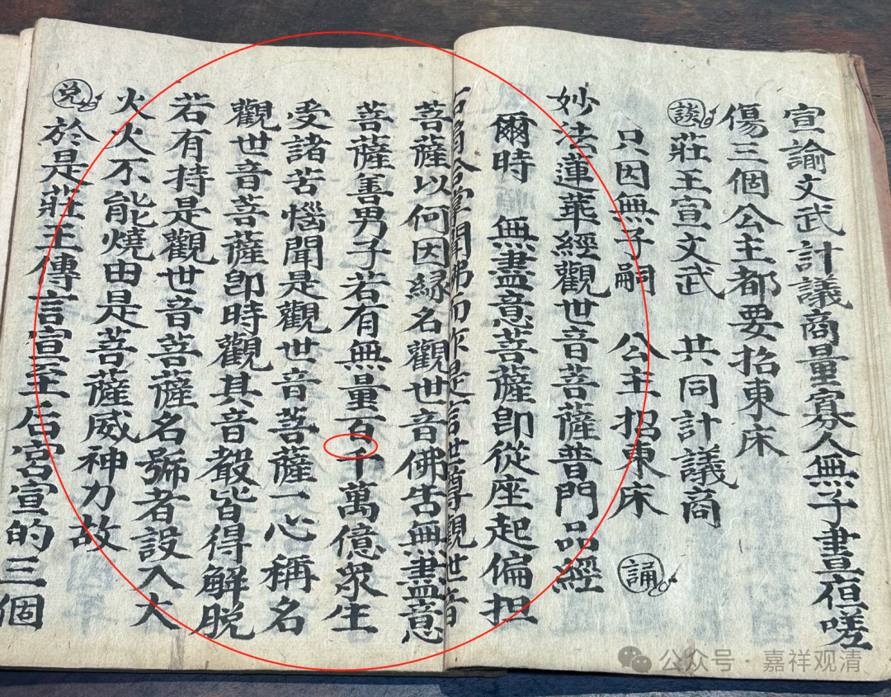

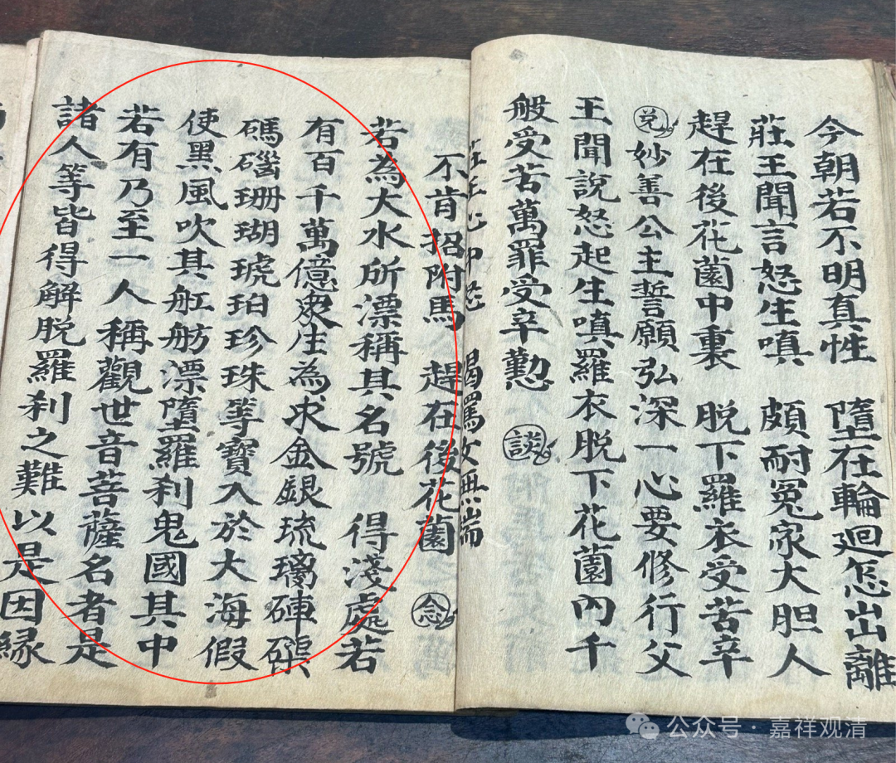

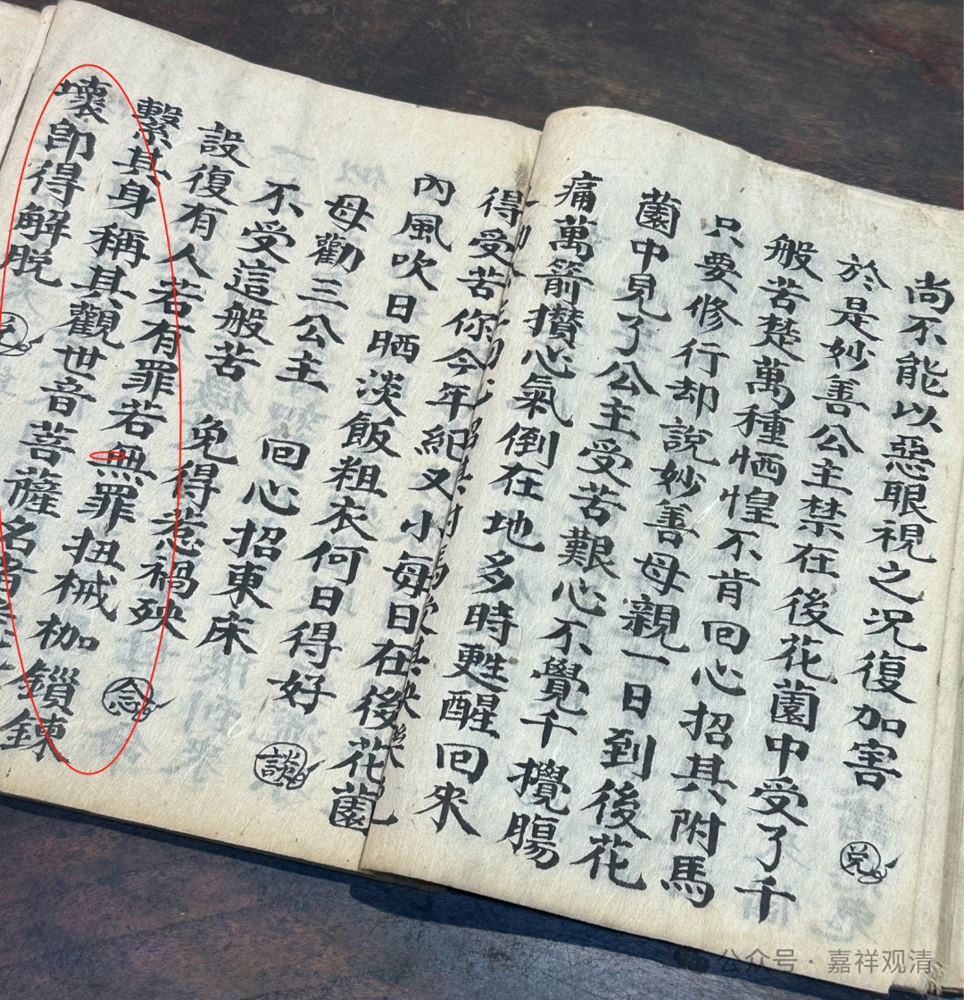

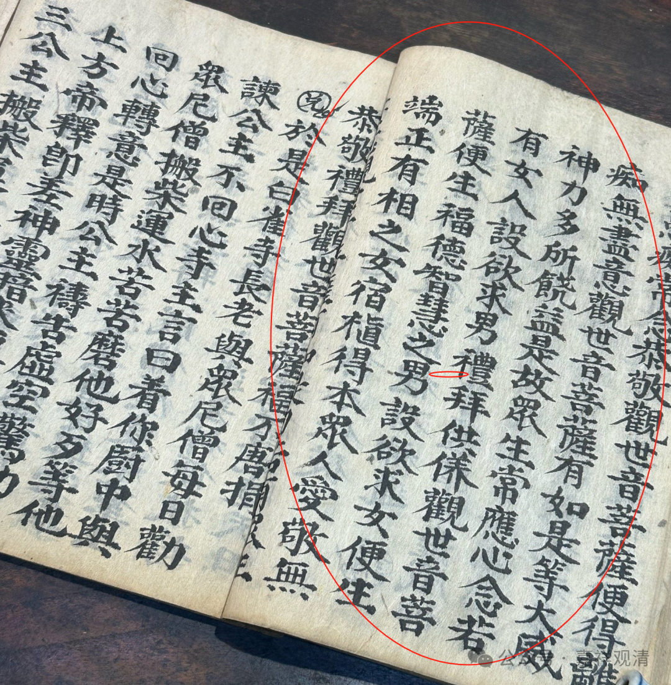

这几段我用红笔圈出来的，都是《妙法莲华经·观世音菩萨普门品》的原文，可以发现，都是按经文原有次序夹在“观音——妙善”故事的篇幅里面的。

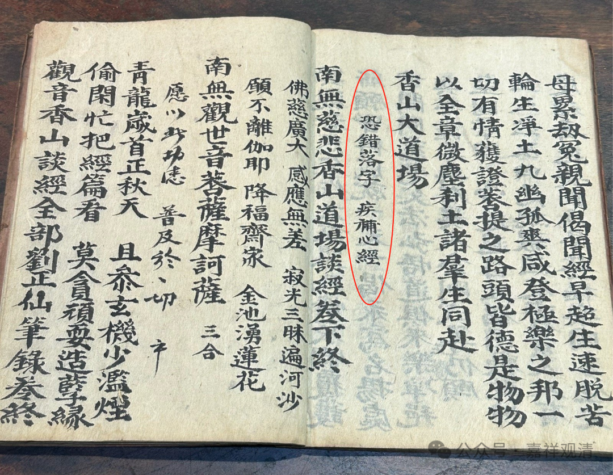

最后这一段，意思是念一遍《心经》补缺，有点像通常在仪轨后面附上《百字明》的作用。这里《心经》原文并没有出现。

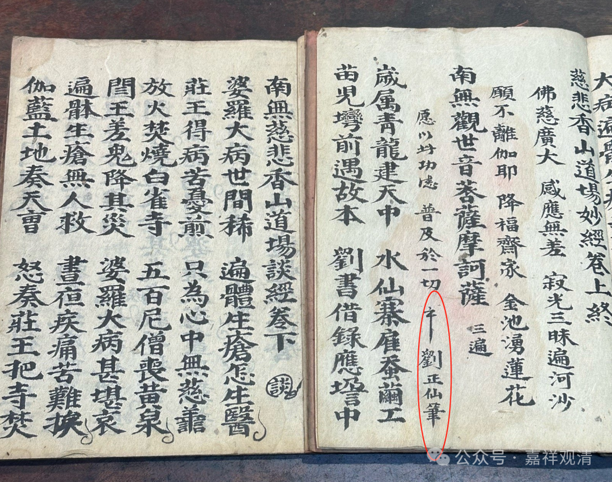

抄录《香山谈经》的这是这个人——刘正仙，应该是个民间的道士。抄的字迹挺工整的，少见。

