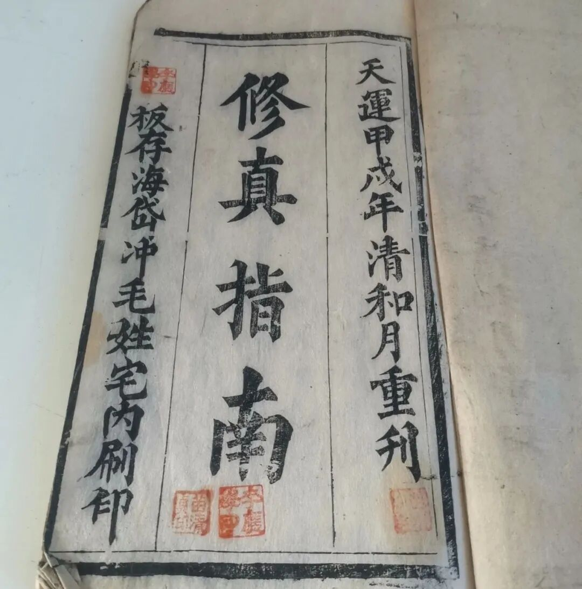
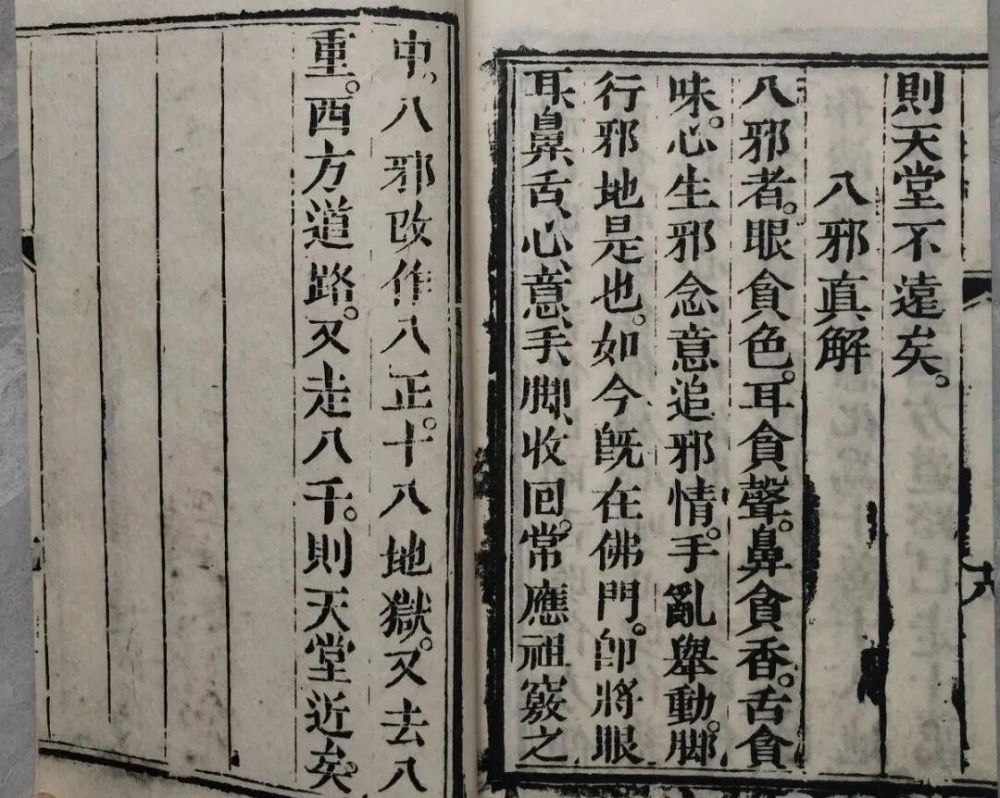

**“八正”与“八邪”**

看来《修真指南》这部书在民间还是很流行的，现在已经看到好几个不同时期、不同地点的版本了。本质上《修真指南》是民间宗教的，但他自己（本书）认为自己是佛门的，用词遣句，则在佛道之间。也许因为它在“理论”上已经做到了民间宗教的天花板，所以才会被大家“重视”。

上次聊了《修真指南》的《皈依真解》部分，后面还有一堆“真解”。今天来看一段“八邪真解”——

** “八邪真解**

** 八邪者，眼贪色、耳贪声、鼻贪香、舌贪味、心生邪念、意追邪情、手乱举动、脚行邪地是也。如今既在佛门，即将眼、耳、鼻、舌、心、意、手、脚收回，长应祖窍之中，八邪改作八正，十八地狱又去八重，西方道路又走八千，则天堂近矣。”**

** **

清按：

佛教里本身是有“八邪”这个概念的，是正对“八正”“八正道”而出现的，“八正”就是正见、正思维、正语、正业、正命、正精进、正念、正定；“八邪”则正相反：邪见、邪思维、邪语、邪业、邪命、邪精进、邪念、邪定。正统佛教“八邪”的概念在《阿含经》系里很常见。

《修真指南》的八邪，“眼贪色、耳贪声、鼻贪香、舌贪味、心生邪念、意追邪情、手乱举动、脚行邪地”直接来源是《道德经》而非《阿含经》：

** 《道德经》：**

** “五色令人目盲；五音令人耳聋；五味令人口爽；驰骋畋猎，令人心发狂；难得之货，令人行妨。”**

这里的“祖窍”，也是道教修炼的概念，指的是眉间、印堂、上丹田这里。

《修真指南》对“十八地狱”做了自己的解读，他认为“十恶”+“八邪”就是十八地狱（的因）。

关于《修真指南》“十恶”的部分，我们明天继续。

