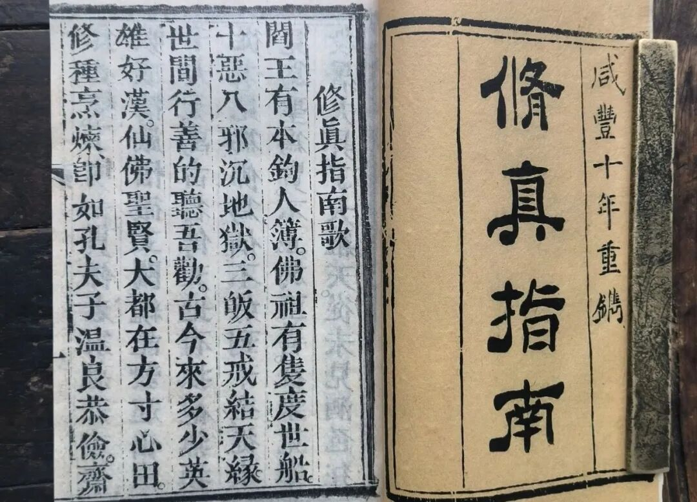
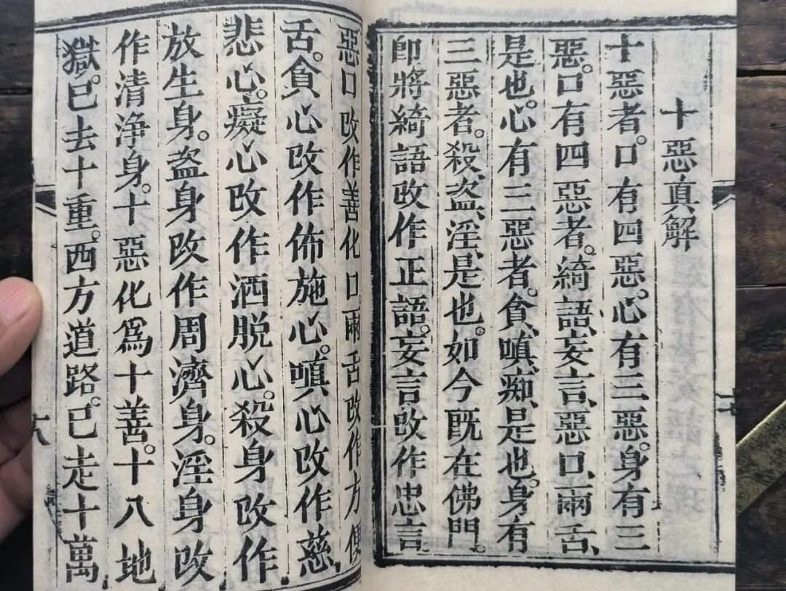
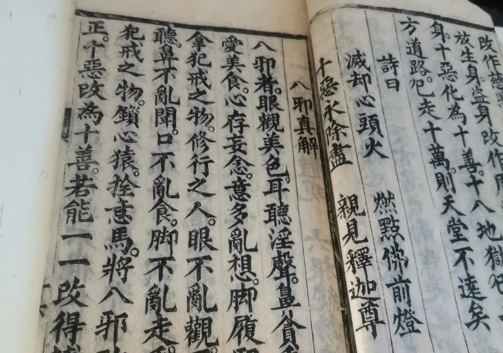

**“十善”“十恶”**

最近盯着《修真指南》聊了。主要是版本多，字迹清楚。手边那些民间的本子残破太过了。呵呵，过段时间准备去报一个“古籍修复班”上上课……这些民间的本子不是那么珍贵，修复得不到位也不那么心疼……

** “十恶真解**

** 十恶者，口有四恶，心有三恶，身有三恶。**

** 口有四恶者，绮语、妄言、恶口、两舌是也；**

** 心有三恶者，贪、嗔、痴是也；**

** 身有三恶者，杀、盗、淫是也。**

** 如今既在佛门，即将绮语改做正语，妄言改作忠言，恶口改作善化口，两舌改作方便舌；贪心改作布施心，嗔心改作慈悲心，痴心改作洒脱心；杀身改作放生身，盗身改作周济身，淫身改作清净身。**

** 十恶化作十善，十八地狱已去十重，西方道路已走十万，则天堂不远矣。”**

另一个版本在这后面还有四句诗——

** “诗曰：**

** 灭却心头火，点燃佛前灯，**

** 十恶永除尽，亲见释迦尊。”**

显然这个版本是后出的。

清案：

首先，十善、十恶属于佛教常用的道德实践，一般说法是“身三、口四、意三”，《修真指南》里把“身三”降到最后改变次序，也许是刻意的。

这里，“十恶”的说法和佛教基本一致，只是“意三”中“贪嗔痴”的“痴”，正统佛教里精确的表达应该说“不正见”或是“邪见”——如果把“痴”作为“恶”的话，则在具体的宗教道德实践中有过于严苛之嫌。当然，底层佛教在“十恶”里能背出“贪嗔痴”已经算基本合格了。

与“十恶”相反，在佛教里说的是“十善”，就是“不杀生”等等。对“不杀生”等的理解，大部分佛教徒以为就是“不去杀生”，但实际上这里的意思要有一个“对治杀生”的意思，其余“九善”也一样。（如果单单“不去杀生”就要算“不杀生”的话，那我上厕所也要算“不杀生”了，因为“不在杀生”啊。）

同样的，“邪见”对治之“正见”，并没有要求达到“空正见”，仅要求达到“世间正见”即可，也就是对泛泛的因果相应有所坚持即可——基础的道德实践，暂时不必拔高到形而上学的程度。

我们在这里还看到这句——“如今既在佛门”。上次说过，很多人把《修真指南》当作是道教的文献，也确实可以从里面找到很多道家和道教的背景，实际他应属于归属模糊的“在民间的宗教”，作者自身则认同自己为“在佛门”——当然“庙堂佛教”对此并不认可。

