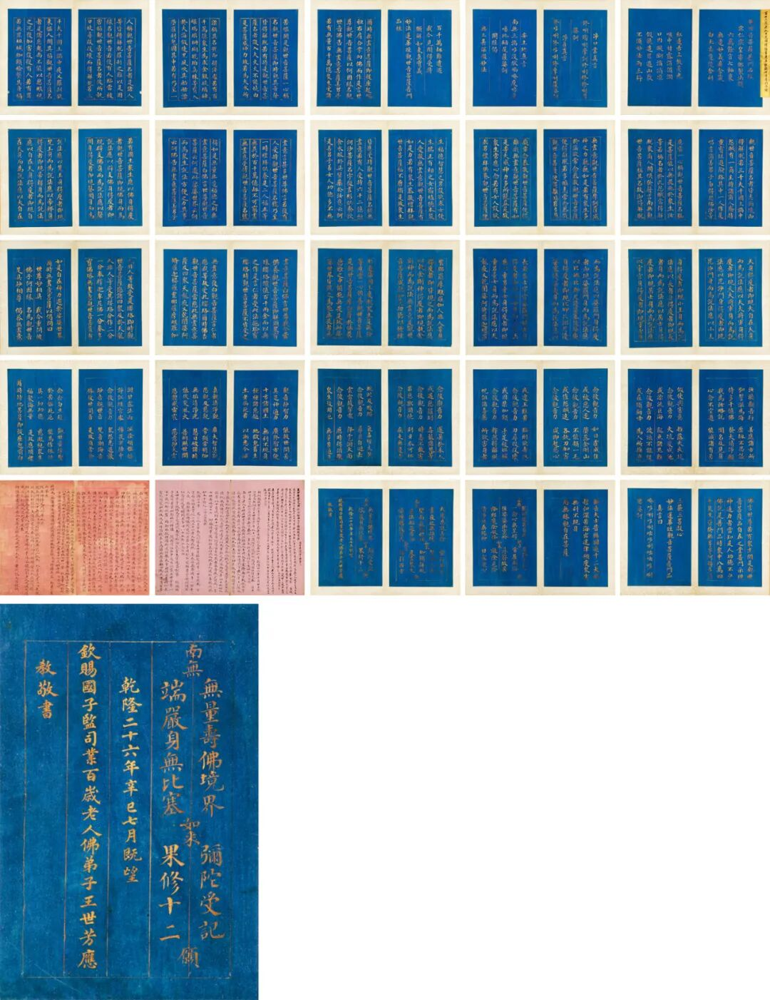

**百岁人瑞王世芳**

昨天开拍国际2024春拍的佛教古籍板块，一件瓷青纸泥金写本经折装的《妙法莲华经·观世音菩萨普门品》拍出了一百八十万的高价，加上佣金，最后成交价报二百零七万。

瓷青纸泥金写本，皇家出现的比较多，这一份也是，其款识为“乾隆二十六年辛巳七月既望，钦赐国子监司业百岁老人佛弟子王世芳应教敬书。”（哈哈，我也认识一个“佛弟子”王世芳，现在在山西太原开茶叶店。）

这里的这个“百岁老人佛弟子王世芳”，浙江台州临海人，是清代著名的长寿老人，被称为“盛世大瑞”，他们家“一门七世”（一般“四世同堂”已经很了不起了），最后寿终一百一十七。

“国子监司业”是乾隆皇帝赏给他的职衔。王世芳在他一百一十岁时被赐“翰林院侍讲衔”，一百十三岁时（？）赐的这个“国子监司业”，一百十五岁时又“赐六品顶戴”。

这件写于乾隆二十六年，王世芳时年一百零三岁，这时候他被举荐进京，庆贺崇庆皇太后七十大寿。（按这个说法他应该在一百零三岁时就被赐“国子监司业”了。）

关于王世芳的寿数，清代各笔记都做一百一十七岁，也有说他生于顺治十六年（1659），卒于嘉庆三年（1798），身历顺治、康熙、雍正、乾隆、嘉庆五朝，享寿141岁。（感觉挺乱的。）到底哪个记载准确，大家有兴趣的继续查吧。

最后一页“乾隆二十六年”之前的两行字，我读不来，谁帮忙解读一下……

